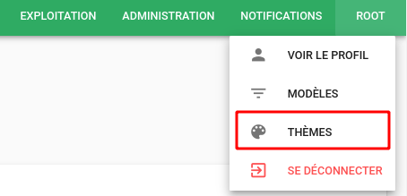
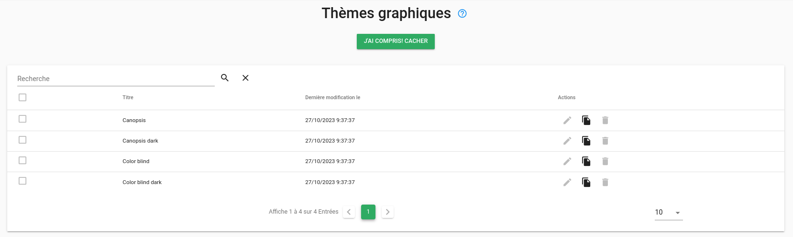
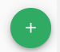
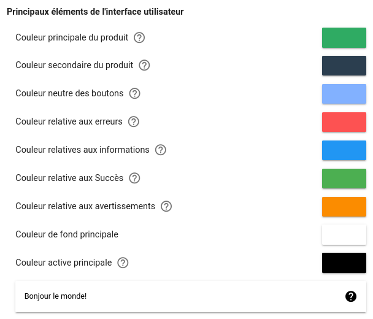
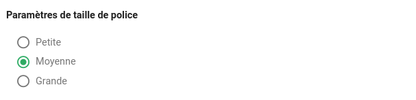
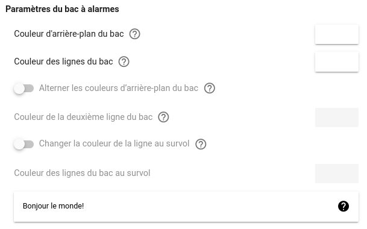
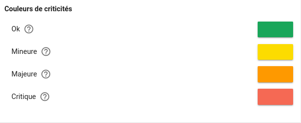

# Thèmes graphique

## Gestion des thèmes

Dans Canopsis, le menu `Thèmes` est dédié à la gestion des thèmes.  


La liste des thèmes s'affiche alors et présente les thèmes par défaut qui sont livrés nativement dans Canopsis



## Création d'un thème

Le bouton "+" vous permet d'afficher le formulaire de création des thèmes. 



Les éléments graphiques personnalisables dans Canopsis sont regroupés dans 4 catégories

1. Principaux éléments de l'interface graphique
1. Paramètres de taille de police
1. Paramètres du bac à alarmes
1. Couleurs de criticités

### Principaux éléments de l'interface graphique



### Paramètres de taille de police



### Paramètres du bac à alarmes



### Couleurs de criticités




## Variables Handlebars associées

Il est possible de conditionner certains affichages en fonction du thème appliqué.  
Pour cela, vous disposez de la variable `theme` et notamment `theme.name` que vous pouvez utiliser comme suit : 

```js
{{#if theme.dark}}
<p style="background:black;color:white">Thème  dark activé</p>
{{else}}
<p style="background:white;color:black">Thème light activé</p>
{{/if}}

{{#compare theme.name '==' 'Canopsis'}}<p>Le thème actif est <span style="background-color:white;color:black">Canopsis</span></p>{{/compare}}
{{#compare theme.name '==' 'Canopsis dark'}}<p>Le thème actif est <span style="background-color:black;color:white">Canopsis dark</span></p>{{/compare}}
```
