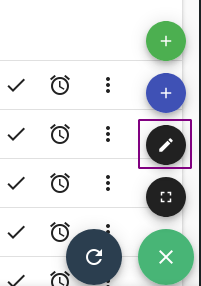
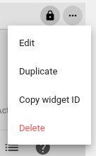
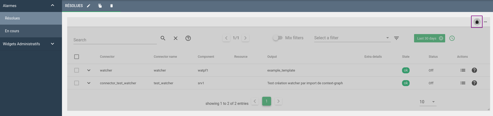
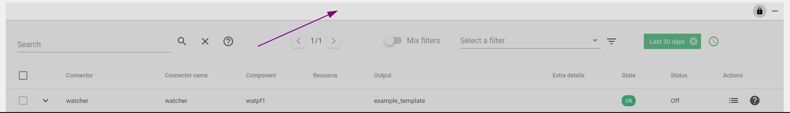
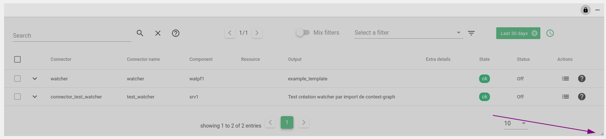

# Documentation de la grille d'édition

* Premièrement il faut se diriger dans une vue comme les alarmes résolues par exemple.
On peut alors entrer en mode edition grâce à `ctrl + e` ou cliquer sur le bouton en bas à droite puis le crayon.

* Nous avons alors accès à des nouvelles options, cliquez sur les trois petits points en haut à droite du widget.

Vous pouvez modifier le nom, dupliquer, copier l'id du widget ou encore le supprimer.

* À côté de ces options, il y a un cadenas qui permet de calculer automatiquement la hauteur en fonction du nombres d'éléments dans le widget.

* Pour déplacer un widget maintenez le clic sur la barre supérieure et glissez le à l'emplacement désiré.

* Pour redimensionner un widget maintenez le clic sur le coin inférieur droit.

* N'oubliez pas de cliquer sur le bouton `ok` en bas à droite pour valider les modifications et sortir du mode édition.

