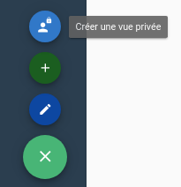

# Les vues et les groupes de vue

## Création d'une vue

Dans Canopsis, la création d'une vue est trés simple, il vous suffit de cliquer sur le bouton 'Créer une vue', présent dans le menu 'Paramètres' de la barre latérale.

Si vous en avez le droit, il vous est également possible de créer une vue privée.  Cette vue ne sera visible que de son créateur.

Une fenêtre apparaît :

Plusieurs informations concernant la vue sont demandées :

* Nom (*requis*): Nom de la vue
* Titre (*requis*): Titre de la vue
* Description: Description de la vue
* Activée: La vue doit-elle être accessible, ou non ?
* Rafraîchissement périodique : Les données de la vue doivent-elles être rafraîchies régulièrement ?

* Labels de groupes: Labels permettant la classification
* Groupe (*requis*): Groupe auquel la vue appartient. Le champ permet de rechercher parmi les groupes existants. Si aucun groupe n'est trouvé, appuyez sur la touche Entrée pour en créer un nouveau.

Une fois les champs renseignés, cliquez sur "Envoyer", votre vue apparaîtra dans la barre latérale, dans le groupe que vous avez choisi lors de la création.

## Mode édition

Afin d'accéder aux fonctionnalités d'édition/suppression des vues et des groupes de vues, il est nécessaire d'activer le mode d'édition.

Il existe deux méthodes pour activer le mode d'édition :

- Clic sur le bouton 'Activer/Désactiver le mode d'édition' présent dans le menu 'Paramètres' de la barre latérale
.
- Raccourci clavier CTRL+E

Pour désactiver le mode d'édition, il suffit de cliquer à nouveau sur le bouton d'édition, ou d'utiliser à nouveau le raccourci clavier CTRL+E.

## Édition/Suppression d'une vue

Une fois la vue créée, il est bien évidemment possible de modifier les informations la concernant (Nom, Titre, Description, Groupe, etc).

### Éditer une vue

Afin d'éditer une vue, il faut tout d'abord [activer le mode d'édition](#mode-edition).

Des icones d'édition aparaissent alors à côté de chacune des vues. Cliquez sur l'icone correspondant à la vue que vous souhaitez éditer.

Une fenêtre apparait. Le formulaire présent dans cette fenêtre reprend les éléments renseignés lors de la création de la vue.

Une fois les modifications faites, cliquez sur 'Envoyer'. Un message de succès apparaît en haut à droite de la fenêtre. La vue est modifiée !

### Supprimer une vue

Afin de supprimer une vue, il vous faut ouvrir la fenêtre d'édition de la vue que vous souhaitez supprimer. Cf: [Editer une vue](#editer-une-vue)
À l'intérieur de cette fenêtre se trouve un bouton 'Supprimer'. Cliquez sur ce bouton. Une fenêtre vous demande confirmation, cliquez sur 'Oui'. Votre vue est supprimée !

## Édition/Suppression d'un groupe

Une fois un groupe créé, il est bien évidemment possible de modifier les informations le concernant (Nom)

### Éditer un groupe

Afin d'éditer un groupe, il faut tout d'abord [activer le mode d'édition](#mode-edition).
Des icones d'édition aparaissent alors à côté de chacuns des groupes. Cliquez sur l'icone correspondant au groupe que vous souhaitez éditer.

Une fenêtre apparait. Le formulaire présent dans cette fenêtre reprend les éléments renseignés lors de la création du groupe (Nom).

Une fois les modifications faites, cliquez sur 'Envoyer'. Le groupe est modifié !

### Supprimer un groupe

Afin de supprimer un groupe, il vous faut ouvrir la fenêtre d'édition de la vue que vous souhaitez supprimer. Cf: [Editer un groupe](#editer-un-groupe)
À l'intérieur de cette fenêtre se trouve un bouton 'Supprimer'. Cliquez sur ce bouton. Une fenêtre vous demande confirmation, cliquez sur 'Oui'. Votre vue est supprimée !

## Les onglets

Dans l'interface de Canopsis, chaque vue peut être découpée en onglets.
Ces onglets permettent de regrouper des widgets dans une même vue, sans surcharger l'affichage.

La liste des onglets d'une vue est présente en haut de celle-ci, sous la barre du haut.

Par défaut, chaque vue créée dans l'interface de Canopsis est constituée d'un onglet "Default".

**Lorsqu'une vue ne contient qu'un seul onglet, celui-ci est invisible dans l'interface.**

### Créer un nouvel onglet

Afin de créer un onglet, cliquez sur le bouton "Ajouter un onglet", situé dans le menu en bas à droite.

Une fenêtre s'ouvre alors, vous demandant d'entrer le nom que vous souhaitez donner au nouvel onglet. Une fois le nom renseigné, cliquez sur le bouton "Envoyer". Votre nouvel onglet a été créé !

### Editer un onglet

Afin d'éditer un onglet, il vous faut tout d'abord [activer le mode d'édition](#mode-edition).

Deux boutons apparaissent alors à droite du nom de chaque onglet, dans la barre des onglets.

Le premier bouton , permet d'éditer l'onglet.
Au clic sur ce bouton, une fenêtre s'ouvre. Cette fenêtre vous permet de modifier le nom de l'onglet.

Cliquez sur "Envoyer" pour valider le changement. Votre onglet a été modifié !

### Supprimer un onglet

Afin de supprimer un onglet, il vous faut tout d'abord [activer le mode d'édition](#mode-edition).

Deux boutons apparaissent alors à droite du nom de chaque onglet, dans la barre des onglets.

Le deuxième bouton , permet de supprimer l'onglet.

Au clic sur ce bouton, une fenêtre de confirmation s'ouvre. Cliquez sur "Oui" pour valider la suppression de l'onglet.

**Attention: Tous les widgets à l'intérieur de l'onglet seront également supprimés**

## La suite

Une fois votre vue créée, il vous est possible d'y ajouter des widgets afin de commencer à utiliser l'application.  

!!! note
    Le rafraîchissement périodique des données de la vue est indépendant du rafraîchissement des widgets eux-mêmes.

Voir : [Widgets](../index.md)

## Importation / Exportation

Vous avez aussi la possibilité d'importer et d'exporter vos vues et vos groupes. La procédure complète est disponible en suivant [ce lien](../../menu-administration/parametres.md#importexport)
