# Les actions du Bac à alarmes

Les différentes actions possibles sur cette alarme sont :

*  [Acquitter l'alarme](#acquitter-lalarme)
*  Une fois l'alarme acquittée, la gestion de l'incident :
    *  [Déclarer un incident](#declarer-un-ticket)
    *  [Associer un ticket](#associer-un-ticket)
    *  [Annuler l'alarme](#annuler-lalarme)
    *  [Annuler l'acquittement](#annuler-lacquittement)
    *  [Mise en veille](#mise-en-veille)
    *  [Changer la criticité](#changer-la-criticite)
    *  [Comportement périodique](#comportement-periodique)
    *  [Lister les comportements périodiques](#lister-les-comportements-periodiques)
    *  [Commenter l'alarme](#commenter-lalarme)
    *  [Historique](#historique)
    *  [Liste des variables disponibles](#liste-des-variables-disponibles)

## Acquitter l'alarme

Deux options possibles : Acquittement et Acquittement rapide.

L'acquittement permet de voir les détails généraux de l'évènement, de lier un numéro de ticket et d'écrire une note. Il permet d'accuser réception, ou d'accuser réception et de reporter un incident.

L'acquittement rapide, lui, permet d'accuser réception sans pour autant remplir ces informations.

Si la colonne 'extra\_details' est activée dans le bac à alarmes, l'icone  apparaît. Au survol de la souris, des informations sur l'action sont disponibles (auteur, date, etc).

## Gérer l'incident

Une fois l'alarme acquittée, un nouveau menu apparaît à la place des actions d'acquittement.

Il permet de :

*  déclarer un ticket
*  associer un ticket
*  annuler l'alarme
*  mettre en veille
*  changer la criticité
*  lister les comportements périodiques
*  définir un comportement périodique
*  obtenir plus d'infos

Les actions 'Déclarer un ticket', 'Associer un ticket' et 'Annuler l'alarme' sont disponibles immédiatement sur chaque ligne d'alarme, dans le Bac à alarmes.

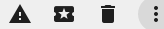

Les autres actions sont disponibles en cliquant sur les 3 points situés à droite de actions citées précedemment.

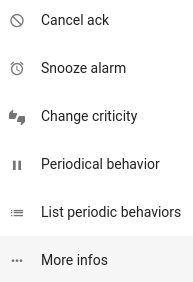

### Déclarer un ticket

L'action 'Déclarer un ticket' permet de déclarer un incident, à partir d'une alarme.

Au clic sur l'action 'Déclarer un ticket', une fenêtre s'affiche :

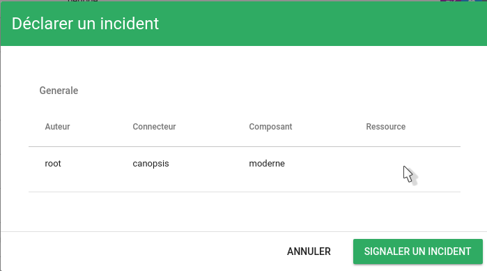

Cette fenêtre présente quelques détails de l'évènement.

Cliquez sur 'Signaler un incident' pour valider la déclaration.
Une fenêtre 'Action effectuée avec succès !' en haut à droite de l'écran vous confirme que l'action a bien été effectuée.

### Associer un ticket

L'action 'Associer un ticket' permet d'associser un numéro de ticket à une alarme.

Au clic sur l'action 'Associer un ticket', une fenêtre s'affiche :

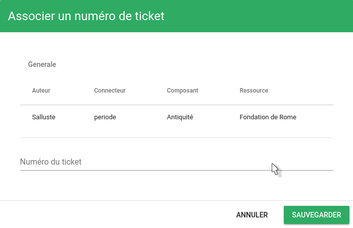

Cette fenêtre présente quelques détails de l'évènement.

En dessous des détails de l'évènement, un champ de texte vous demande de renseigner le numéro du ticket que vous souhaitez associer à cet évènement.

Après avoir renseigné le numéro de ticket, cliquez sur 'Sauvegarder'.
Une fenêtre 'Action effectuée avec succès !' en haut à droite de l'écran vous confirme que l'action a bien été effectuée.

Si la colonne 'extra\_details' est activée dans le bac à alarmes, l'icone  apparaît. Au survol de la souris, des informations sur l'action sont disponibles (auteur, date, etc)

### Annuler l'alarme

L'action 'Annuler l'alarme' permet d'annuler une alarme.

Au clic sur l'action 'Annuler l'alarme', une fenêtre s'affiche :

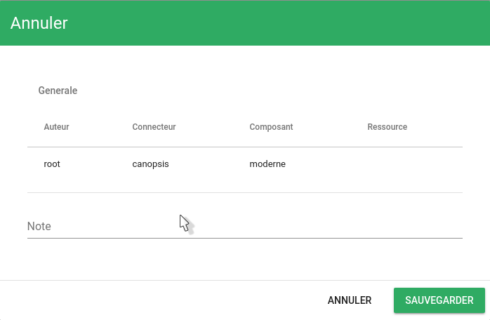

Cette fenêtre présente quelques détails de l'évènement.

En dessous des détails de l'évènement, un champ de texte vous demande de renseigner une note concernant l'action que vous effectuez.

Après avoir renseigné cette note, cliquez sur 'Sauvegarder'.
Une fenêtre 'Action effectuée avec succès !' en haut à droite de l'écran vous confirme que l'action a bien été effectuée.

Si la colonne 'extra\_details' est activée dans le bac à alarmes, l'icone  apparaît. Au survol de la souris, des informations sur l'action sont disponibles (auteur, date, etc).

L'alarme prend alors le statut `cancel` et reste pendant 1h dans le bac des alarmes en cours. Ce délai de 1h passé, elle change de statut pour passer en `resolved` et bascule dans le bac des alarmes résolues.

**Note 1 :** Toute alarme annulée garde son dernier niveau de criticité connu.

**Note 2 :** Par défaut, une alarme annulée manuellement reste affichée dans le Bac des alarmes en cours durant une heure. Cette durée peut être modifiée à l'aide de [l'option `CancelAutosolveDelay` du fichier de configuration global](../../../../guide-administration/administration-avancee/modification-canopsis-toml.md).

### Annuler l'acquittement

L'action 'Annuler l'acquittement' permet d'annuler la confirmation de réception de l'alarme.

Au clic sur l'action 'Annuler l'acquittement', une fenêtre s'affiche :

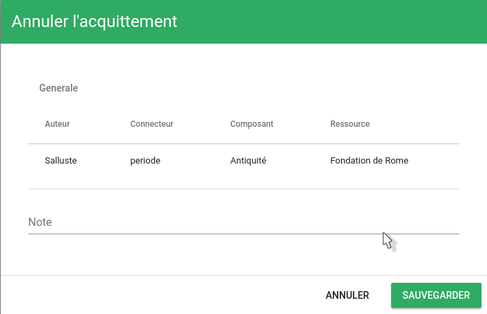

Cette fenêtre présente quelques détails de l'évènement.

En dessous des détails de l'évènement, un champ de texte vous demande de renseigner une note concernant l'action que vous effectuez.

Après avoir renseigné cette note, cliquez sur 'Sauvegarder'.
Une fenêtre 'Action effectuée avec succès !' en haut à droite de l'écran vous confirme que l'action a bien été effectuée.

Les actions disponibles reviennent alors à l'état dans lequel elles étaient avant l'action d'acquittement effectuée auparavant.

### Mettre en veille

L'action 'Mettre en veille' (*snooze*) permet de reporter une alarme pour une durée déterminée.

Au clic sur l'action 'Mettre en veille', une fenêtre s'affiche :

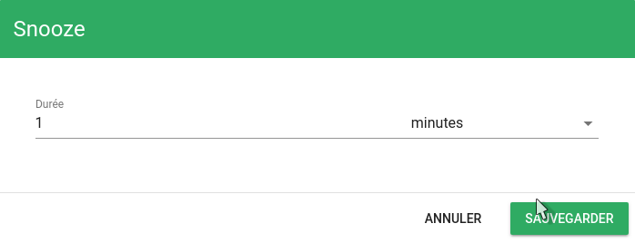

Cette fenêtre vous demande de renseigner la durée souhaitée.

Une fois la durée renseignée, cliquez sur 'Sauvegarder'.
Une fenêtre 'Action effectuée avec succès !' en haut à droite de l'écran vous confirme que l'action a bien été effectuée.

Si la colonne 'extra\_details' est activée dans le bac à alarmes, l'icone  apparaît. Au survol de la souris, des informations sur l'action sont disponibles (auteur, date, etc).

### Changer la criticité

L'action 'Changer la criticité' permet de modifier [la criticité](../../../vocabulaire/index.md#criticite) d'une [alarme](../../../vocabulaire/index.md#alarme) (Info, Mineure, Majeure, Critique).

Au clic sur l'action 'Changer la criticité', une fenêtre s'affiche :

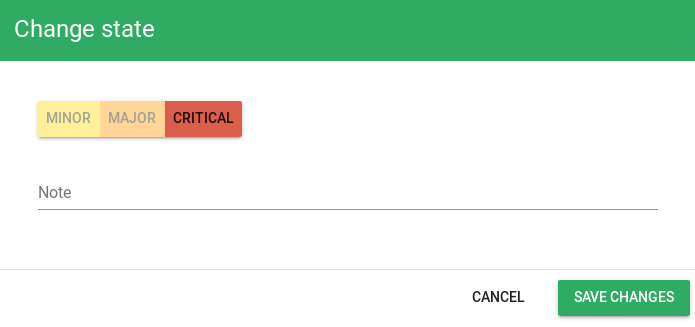

Cette fenêtre vous demande de choisir le niveau de criticité souhaité et de renseigner une note concernant l'action que vous effectuez.

Une fois la durée renseignée, cliquez sur 'Sauvegarder'.
Une fenêtre 'Action effectuée avec succès !' en haut à droite de l'écran vous confirme que l'action a bien été effectuée.

Si la colonne 'state' est activée dans le Bac à alarmes, l'icone  apparaît à côté de la criticité de l'alarme, signifiant que celle-ci a été modifiée manuellement.

### Comportement périodique

L'action 'Comportement périodique' permet d'ajouter un comportement périodique.

Pour plus de détails sur les comportements périodiques, voir : [Les comportements périodiques](../../pbehaviors/index.md).

### Lister les comportements périodiques

L'action 'Lister les comportements périodiques' permet de lister les comportements périodiques associés à un évènement.

Au clic sur l'action 'Lister les comportements périodiques', une fenêtre s'affiche :

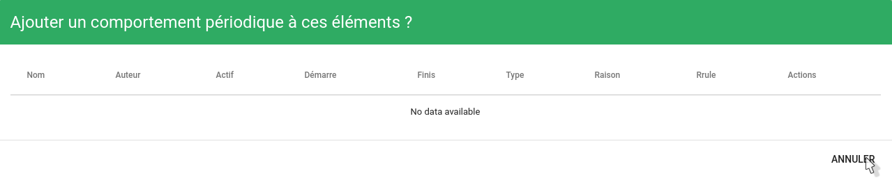

Cette fenêtre présente une liste des comportements périodiques affectant cet évènement.

Il est possible depuis cette fenêtre de supprimer les comportements périodiques.

Pour fermer la fenêtre, cliquez en dehors de celle-ci, ou sur le bouton 'Annuler'

### Commenter l'alarme

L'action 'Commenter l'alarme' permet de poser un commentaire sur une alarme.

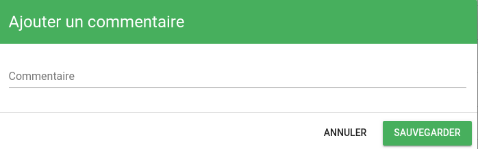

Si la colonne 'extra\_details' est activée dans le bac à alarmes, l'icone  apparaît. Au survol de la souris, des informations sur l'action sont disponibles (auteur, date, etc).

### Historique

L'action 'Historique' permet de consulter l'historique de cette alarme durant les 30 derniers jours (valeur par défaut).

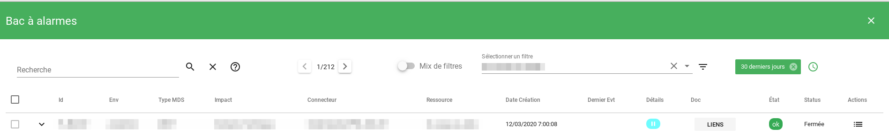

En utilisant le [suivi personnalisé](../bac-a-alarmes/index.md#suivi-personnalisé), vous pouvez modifier l'intervalle de dates pour cet historique.

### Liste des variables disponibles

Cette action permet de montrer à l'utilisateur l'ensemble des variables disponibles concernant l'alarme et son entité.

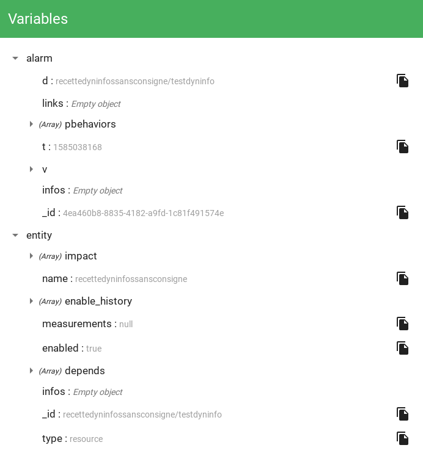

!!! info
    Cette action est autorisée grâce au droit `common_variablesHelp(Access to available variables list)`.
