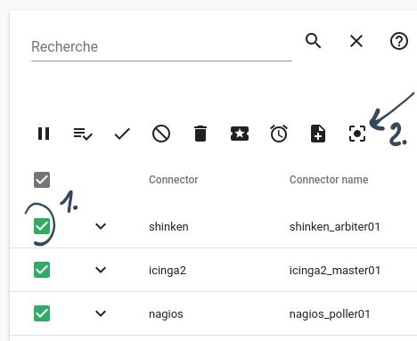
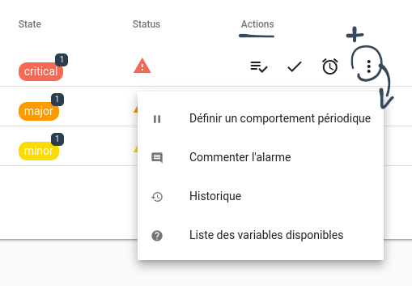
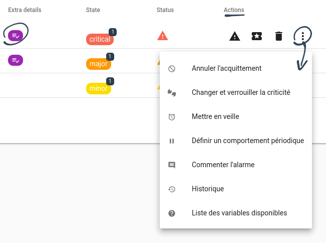
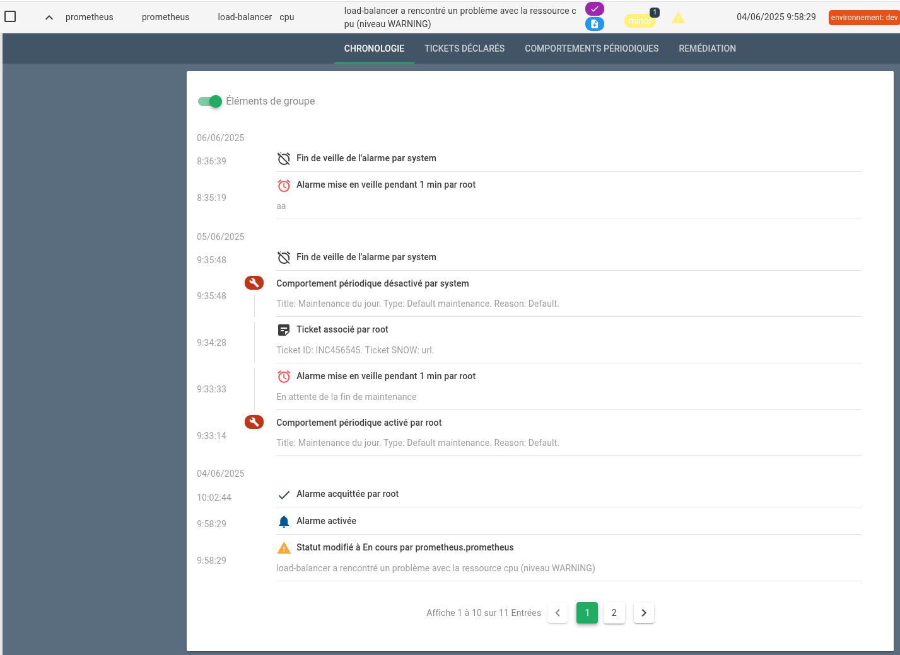

# Les actions du Bac à alarmes

Des actions peuvent être exécutées sur les alarmes d'un bac à alarmes pour respecter le workflow mis en place dans l'entreprise.  

Ces actions peuvent être exécutées unitairement ou en masse.

- Actions de masse

- Actions à l'unité dans la colonne « Actions »

- Certaines actions sont accessibles selon l'étape du workflow
  (avant/après acquittement)

## Description des actions

| Icône                                                        | Action                                 |
| ---                                                          | ---                                    |
| ![w:15px icône ack][action-ack]{ width="30"}                 | Ack (avec message)                     |
| ![w:15px icône fastAck][action-fastAck]{ width="30"}         | Ack rapide                             |
| ![w:15px icône ackRemove][action-ackRemove]{ width="30"}     | Annuler l'ack                          |
| ![w:15px icône snooze][action-snooze]{ width="30"}           | Mettre en veille (Snooze)              |
| ![w:15px icône unsnooze][action-unsnooze]{ width="30"}       | Annuler la mise en veille              |
| ![w:15px icône pbehavior][action-pbehavior]{ width="30"}     | Comportement périodique                |
| ![w:15px icône fast pbehavior][action-fastpbh]{ width="30"}  | Pause rapide (pbehavior pré-paramétré) |
| ![w:15px icône changeState][action-changeState]{ width="30"} | Changer et verrouiller la criticité    |
| ![w:15px icône comment][action-comment]{ width="30"}         | Commenter l'alarme                     |

| Icône                                                   | Action                                 |
| ---                                                     | ---                                    |
| ![w:30px icône bookmark][action-bookmark]{ width="30"}               | Ajouter un signet (Bookmark)           |
| ![w:30px icône history][action-history]{ width="30"}                 | Historique                             |
| ![w:30px icône variablesHelp][action-variablesHelp]{ width="30"}     | Lister les variables                   |
| ![w:30px icône exportPdf][action-exportPdf]{ width="30"}             | Exporter en PDF                        |
| ![w:30px icône associateTicket][action-associateTicket]{ width="30"} | Associer un ticket                     |
| ![w:30px icône declareTicket][action-declareTicket]{ width="30"}     | Déclarer un ticket (si règle présente) |
| ![w:30px icône cancel][action-cancel]{ width="30"}                   | Annuler l'alarme (avec message)        |
| ![w:30px icône fastcancel][action-fastcancel]{ width="30"}           | Annulation rapide                      |
| ![w:30px icône uncancel][action-uncancel]{ width="30"}               | Rétablir l'alarme                      |

[action-ack]: ./img/icons/material/done_48dp.svg
[action-fastAck]: ./img/icons/material/done_all_48dp.svg
[action-ackRemove]: ./img/icons/material/remove_done_48dp.svg
[action-snooze]: ./img/icons/material/alarm_48dp.svg
[action-unsnooze]: ./img/icons/material/alarm_off_48dp.svg
[action-pbehavior]: ./img/icons/material/pause_48dp.svg
[action-fastpbh]: ./img/icons/material/fast_pbh_48dp.svg
[action-bookmark]: ./img/icons/material/bookmark_add_48dp.svg
[action-changeState]: ./img/icons/material/thumbs_up_down_48dp.svg
[action-comment]: ./img/icons/material/comment_48dp.svg
[action-history]: ./img/icons/material/history_48dp.svg
[action-variablesHelp]: ./img/icons/material/help_48dp.svg
[action-exportPdf]: ./img/icons/material/assignment_returned_48dp.svg
[action-associateTicket]: ./img/icons/material/sticky_note_2_48dp.svg
[action-declareTicket]: ./img/icons/material/note_add_48dp.svg
[action-cancel]: ./img/icons/material/cancel.svg
[action-fastcancel]: ./img/icons/material/delete_48dp.svg
[action-uncancel]: ./img/icons/material/delete_forever_48dp.svg

## Visualisation des actions

Lorsqu'une action a été exécutée, le résultat est visible dans la [chronologie](./index.md#alarmes) (timeline) de l'alarme ainsi que dans les colones "Détails supplémentaires" et "Sévérité".

### Chronologie de l'alarme

Voici une description des icônes de la chronologie

| Icône                                 | Signification                                       |
|---------------------------------------|-----------------------------------------------------|
|    | Changement de criticité (augmentation ou baisse)    |
|   | Changement de statut                                |
|      | Ack ou Annulation d’ack                             |
|   | Mise en veille ou sortie de veille                  |
|      | Entrée dans un comportement périodique              |
|   | Déclaration ou association de ticket                |
|  | Exécution de webhook ou d’étapes de scénario        |
|      | Instructions, jobs ou étapes lancées                |
|   | Activation d’alarme                                 |
|    | Exécution de tests (JUnit)                          |
|     | Alarme liée ou déliée à une méta-alarme             |
|  | Commentaire                                         |

### Colonnes

  

**Colonne "Détails supplémentaires"**

| Icône                                  | Témoin de l'action… |
| --:                                    | ---                 |
| ![icône ack][icon-ack]                 | ACK                 |
| ![icône snooze][icon-snooze]           | Snooze              |
| ![icône ticket][icon-ticket]           | Ticket              |
| ![icône correlation][icon-correlation] | Méta-alarme         |
| ![icône comment][icon-comment]         | Commentaire         |
| ![icône pbh inactif][icon-pbh-inactive] ![icône pbh maintenance][icon-pbh-maintenance] ![icône pbh pause][icon-pbh-pause]   … | Comportement périodique |

  

  

**Colonne "Sévérité"**

| Icône                                  | Témoin de l'action…     |
| --:                                    | ---                     |
| ![][icon-changeState1] ![][icon-changeState2] ![][icon-changeState3] | Changement de criticité |

  

[icon-ack]: ./img/icons/extradetails_ack.png
[icon-snooze]: ./img/icons/extradetails_snooze.png
[icon-ticket]: ./img/icons/extradetails_ticket.png
[icon-correlation]: ./img/icons/extradetails_correlation.png
[icon-comment]: ./img/icons/extradetails_comment.png
[icon-pbh-inactive]: ./img/icons/extradetails_pbh_inactive.png
[icon-pbh-maintenance]: ./img/icons/extradetails_pbh_maintenance.png
[icon-pbh-pause]: ./img/icons/extradetails_pbh_pause.png

[icon-changeState1]: ./img/icons/state_changeState_1.png
[icon-changeState2]: ./img/icons/state_changeState_2.png
[icon-changeState3]: ./img/icons/state_changeState_3.png

