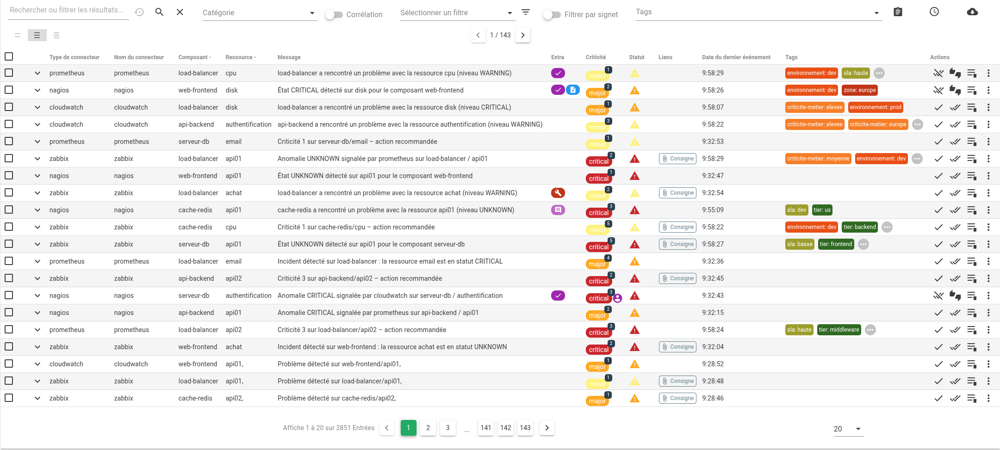
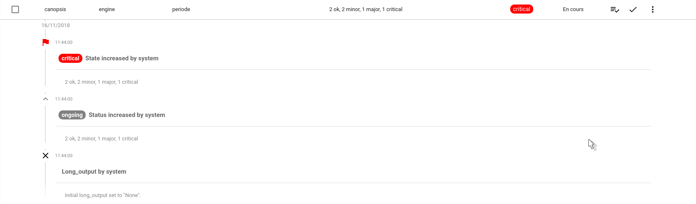
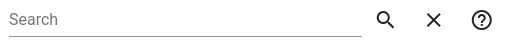
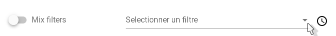
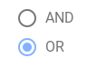
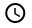
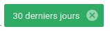
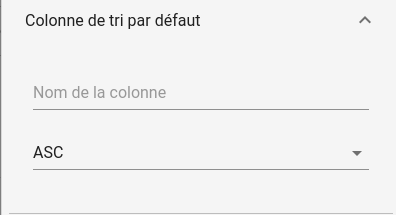
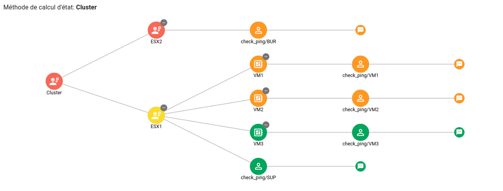

# Bac à alarmes



## Utilisation courante

### Alarmes

Le tableau d'alarmes présente la liste des alarmes. Une ligne correspond à une alarme.
Les colonnes affichées sont personnalisables (*Cf: [Guide exploitant](#guide-exploitant)*).
En plus de détails de l'alarme, chaque ligne expose une liste d'actions opérables sur l'alarme (*Cf: [Actions](#actions)*).

Il est possible d'attacher à chaque colonne une Info popup, qui s'ouvrira au clic sur le texte de la colonne, présentant dans une fenêtre un texte personnalisable (*Cf: [Guide exploitant](#guide-exploitant)*).

Au clic sur une alarme (en dehors du texte des colonnes), la chronologie de l'alarme s'affiche.



Cette chronologie reprend certains éléments du cycle de vie de l'alarme (notamment les actions effectuées sur celle-ci).

### Recherche

Le champ de recherche permet de réaliser une recherche parmi les alarmes.



Pour faire une recherche 'simple', il suffit d'entrer les termes de la recherche dans le champ de texte, puis d'appuyer sur la touche Entrée, ou de cliquer sur l'icone 

Dans le bac à alarmes, il est possible d'effectuer des recherches plus avancées. Une aide concernant la syntaxe à utiliser est disponible en survolant avec la souris l'icone d'aide . Une documentation est également disponible pour cette aspect [ici](../../recherche/index.md) !

Pour supprimer la recherche, cliquez sur l'icone 

### Filtres

Le sélecteur de filtre permet d'appliquer un filtre sur le Bac à alarmes. Seules les alarmes correspondant aux critères du filtres seront affichées.



Pour sélectionner un filtre, il suffit de cliquer sur le champ 'Sélectionner un filtre'. Une liste des filtres disponibles apparaît.
Cliquez sur un filtre. Celui-ci est sélectionné et directement appliqué.
Pour ne plus appliquer de filtre, il suffit de cliquer sur l'icone présent au bout du champ de sélection de filtre. Le bac à alarmes se rafraichit, le champ de sélection revient dans état initial, le filtre n'est plus appliqué !

#### Mix filters

L'option "Mix filters", présente à gauche du sélecteur de filtre permet de cumuler plusieurs filtres.

Pour activer cette option, cliquez sur le bouton .
Une fois l'options activée, un sélecteur apparaît à droite du bouton d'activation . Ce sélecteur permet de choisir l'opérateur utilisé pour réunir les filtres.

- "AND": Les critères présents dans tout les filtres doivent êtres vérifiés
- "OR": Les critères présents dans un ou plusieurs des filtres doivent êtres vérifiés.

Une fois l'opérateur sélectionné, il ne vous reste plus qu'à sélectionner les filtres à appliquer dans le menu déroulant de sélection de filtres.

#### Suivi personnalisé

Le Suivi personnalisé sert à paramétrer des filtres par période. Ils permet de filtrer les alarmes en ne conservant que les alarmes d'une période donnée.

Ce filtre est disponible en cliquant sur l'icone  présente à droite du sélecteur de filtre. Une fenêtre apparaît.


Il suffit alors de sélectionner la période souhaitée parmi les périodes prédéfinies, ou d'en créer une personalisée en sélectionnant 'Custom', puis en renseignant les dates de début et de fin.

Dans un bac à alarmes en cours, le filtre est appliqué sur la date de création.

Dans un bac à alarmes résolues, le filtre est appliqué sur la date de résolution.

Cliquez ensuite sur 'Appliquer'.

La fenêtre se ferme, le bac à alarmes se rafraîchit. Votre filtre par période est appliqué.
Celui-ci est visible en haut du Bac à alarmes.



Afin de supprimer ce filtre, cliquez sur le bouton de fermeture présent sur le filtre (*Cf Image ci-dessus*)

#### Lien direct vers une alarme

Vous pouvez accéder à une alarme en particulier grâce à une URL directe.  
Cette URL est de la forme : `http(s)://URL_CANOPSIS/alarms/<alarmID>[?widgetId=<widgetID>]`.  

* `<alarmID>` **(requis)** : correspond à l'attribut `_id` de l'alarme.
* `<widgetID>` **(optionnel)** : correspond à l'identifiant d'un widget. Lorsque cet identifiant est précisé, la configuration du widget s'applique (colonnes, plus d'infos, etc.)

L'identifiant d'un widget est disponible pour copie dans le mode **édition** d'une vue en bas d'un widget.

### Actions

Pour chaque alarme, des actions sont disponibles.

Pour le détail de chacune des actions, voir la [liste des actions](actions.md) du Bac à alarmes.

### Éléments par page

Le champ 'Eléments par page' permet de sélectionner le nombre d'alarmes à afficher sur chaque page.

Le choix par défaut est réglable dans les paramètres du bac à alarmes (*Cf: [Guide exploitant](#guide-exploitant)*)

### Suivi personnalisé

Le champ 'Eléments par page' permet de sélectionner le nombre d'alarmes à afficher sur chaque page.

Le choix par défaut est réglable dans les paramètres du bac à alarmes (*Cf: [Guide exploitant](#guide-exploitant)*)

## Paramètres du widget

### Titre (*optionnel*)

Ce paramètre permet de définir le titre du widget, qui sera affiché au dessus de celui-ci.

Un champ de texte vous permet de définir ce titre.

### Intervalle de date

Ce paramètre permet de définir un intervalle de date pour "borner" les alarmes à afficher.  
Le critère de temps peut être :

* Date de création de l'alarme
* Date de résolution de l'alarme
* Date de la dernière mise à jour de l'alarme
* Date du dernier événement reçu par l'alarme

### Colonnes

#### Colonne de tri par défaut

Ce paramètre permet de définir la colonne par laquelle trier les alarmes.



Un sélecteur vous permet ensuite de définir le sens de tri :

*  "ASC" = Ascendant
*  "DESC" = Descendant

#### Nom des colonnes

Les paramètres qui sont décrits dans ce paragraphe concernent les éléments suivants :

* Nom des colonnes : colonnes affichées pour le bac à alarmes
* Nom des colonnes des méta alarmes : colonnes affichées pour les alarmes conséquences des méta alarmes
* Nom des colonnes pour la source de suivi des alarmes : colonnes visbles dans l'onglet "Suivi"

Afin d'**ajouter une colonne**, cliquez sur le bouton :material-plus:.
Il vous reste alors à sélectionner la colonne souhaitée dans la liste.

!!! tip "Astuce"
    Vous pouvez modifier le label de la colonne en activant l'option "Etiquette personnalisée".
    Cela est très utile lorsque vous utilisez des informations enrichies.

Pour supprimer une colonne, cliquez dans la liste des colonnes sur la croix rouge présente en haut à droite de la case de la colonne que vous souhaitez effacer.

L'ordre des colonnes est modifiable par drag'n drop.

!!! tip "Recommandation"
    Il est recommandé de définir un [modèle de colonnes/template](../../../menu-administration/parametres/#modeles-de-widgets) pour faciliter la maintenance générale.

#### Paramètres des colonnes

Vous pouvez activer 2 options liées à la représentation graphique des colonnes :

* Glisser/déposer les colonnes : permet à l'utilisateur de gérer graphiquement l'ordre des colonnes par drag'n drop
* Redimensionner : permet à l'utilisateur de définir graphiquement la largeur des colonnes

#### Paramètres du diagramme de cause racine

Les dépendances d'une entité peuvent être visualisées sous forme de diagramme, accessible depuis la colonne de criticité/sévérité.
Vous pouvez choisir de présenter les dépendances avec leur sévérité ou leur priorité.



#### Fenêtre d'information pour la colonne

Chaque colonne du bac à alarmes peut être accompagnée d'une popup d'informations complémentaires.  
Ce paramètre permet de définir les informations que vous souhaitez afficher. 
L'éditeur wysiwyg met à disposition une liste de variables accessibles pour chaque alarme via le bouton `(X)`.

!!! tip "Astuce"
    Les [helpers handlebars](../helpers/index.md) peuvent être utilisés dans l'éditeur

### Filtres

#### Filtres

Ce paramètre permet de définir les filtres qui seront mis à disposition des utilisateurs.  
Pour plus de détails sur les filtres et leur création, voir la partie sur [Les filtres](../../patterns/).

Pour créer un filtre, cliquez sur le bouton 'Ajouter'. Une fenêtre de création de filtre s'ouvre alors.
Vous avez la possibilité d'éditer ou de supprimer des filtres existants et de définir un filtre à appliquer par défaut.

#### Filtre sur Ouverte/Résolue

Ce paramètre permet de choisir le contexte de calcul des filtres.

* Alarmes ouvertes : les filtres sont appliqués sur les alarmes ouvertes uniquement.
* Alarmes ouvertes et récemment résolues : les filtres s'appliquent sur les alarmes ouvertes ainsi que les alarmes résolues depuis moins de `TimeToKeepResolvedAlarms` (Voir [la documentation du fichier canopsis.toml](../../../../guide-administration/administration-avancee/modification-canopsis-toml/#section-canopsisalarm)).
* Alarmes résolues : les filtres s'appliquent sur les alarmes résolues uniquement.

#### Filtres de consignes

Ce paramètre permet de fixer un filtre de "consigne" qui sera appliquée au bac à alarmes.  
Un filtre de consigne consiste à sélectionner des alarmes avec des critères de remédiation particuliers :

* Sélectionner les alarmes avec des consignes particulières attachées
* Sélectionner les alarmes avec des consignes particulières non attachées
* Afficher les alarmes avec une remédiation en cours
* Masquer les alarmes avec une remédiation en cours

#### Corrélation

Lorsque ce paramètre est activé, les [méta alarmes](../../menu-exploitation/regles-metaalarme/index.md) sont présentées sur la bac à alarmes avec la possibilité de visualiser les alarmes conséquences dans un onglet dédié.  
Lorsqu'il est désactivé, les méta alarmes sont masquées.

#### Effacement du filtre sélectionné autorisé

Ce paramètre gère l'autorisation pour un utilisateur de supprimer le filtre sélectionné.

### Vue

#### Nombre d'éléments par page par défaut

Ce paramètre permet de définir le nombre d'alarmes qui seront affichés, par défaut, pour chaque page du bac à alarmes.

#### Densité de table par défaut

Le bac à alarmes peut afficher plus ou moins d'alarmes sur une page.  

* Vue confort : L'affichage est aéré, permet d'afficher entre 10 et 20 alarmes par page
* Vue compacte : L'affichage est plus compact, il est adapté pour 20 à 50 alarmes par page
* Vue ultra compacte : L'affichage est ultra compact, pour un maximum d'alarmes par page

#### Mode kiosque

Canopsis met à disposition un mode "kiosque" pour chaque vue, accessible via une URL construite de la manière suivante :

```
https://canopsis/kiosk-views/<view_id>/<tab_id>
```

Ces vues sont adaptées pour des écrans d'informations, de communication dans les couloirs, ou tout simplement sur les murs de salle de supervision.


* Masquer les actions : La colonne action est masquée
* Masquer la sélection en masse : Les actions de masse sont masquées
* Masquer la barre des tâches : La barre d'entête (recherche, filtre, tags, etc) est masquée

#### Entête collant

Lorsque cette option est activée, les entêtes de colonnes restent affichées en scrollant verticalement.

#### Défilement horizontal fixe

??

#### Rendre les éléments lors du défilement

??

### Actions

#### Acquittement

* Ack - champ de note obligatoire : Obligation de saisir un message lors de l'acquittement d'un alarme
* Acquittements multiples : Possibilité d'acquitter plusieurs fois une alarme
* Commentaire d'acquittement rapide : Message qui sera utilisé lors d'un acquittement rapide (fast ack)

#### Annuler

* Commentaire d'annulation rapide : Message qui sera utilisé lors d'une annulation rapide d'alarme
* Annuler - champ de commentaire obligatoire : Obligation de saisir un message lors de l'annulation d'une alarme

#### Comportement périodique rapide

* Préfixe du nom : Préfixe utilisé pour générer le nom du comportement périodique pour l'action "Comportement périodique rapide"
* Type du comportement périodique : Seuls les types avec le type canonique "Pause" sont listés et utilisables
* Raison du comportement périodique

#### Snooze

* Snooze - champ de note obligatoire : Obligation de saisir un message lors de la mise en veille d'une alarme

#### Méta-alarmes

* Supprimer les alarmes de la méta-aalrme manuelle - champ de commentaire requis : Obligation de saisir un message lors de la suppression d'appartenance d'une alarme à une méta alarme

#### Déclarer un ticket multiple

* Déclarer un ticket multiple : Possibilité de déclarer plusieurs tickets sur une alarme

#### Actions autorisées lorsque l'état est OK

* Actions autorisées lorsque l'état est OK : Possibilité d'exécuter toutes les actions sur une alarme dont la sévérité est "OK"

#### Modèle pour l'export PDF

Vous pouvez personnaliser le PDF qui sera généré lors de l'export d'une alarme.  

### Agrandir le panneau

#### Plus d'infos

Ce paramètre permet de définir le contenu de la fenêtre plus d'infos. Le bouton permettant d'ouvrir cette fenêtre se trouve dans les actions de chaque alarme du bac à alarmes.

Ce champ se présente sous forme d'un éditeur de texte.
Le langage utilisé dans cet éditeur est le [Handlebars](../helpers/index.md).

Par ailleurs, vous pouvez ajuster la largeur occupée par la fenêtre "Plus d'infos".

#### Paramètres du graphique de disponibilité

Vous pouvez activer la possibilité de visualiser dans un onglet de l'alarme le [graphique de disponibilité](../disponibilite/index.md) de l'entité de l'alarme.

#### HTML activé dans la chronologie

En activant cette option, vous activez l'interprétation HTML dans la fenêtre de chronologie d'une alarme

### Exporter CSV

Vous avez à disposition les paramètres d'export CSV de la liste d'alarmes.

### Graphiques

Vous pouvez ajouter un onglet dédié aux graphiques d'une alarme.  
Pour plus d'informations concernant les métriques utilisables, consultez [cette documentation](../graphiques/index.md)
