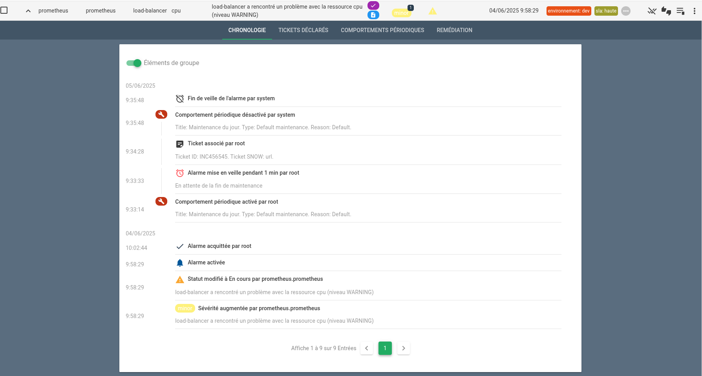
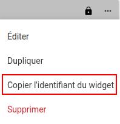
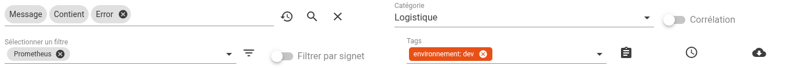

# Bac à alarmes

Le widget **Bac à alarmes** est l’un des composants centraux de l’interface Canopsis.  
Il permet d’**afficher, filtrer et interagir avec les alarmes en temps réel**, issues de l’ensemble du système d’information.

Ce widget offre une vue structurée et dynamique des alarmes actives, avec la possibilité d’intervenir directement sur chacune d’elles (acquittement, commentaire, ticketing, mise en maintenance, etc.).

Il est souvent utilisé dans les vues principales des exploitants et NOC pour assurer un suivi réactif des incidents en cours.

## Utilisation courante

### Alarmes

Le tableau [d'alarmes](../../../vocabulaire/#alarme) présente la liste des alarmes. Une ligne correspond à une alarme.  
Les colonnes affichées sont personnalisables ([Paramètres colonnes](#colonnes)).
En plus des détails de l'alarme, chaque alarme est éligible à des [actions](#actions).

Il est possible d'attacher à chaque colonne une [Info popup](#fenetre-dinformation-pour-la-colonne), qui s'ouvrira au clic sur le texte de la colonne, présentant dans une fenêtre un texte personnalisable.

Au clic sur le chevron d'une alarme (tout à gauche), la chronologie de l'alarme s'affiche.

Tous les changements opérés sur une alarme sont indiqués dans cette chronologie.

### Lien unique d'alarme

Vous pouvez accéder à une alarme en particulier grâce à une URL directe.  
Cette URL est de la forme : `http(s)://URL_CANOPSIS/alarms/<alarmID>[?widgetId=<widgetID>]`.  

* `<alarmID>` **(requis)** : correspond à l'attribut `_id` de l'alarme.
* `<widgetID>` **(optionnel)** : correspond à l'identifiant d'un widget. Lorsque cet identifiant est précisé, la configuration du widget s'applique (colonnes, plus d'infos, etc.)

L'identifiant d'un widget est disponible pour copie dans le mode **édition**.  

### Filtrage des alarmes

Tout l'entête du widget est prévu pour filtrer les alarmes à afficher dans la liste.

#### Recherche

Le bac à alarmes met à disposition 2 types de recherche, la recherche simple et l'avancée.  

**Recherche simple**

Il s'agit d'une recherche textuelle, opérée parmi les colonnes affichées sur le bac.  
Cette recherche est également capable de rechercher parmi les alarmes conséquences d'une méta-alarme.

**Recherche avancée**

La recherche avancée est accessible en cliquant dans la zone de recherche.  

Séquence :

* Des suggestions de champs sont présentées à l'utilisateur : Composant, Information d'entité, Message de l'alarme, etc.
* Le module complète avec des opérateurs en fonction du champ précédent : Egal, Contient, Est l'un de, etc.
* L'utilisateur complète la valeur attendue par l'opérateur
* Le module propose de combiner la recherche avec un opérateur `ET` ou `OU`. 
    * En cliquant sur la :material-magnify:, la recherche se lance
    * En sélectionnant un opérateur, une nouvelle séquence démarre

#### Catégorie

Il est possible d'afficher les alarmes dont l'entité est attachée à une [catégorie](../contexte/#categorie)

#### Filtres

L'utilisateur peut sélectionner un [filtre](../../patterns/) parmi la liste. 

Il peut également, selon ses droits, gérer ses propres filtres en cliquant sur le bouton :material-filter-variant:.

#### Signet / Bookmark

En activant cette option, seules les alarmes marquées avec un signet (bookmarquées) sont affichées.

#### Tags

La zone `Tags` permet de filtrer la liste des alarmes en fonction des tags qui leur sont assignés. La multi sélection est permise.  
Si le bac à alarme présente la colonne `tags` alors il est possible de cliquer sur un tag pour sélectionner les alarmes disposant de ce tag.

#### Intervalle de date

Ce paramètre permet de définir un intervalle de date pour "borner" les alarmes à afficher.
Le critère de temps peut être :

* Date de création de l'alarme
* Date de résolution de l'alarme
* Date de la dernière mise à jour de l'alarme
* Date du dernier événement reçu par l'alarme

### Corrélation

Lorsque ce paramètre est activé, les [méta alarmes](../../../menu-exploitation/regles-metaalarme/index.md) sont présentées sur la bac à alarmes avec la possibilité de visualiser les alarmes conséquences dans un onglet dédié.
Lorsqu'il est désactivé, les méta alarmes sont masquées.

### Export CSV

En cliquant sur le bouton :material-cloud-download:, un fichier CSV vous sera proposé en téléchargement.  
Les options de l'export sont définis dans les [paramètres du widget](#exporter-csv)

### Actions

Pour chaque alarme, des actions sont disponibles.

Pour le détail de chacune des actions, voir la [liste des actions](actions.md) du Bac à alarmes.

## Paramètres du widget

### Titre (*optionnel*)

Ce paramètre permet de définir le titre du widget, qui sera affiché au dessus de celui-ci.

Un champ de texte vous permet de définir ce titre.

### Intervalle de date

Ce paramètre permet de définir un intervalle de date pour "borner" les alarmes à afficher.  
Le critère de temps peut être :

* Date de création de l'alarme
* Date de résolution de l'alarme
* Date de la dernière mise à jour de l'alarme
* Date du dernier événement reçu par l'alarme

### Colonnes

#### Colonne de tri par défaut

Ce paramètre permet de définir la colonne par laquelle trier les alarmes.

Un sélecteur vous permet ensuite de définir le sens de tri :

*  "ASC" = Ascendant
*  "DESC" = Descendant

#### Nom des colonnes

Les paramètres qui sont décrits dans ce paragraphe concernent les éléments suivants :

* Nom des colonnes : colonnes affichées pour le bac à alarmes
* Nom des colonnes des méta alarmes : colonnes affichées pour les alarmes conséquences des méta alarmes
* Nom des colonnes pour la source de suivi des alarmes : colonnes visbles dans l'onglet "Suivi"

Afin d'**ajouter une colonne**, cliquez sur le bouton :material-plus:.
Il vous reste alors à sélectionner la colonne souhaitée dans la liste.

Chaque colonne peut être configurée plus finement en fonction de son type :

| Option                      | Utilisation                                                                                 |
| --------------------------- | ------------------------------------------------------------------------------------------- |
| **Étiquette personnalisée** | Définit un alias à afficher pour la colonne.                                                |
| **Modèle personnalisé**     | Personnalise le contenu affiché dans la colonne à l'aide d'un template Handlebars.          |
| **Interprétation HTML**     | Permet d'afficher le HTML contenu dans la colonne (au lieu de le montrer comme texte brut). |
| **Indicateur de couleur**   | Ajoute un fond coloré en fonction de la sévérité ou de la priorité de l'alarme.             |
| **Filtre au clic**          | Déclenche une recherche basée sur le contenu de la colonne lorsqu'on clique dessus.         |

Pour supprimer une colonne, cliquez dans la liste des colonnes sur la croix rouge présente en haut à droite de la case de la colonne que vous souhaitez effacer.

L'ordre des colonnes est modifiable par drag'n drop.

!!! tip "Recommandation"
    Il est recommandé de définir un [modèle de colonnes/template](../../../menu-administration/parametres/#modeles-de-widgets) pour faciliter la maintenance générale.

#### Paramètres des colonnes

Vous pouvez activer 2 options liées à la représentation graphique des colonnes :

* Glisser/déposer les colonnes : permet à l'utilisateur de gérer graphiquement l'ordre des colonnes par drag'n drop
* Redimensionner : permet à l'utilisateur de définir graphiquement la largeur des colonnes

#### Paramètres du diagramme de cause racine

Les dépendances d'une entité peuvent être visualisées sous forme de diagramme, accessible depuis la colonne de criticité/sévérité.
Vous pouvez choisir de présenter les dépendances avec leur sévérité ou leur priorité.

#### Fenêtre d'information pour la colonne

Chaque colonne du bac à alarmes peut être accompagnée d'une popup d'informations complémentaires.  
Ce paramètre permet de définir les informations que vous souhaitez afficher. 
L'éditeur wysiwyg met à disposition une liste de variables accessibles pour chaque alarme via le bouton `(X)`.

!!! tip "Astuce"
    Les [helpers handlebars](../helpers/index.md) peuvent être utilisés dans l'éditeur

### Filtres

#### Filtres

Ce paramètre permet de définir les filtres qui seront mis à disposition des utilisateurs.  
Pour plus de détails sur les filtres et leur création, voir la partie sur [Les filtres](../../patterns/).

Pour créer un filtre, cliquez sur le bouton 'Ajouter'. Une fenêtre de création de filtre s'ouvre alors.
Vous avez la possibilité d'éditer ou de supprimer des filtres existants et de définir un filtre à appliquer par défaut.

#### Filtre sur Ouverte/Résolue

Ce paramètre permet de choisir le contexte de calcul des filtres.

* Alarmes ouvertes : les filtres sont appliqués sur les alarmes ouvertes uniquement.
* Alarmes ouvertes et récemment résolues : les filtres s'appliquent sur les alarmes ouvertes ainsi que les alarmes résolues depuis moins de `TimeToKeepResolvedAlarms` (Voir [la documentation du fichier canopsis.toml](../../../../guide-administration/administration-avancee/modification-canopsis-toml/#section-canopsisalarm)).
* Alarmes résolues : les filtres s'appliquent sur les alarmes résolues uniquement.

#### Filtres de consignes

Ce paramètre permet de fixer un filtre de "consigne" qui sera appliquée au bac à alarmes.  
Un filtre de consigne consiste à sélectionner des alarmes avec des critères de remédiation particuliers :

* Sélectionner les alarmes avec des consignes particulières attachées
* Sélectionner les alarmes avec des consignes particulières non attachées
* Afficher les alarmes avec une remédiation en cours
* Masquer les alarmes avec une remédiation en cours

#### Corrélation

Lorsque ce paramètre est activé, les [méta alarmes](../../menu-exploitation/regles-metaalarme/index.md) sont présentées sur la bac à alarmes avec la possibilité de visualiser les alarmes conséquences dans un onglet dédié.  
Lorsqu'il est désactivé, les méta alarmes sont masquées.

#### Effacement du filtre sélectionné autorisé

Ce paramètre gère l'autorisation pour un utilisateur de supprimer le filtre sélectionné.

### Vue

#### Nombre d'éléments par page par défaut

Ce paramètre permet de définir le nombre d'alarmes qui seront affichés, par défaut, pour chaque page du bac à alarmes.

#### Densité de table par défaut

Le bac à alarmes peut afficher plus ou moins d'alarmes sur une page.  

* Vue confort : L'affichage est aéré, permet d'afficher entre 10 et 20 alarmes par page
* Vue compacte : L'affichage est plus compact, il est adapté pour 20 à 50 alarmes par page
* Vue ultra compacte : L'affichage est ultra compact, pour un maximum d'alarmes par page

#### Mode kiosque

Le mode Kiosque permet d'adapter l'affichage du bac à alarmes pour une utilisation sur écran de supervision, en masquant les éléments non essentiels et en facilitant la lecture à distance.  
La documentation du mode kiosque est disponible sur la page [Mode TV (ou Kiosque) ](./mode-kiosque.md)

#### Entête collant

Lorsque cette option est activée, les entêtes de colonnes restent affichées en scrollant verticalement.

#### Défilement horizontal fixe

??

#### Rendre les éléments lors du défilement

??

### Actions

#### Acquittement

* Ack - champ de note obligatoire : Obligation de saisir un message lors de l'acquittement d'un alarme
* Acquittements multiples : Possibilité d'acquitter plusieurs fois une alarme
* Commentaire d'acquittement rapide : Message qui sera utilisé lors d'un acquittement rapide (fast ack)

#### Annuler

* Commentaire d'annulation rapide : Message qui sera utilisé lors d'une annulation rapide d'alarme
* Annuler - champ de commentaire obligatoire : Obligation de saisir un message lors de l'annulation d'une alarme

#### Comportement périodique rapide

* Préfixe du nom : Préfixe utilisé pour générer le nom du comportement périodique pour l'action "Comportement périodique rapide"
* Type du comportement périodique : Seuls les types avec le type canonique "Pause" sont listés et utilisables
* Raison du comportement périodique

#### Snooze

* Snooze - champ de note obligatoire : Obligation de saisir un message lors de la mise en veille d'une alarme

#### Méta-alarmes

* Supprimer les alarmes de la méta-aalrme manuelle - champ de commentaire requis : Obligation de saisir un message lors de la suppression d'appartenance d'une alarme à une méta alarme

#### Déclarer un ticket multiple

* Déclarer un ticket multiple : Possibilité de déclarer plusieurs tickets sur une alarme

#### Actions autorisées lorsque l'état est OK

* Actions autorisées lorsque l'état est OK : Possibilité d'exécuter toutes les actions sur une alarme dont la sévérité est "OK"

#### Modèle pour l'export PDF

Vous pouvez personnaliser le PDF qui sera généré lors de l'export d'une alarme.  

#### Actions rapides

Les actions présentées dans la colonnes "actions" peuvent être sélectionnées et ordonnées.

#### Actions massives rapides

Les actions de masse présentées dans l'entête peuvent être sélectionnées et ordonnées.

### Agrandir le panneau

#### Plus d'infos

Ce paramètre permet de définir le contenu de la fenêtre plus d'infos. Le bouton permettant d'ouvrir cette fenêtre se trouve dans les actions de chaque alarme du bac à alarmes.

Ce champ se présente sous forme d'un éditeur de texte.
Le langage utilisé dans cet éditeur est le [Handlebars](../helpers/index.md).

Par ailleurs, vous pouvez ajuster la largeur occupée par la fenêtre "Plus d'infos".

#### Paramètres du graphique de disponibilité

Vous pouvez activer la possibilité de visualiser dans un onglet de l'alarme le [graphique de disponibilité](../disponibilite/index.md) de l'entité de l'alarme.

#### HTML activé dans la chronologie

En activant cette option, vous activez l'interprétation HTML dans la fenêtre de chronologie d'une alarme

### Exporter CSV

Vous avez à disposition les paramètres d'export CSV de la liste d'alarmes.

### Graphiques

Vous pouvez ajouter un onglet dédié aux graphiques d'une alarme.  
Pour plus d'informations concernant les métriques utilisables, consultez [cette documentation](../graphiques/index.md)
