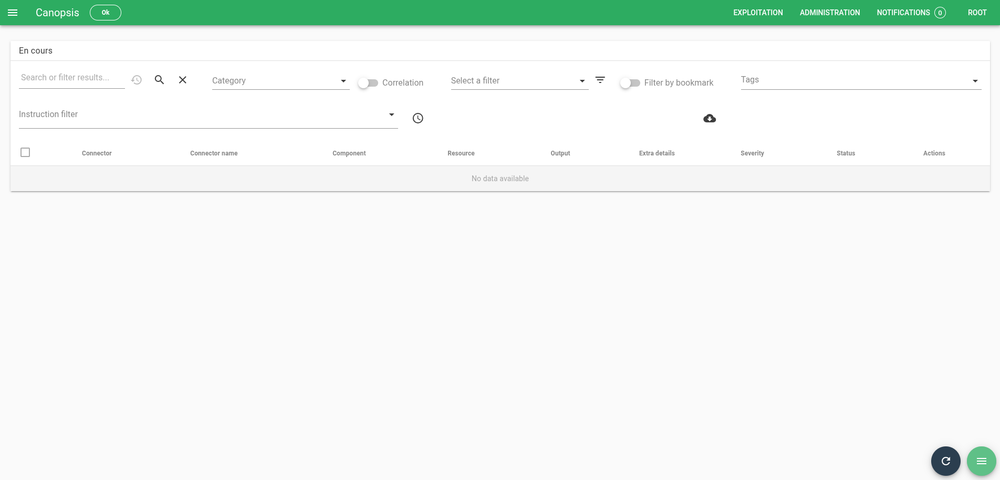
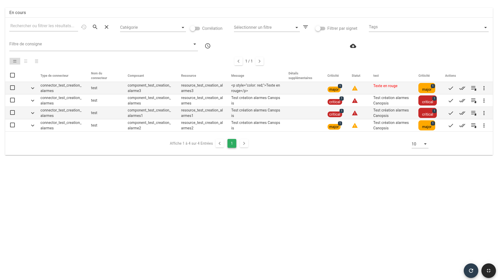
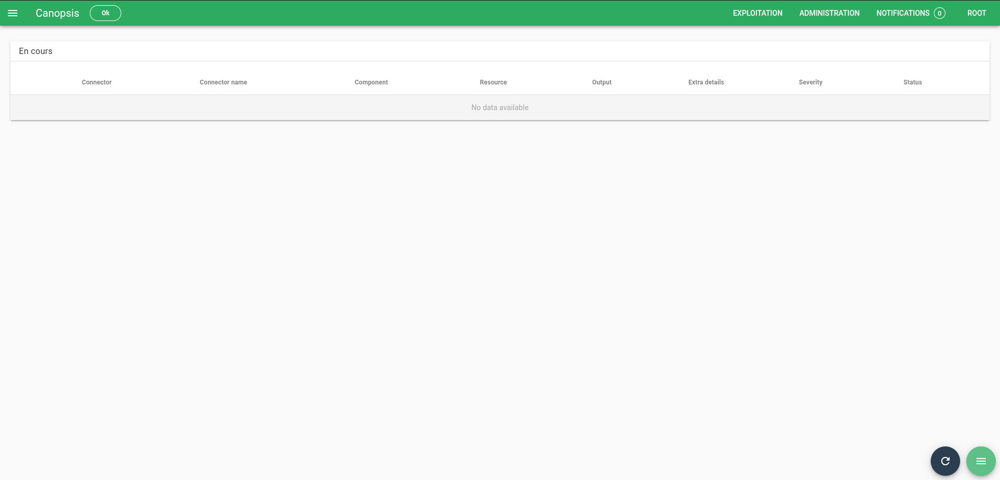
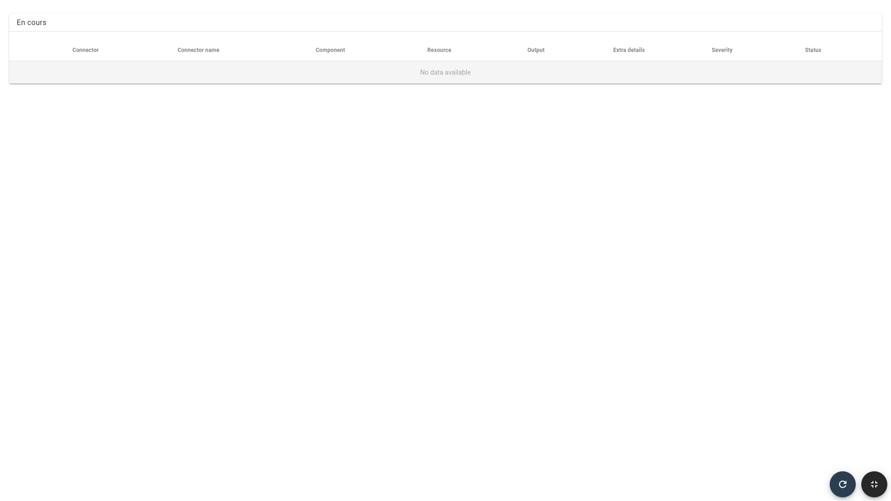

# Mode TV (ou Kiosque) 

Le mode TV (ou mode Kiosque) est un mode disponible dans les vues de Canopsis, il permet de changer la manière dont les informations sont affichées à l'écran pour être adapté à des écrans de supervision (visible par plusieurs opérateurs sur le même site. Par exemple: dans un service informatique ou un service de supervision).

## Types de vues disponibles

Le mode TV propose 3 types d'affichage :

1. [Plein écran](#plein-ecran) 
2. [Kiosque uniquement](#kiosque-uniquement) 
3. [Kiosque + Plein écran](#kiosque-plein-ecran) 

## Accéder au mode Kiosque

2 possibilités existent pour activer le mode Kiosque :

1. Depuis la bac à alarme, en passant en mode édition ou en utilisant les raccourcis
2. En accédant directement à l'URL: `https://[canopsis]/kiosk-views/<ID de la vue>/<ID de l'onglet>` *(Ces deux identifiants peuvent être trouvés dans l'URL lorsque vous êtes sur le bac à alarmes)*

## Configurer le mode kiosque du widget

Pour configurer le mode kiosque

1. Passez en mode édition (CTRL + E)
2. Ouvrez le menu `...` dans l'onglet `Vues`
3. Sélectionnez `Mode kiosque`

Options disponibles :

| Option                         | Utilisation                                          |
|--------------------------------|------------------------------------------------------|
| Masquer les actions            | Supprime la colonne des actions rapides.             |
| Masquer la sélection de masse  | Supprime la colonne permettant la sélection multiple |
| Masquer la barre des tâches    | Supprime la barre des tâches                         |

## Modes d'affichage

### Affichage par défaut

*Raccourcis: Alt/CMD + Shift + 1*

### Plein écran

*Raccourcis: Alt/CMD + Shift + 2*

Le mode plein écran affiche la vue en cours en masquant la barre de navigation supérieure et la barre latérale.

!!! info "Information"
    Ce mode n’applique pas les paramètres définis dans le menu Mode kiosque.

### Kiosque uniquement

*Raccourcis: Alt/CMD + Shift + 3*

Le mode Kiosque affiche la vue selon la configuration définie dans Édition > Vues > Mode kiosque.

### Kiosque + Plein écran

*Raccourcis: Alt/CMD + Shift + 4*

Le mode Kiosque + Plein écran combine les deux modes : il affiche la vue en plein écran tout en appliquant la configuration du mode kiosque.

### En tête de Canopsis

Par défaut, l’en-tête de Canopsis est masqué en mode kiosque.  
Pour l’afficher :

1. Rendez-vous dans Administration > Paramètres.
2. Activez l’option Afficher l’en-tête en mode kiosque.

!!! info "Information"
    Cette option n’est pas disponible pour le mode Kiosque + Plein écran.

