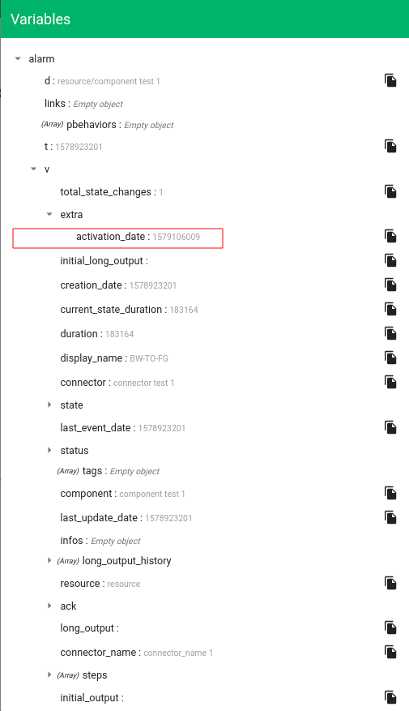
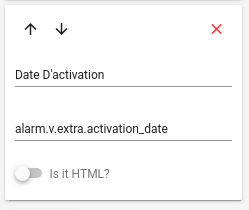
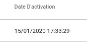

# Personnalisation des typages

## Affichage de type de données formatées dans une colonne

Il est possible de choisir un formatage de donnée particulier pour les champs présents et affichés dans une colonne du Bac à alarmes de Canopsis.

Pour cela, il faut au préalable ajouter des règles de conversion via l'API `associativetable` qui sauvegardera dans un champ `alarm-column-filters`  de la collection MongoDB `default_associativetable`

### Envoi via l'API

Voici un exemple de configuration avec ajout de `2 règles`

```sh
curl -H "Content-Type: application/json" -X POST -u root:root -d '{
    "filters" : 
    [
      {
        "column": "v.extra.activation_date",
        "filter": "date",
        "attributes": ["long"]
      },
      {
        "column": "v.duration",
        "filter": "duration"
      }
    ]
}' http://localhost:8082/api/v2/associativetable/alarm-column-filters
```

Dans cet exemple, nous allons configurer `2 valeurs de colonne` avec un rendu particulier.

Toute colonne qui afficherait :

* l'attribut `v.extra.activation_date` initialement de type `timestamp Unix` qui sera affiché en format `date` de type `long` (voir [matrice de correspondance](#les-attributs-lies-aux-dates-peuvent-contenir-plusieurs-type-de-formats) des types d'attributs liés au filtre date)
* l'attribut `v.duration` initialement en secondes qui sera affiché en format `duration` de type durée par défaut

### Les filtres utilisés (attribut `filter`) peuvent contenir plusieurs valeurs

* `date` 
  
    * `attributes` possibles (tableau de valeurs)
      
        * 1) Format (voir [matrice de correspondance](#les-attributs-lies-aux-dates-peuvent-contenir-plusieurs-type-de-formats) des types d'attributs liés au filtre date)
    	* 2) `true` ou `false` (valeur par défaut si non précisée) : Ignore la vérification du jour courant
        * 3) Valeur par défaut à mettre dans l'attribut si aucune valeur n'est présente dans l'explorateur de contexte
        
    * Exemple
    
```json
{
  column: "v.last_update_date",
  filter: "date",
  attributes: [
    "timePicker",
    false,
    "Default value"
  ]
}
```
    
        
    
* `duration`
  
    * `attributes` possibles (tableau de valeurs)
        * 1) Locale (par défaut locale du navigateur)
            * Exemples
                * Rendu avec la locale `fr` : 27 jours 5 heures 6 minutes
                * Rendu avec la locale `en` : 27 days 5 hours 6 minutes

        * 2) Format de la Durée (par défaut - `'D __ H _ m _ s _'`)

#### Les attributs liés aux dates peuvent contenir plusieurs type de formats

* `long` - DD/MM/YYYY H:mm:ss
* `medium` - DD/MM H:mm
* `short` - DD/MM/YYYY
* `time` - H:mm:ss
* `dateTimePicker`  -  DD/MM/YYYY HH:mm
* `dateTimePickerWithSeconds` - DD/MM/YYYY HH:mm:ss
* `datePicker` - DD/MM/YYYY
* `timePicker` - HH:mm
* `timePickerWithSeconds` - HH:mm:ss
* `veeValidateDateTimeFormat` - dd/MM/yyyy HH:mm

Il est à noter que les champs utilisés ne peuvent être que des sous-éléments d'une `alarme` et pas d'une `entité`

Par défaut, la date du jour ne sera pas affichée (uniquement l'heure : format `timePicker`)

### Le fichier peut ensuite être envoyé via l'API pour charger la configuration

Attention à bien utiliser la méthode `POST` pour la première création de règle et `PUT` par la suite

```sh
curl -H "Content-Type: application/json" -X POST -u root:root -d @configuration.json http://localhost:8082/api/v2/associativetable/alarm-column-filters
```

### Accès à la configuration via l'UI

Nous allons configurer la personnalisation du champ `alarm.v.extra.activation_date` présent dans l'explorateur de contexte et correspondant au champ `v.extra.activation_date` envoyé à l'API [ci-dessus](#envoi-via-lapi)



Pour accéder au paramétrage de cette fonctionnalité de rendu côté interface Web, il faut :

* Passer en mode édition sur le widget de bac à alarmes
* Se rendre dans le menu de configuration du widget du bac à alarmes
* Aller dans le sous menu `Column names` du menu `Advanced Settings`


* Ajouter une colonne correspondant à un des types personnalisés dont l'affichage doit être rendu grâce aux filtres. Puis sauvegarder tout en bas du menu.



* L'affichage du rendu se fait dans la colonne paramétrée (par défaut la date du jour n'est pas affichée avec ce type de données)


* Elle s'affiche uniquement avec une date différente de la date du jour



* Voici le rendu de l'autre champ personnalisé envoyé à l'API (`alarm.v.duration` utilisé au niveau de la configuration du widget)


