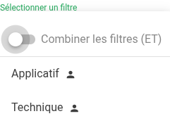
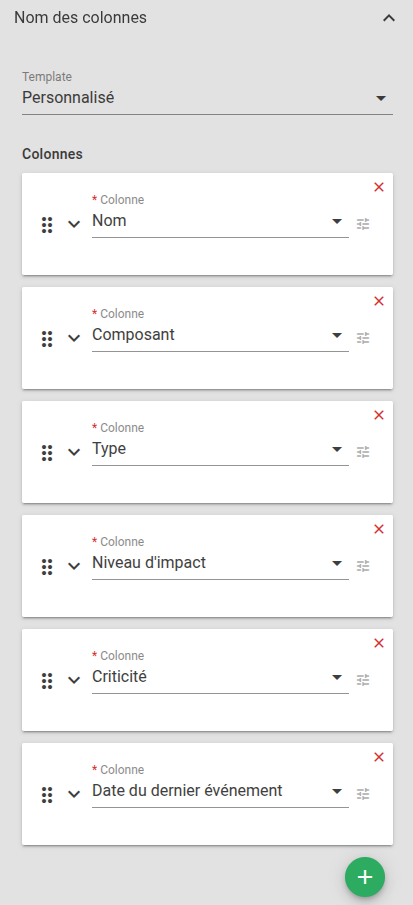

# Cartographie

## Utilisation courante

### Catégorie

Une entité peut être positionnée dans une "catégorie" au moment de sa création ou de son import.  
Le widget Cartographie permet de filtrer les entités selon ces catégories.

### Filtres

Le sélecteur de filtre permet d'appliquer un [filtre](../../patterns) sur la cartographie. Seules les entités correspondant aux critères du filtre seront affichées.

L'option "Combiner les filtres", présente dans l'entête du sélecteur de filtre, permet de cumuler plusieurs filtres avec un **ET logique**.

### Types de cartographies

Il existe 4 types de cartes :

* Géographique : nécessite les coordonnées des entités dans le référentiel
* Flowchart : réalisé à partir d'un "fond" de carte
* Mermaid : interprétation du format [Mermaid](https://mermaid.js.org/). Un [éditeur en ligne](https://mermaid.live) est disponible.
* Arbre de dépendances : modélisation des [services Canopsis](../../../services/)

### Actions

En fonction du type d'entité, plusieurs actions sont disponibles :

* **Clic sur une pastille** : Lorsqu'une pastille montre un nombre, il s'agit d'une pastille agrégée; Le clic effectuera un "zoom" sur la région. S'il s'agit d'une pastille d'entité alors le clic ouvrira une [modale](#parametres-daffichage-des-entites).

* **Voir les alarmes**: La modale permet l'ouverture d'un bac à alarmes présentant les alarmes liées à l'entité correspondante.

* **Zoom** : Les boutons "+" et "-", ou "Ctrl + molette de la souris" permettent d'agir sur le zoom de la carte.

## Paramètres du widget

### Titre (*optionnel*)

Ce paramètre permet de définir le titre du widget, qui sera affiché au dessus de celui-ci.

Un champ de texte vous permet de définir ce titre.

### Cartographie

Il s'agit ici de sélectionner la cartographie qui doit êtr présentée dans le widget.

### Paramètres d'affichage des entités

#### Indicateur de couleur
    
La couleur d'un tuile correspond t-elle à la sévérité ou la priorité du service ?

### Paramètres avancés

#### Filtres

Ce paramètre permet créer des [filtres](../../patterns/) qui seront appliquées sur les cartographies.

L'ordre des filtres est modifiable par drag'n drop.

#### Fenêtre contextuelle d'informations sur l'entité

Ce paramètre permet de personnaliser les informations affichées dans la modale des entités/

Le langage utilisé ici est le [Handlebars](../../../cas-d-usage/template_handlebars/).

Cliquez sur le bouton 'Afficher/Editer'. Une fenêtre s'ouvre avec un éditeur de texte. Entrez le texte souhaité pour le template des tuiles, puis cliquez sur 'Soumettre'.

L'ensemble des variables utiliables dans ce template pet être parcouru dans l'éditeur en cliquant sur l'icône `(x)`.

#### Colonnes

Les paramètres qui sont décrits dans ce paragraphe concernent les éléments suivants :

* Colonnes de la liste des alarmes : colonnes visbles dans l'onglet "Alarmes"
* Colonnes de l'explorateur de contexte : colonnes visibles lorsque l'on regarde les entités

Afin d'**ajouter une colonne**, cliquez sur le bouton :material-plus:.  
Il vous reste alors à sélectionner la colonne souhaitée dans la liste.  

!!! tip "Astuce"
    Vous pouvez modifier le label de la colonne en activant l'option "Etiquette personnalisée".  
    Cela est très utile lorsque vous utilisez des informations enrichies.

Pour supprimer une colonne, cliquez dans la liste des colonnes sur la croix rouge présente en haut à droite de la case de la colonne que vous souhaitez effacer.

L'ordre des colonnes est modifiable par drag'n drop.

!!! tip "Recommandation"
    Il est recommandé de définir un [modèle de colonnes/template](../../../menu-administration/parametres/#modeles-de-widgets) pour faciliter la maintenance générale.

