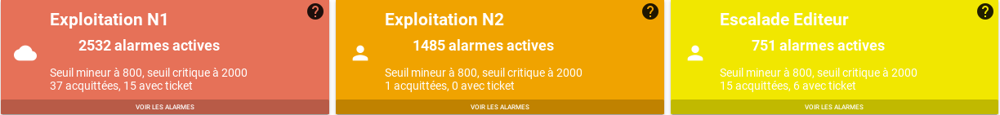
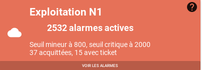

# Compteur

Le widget "Compteur" permet d'afficher, sous forme de tuiles numériques, le nombre d’alarmes correspondant à un ou plusieurs filtres prédéfinis.

Chaque tuile représente un filtre et indique en temps réel le total d’alarmes qui lui sont associées (d'autres types de compteurs sont également disponibles).

Ce widget est particulièrement utile pour visualiser en un coup d’oeil l’état global d’un périmètre, d’un service ou d’une application. La couleur de chaque tuile est configurable en fonction de seuils, afin d’attirer rapidement l’attention sur les situations critiques.

## Utilisation courante

### Les compteurs

Les compteurs sont relatifs à un [filtre d'alarmes][patterns].

| Compteur           | Variable                       | Signification |
| ------------------ |------------------------------- |-------------- |
| `total`            | {{ counter.total }}            | Nombre total d'alarmes |
| `total_active`     | {{ counter.total_active }}     | Nombre d'alarmes non mises en veille et sans comportement périodique actif |
| `snooze`           | {{ counter.snooze }}           | Nombre d'alarmes mises en veille |
| `ack`              | {{ counter.ack }}              | Nombre d'alarmes acquittées |
| `unack`            | {{ counter.unack }}            | Nombre d'alarmes non acquittées |
| `ticket`           | {{ counter.ticket }}           | Nombre d'alarmes avec un ticket d'incident associé |
| `pbehavior_active` | {{ counter.pbehavior_active }} | Nombre d'alarmes avec un comportement périodique actif |

### Les tuiles

L'ensemble des compteurs est présenté sous forme de tuiles. 

Exemple d'une tuile :

Chaque tuile est associée à un [filtre d'alarmes][patterns] et met à disposition un ensemble de compteurs relatifs à ce filtre.  
Le contenu textuel de cette tuile est personnalisable grâce à un template. Il permet de présenter les compteurs sous la forme souhaitée.

La couleur de la tuile et l'icône présente sur celle-ci représentent des dépassements de seuils.

#### La couleur et l'icône

La couleur et l'icône de la tuile représentent l'atteinte ou non d'un seuil défini pour un des compteurs.  
Le compteur de référence ainsi que les seuils doivent être spécifiés dans les paramètres du widget.

Exemple :
Le compteur principal d'alarmes vaut 250, le seuil `mineur` vaut 100, le seuil `majeur` vaut 200, et le seuil critique vaut 300.

- Vert/Soleil: Le compteur principal est < seuil mineur
- Jaune/Personne: Le compteur principal est < seuil majeur
- Orange/Personne: Le compteur principal est < seuil critique
- Rouge/Nuage: Le compteur principal est > seuil critique

## Paramètres du widget

### Aide - Variables

Lors de la configuration de votre widget `Compteur`, notamment le Template, il vous sera possible d'accéder à des variables concernant les compteurs, les filtres, ainsi que les seuils.

Afin de connaitre les variables disponibles, une modale d'aide est disponible grâce au point d'interrogation présent en haut à droite de la tuile.  
Au clic sur ce bouton, une fenêtre s'ouvre. Celle-ci liste toutes les variables disponibles pour le template de tuile. Un bouton, à droite de chacune des variables, vous permet de copier directement dans le Presse-papier le chemin de cette variable.

### Titre (*optionnel*)

Ce paramètre permet de définir le titre du widget, qui sera affiché au-dessus de celui-ci.

Un champ de texte vous permet de définir ce titre.

### Filtres (*requis*)

Ce paramètre permet de définir les filtres pour lesquels vous souhaitez des compteurs.  
Pour plus de détails sur les filtres et leur création, voir la partie sur [les filtres][patterns].

Pour créer un filtre, cliquez sur le bouton 'Ajouter'. Une fenêtre de création de filtre s'ouvre alors.
Vous avez la possibilité d'éditer ou de supprimer des filtres existants.

### Filtre sur Ouverte/Résolue (*requis*)

Ce paramètre permet de choisir le contexte de calcul des filtres.

* Alarmes ouvertes : les filtres sont appliqués sur les alarmes ouvertes uniquement.
* Alarmes ouvertes et récemment résolues : les filtres s'appliquent sur les alarmes ouvertes ainsi que les alarmes résolues depuis moins de `TimeToKeepResolvedAlarms` (Voir [la documentation du fichier canopsis.toml](../../../../guide-administration/administration-avancee/modification-canopsis-toml.md#section-canopsisalarm)).
* Alarmes résolues : les filtres s'appliquent sur les alarmes résolues uniquement.

### Paramètres du bac à alarmes

Vous trouvez ici tous les paramètres relatifs au bac à alarme qui s'ouvre sous forme de modale lorsque l'utilisateur clique sur "Voir les alarmes" en bas d'une tuile.

### Paramètres avancés

#### Template - Tuile

Ce paramètre permet de personnaliser les informations affichées à l'intérieur des tuiles de Compteur.

Le langage utilisé ici est le [Handlebars](../../../cas-d-usage/template_handlebars.md).

Cliquez sur le bouton 'Afficher/Editer'. Une fenêtre s'ouvre avec un éditeur de texte. Entrez le texte souhaité pour le template des tuiles, puis cliquez sur 'Soumettre'.

Deux variables sont disponibles ici pour vous permettre d'afficher les détails des compteurs : `counter` et `levels`.
Exemple : 

* Pour afficher le compteur `total`, il vous faut écrire dans le template : `{{ counter.total }}`.
* Pour afficher le seuil `critique`, il vous faut écrire dans le template : `{{ levels.values.critical }}`.

#### Colonnes Mobiles, Tablette, Bureau

Ces paramètres vous permettent de sélectionner le nombre de tuiles qui seront affichées en largeur selon le périphérique utilisé.

#### Marges

Ce paramètre permet de régler les espaces séparant les tuiles.

Celui-ci est séparé en quatre, vous permettant de régler l'espace que vous souhaitez pour chaque côté des tuiles (haut, bas, droite et gauche).

Pour modifier ce paramètre, faites glisser le sélecteur, afin de choisir une valeur entre 0 et 5 (0 correspondant à l'absence de marge, 5 le maximum de marge).

Par défaut, ce paramètre est réglé sur une valeur de 1 pour chacun des côtés des tuiles.

#### Hauteur

Ce paramètre permet de régler la hauteur des tuiles.

Pour le modifier, faites glisser le sélecteur, afin de choisir une valeur entre 1 (hauteur minimale) et 20 (hauteur maximale).

Par défaut, ce paramètre est réglé sur une valeur de 6.

#### Niveaux

Cet ensemble de paramètres permet de définir la couleur et l'icône qui seront utilisés sur les tuiles.  

* Compteur : il s'agit du compteur principal c'est-à-dire celui qui est utilisé pour la comparaison avec les seuils
* Niveaux de criticité : seuils au delà desquels les couleurs des tuiles sont appliquées
* Sélecteur de couleur : vous pouvez personnaliser les couleurs des différents seuils

#### Corrélation activée

Il s'agit d'activer ou non le mécanisme de corrélation pour les compteurs.  
Exemple : il existe une [méta alarme](../../../menu-exploitation/regles-metaalarme.md) regroupant 4 alarmes de base.

* Corrélation activée "Off" : le compteur `total_active` vaut 4
* Corrélation activée "On" : le compteur `total_active` vaut 1

[patterns]: ../../patterns/index.md
