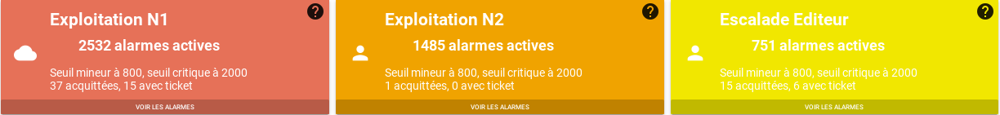
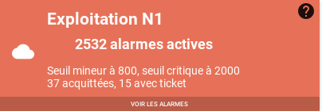

# Compteur

## Sommaire

### Guide utilisateur

1. [Présentation générale](#presentation-generale)
2. [Les compteurs](#les-tuiles)
3. [Les tuiles](#les-compteurs)

### Guide exploitant

1. [Aide sur les variables](#aide-variables)
2. [Paramètres du widget](#parametres-du-widget)

## Guide utilisateur

### Présentation générale

### Les compteurs

Les compteurs sont relatifs à un filtre d'alarmes.  

Compteur  | Variable | Signification 
--|--|--
`total`            | {{ counter.total }}            | Nombre total d'alarmes
`total_active`     | {{ counter.total_active }}     | Nombre d'alarmes non mises en veille et sans comportement périodique actif
`ack`              | {{ counter.ack }}              | Nombre d'alarmes acquittées
`pbehavior_active` | {{ counter.pbehavior_active }} | Nombre d'alarmes avec un comportement périodique actif
`snooze`           | {{ counter.snooze }}           | Nombre d'alarmes mises en veille
`ticket`           | {{ counter.ticket }}           | Nombre d'alarmes avec un ticket d'incident associé

### Les tuiles

L'ensemble des compteurs est présenté sous forme de tuiles. 

Exemple d'une tuile :

Chaque tuile est associée à un [filtre d'alarmes](../../filtres/index.md) et met à disposition un ensemble de compteurs relatifs à ce filtre.  
Le contenu de texte de cette tuile est personnalisable (*Cf: [Guide exploitant](#guide-exploitant_1)*). Il permet de présenter les compteurs sous la forme souhaitée.

La couleur de la tuile et l'icône présente sur celle-ci représentent des dépassements de seuils.

#### La couleur et icône

La couleur et l'icône de la tuile représentent l'atteinte ou non d'un seuil défini pour un des compteurs.  
Le compteur de référence ainsi que les seuils doivent être spécifiés dans les paramètres du widget.

Exemple :
Le compteur principal d'alarmes vaut 250, le seuil `mineur` vaut 100, le seuil `majeur` vaut 200, le seuil critique vaut 300.

- Vert/Soleil: Le compteur principal est < seuil mineur
- Jaune/Personne: Le compteur principal est < seuil majeur
- Orange/Personne: Le compteur principal est < seuil critique
- Rouge/Nuage: Le compteur principal est > seuil critique

## Guide exploitant

### Aide - Variables

Durant la configuration de votre widget `Compteur`, notamment le Template, il vous sera possible d'accéder à des variables concernant les compteurs, les filtres, ainsi que les seuils.

Afin de connaitre les variables disponibles, une modale d'aide est disponible grâce au point d'interrogation présent en haut à droite de la tuile.  
Un droit est toutefois requis pour y accéder : `Access to available variables list(common_variablesHelp)`

Au clic sur ce bouton, une fenêtre s'ouvre. Celle-ci liste toutes les variables disponibles pour le template de tuile. Un bouton, à droite de chacune des variables, vous permet de copier directement dans le Presse-papier le chemin de cette variable.

### Paramètres du widget

1. [Taille du widget](#taille-du-widget-requis)
2. [Titre](#titre-optionnel)
3. [Filtres](#filtres-requis)
4. [Paramètres avancés](#parametres-avances)
    1. [Template - Tuiles](#template-tuile)
    2. [Colonnes - Petit](#colonnes-petit)
    3. [Colonnes - Moyen](#colonnes-moyen)
    4. [Colonnes - Large](#colonnes-large)
    5. [Marges](#marges)
    6. [Hauteur](#hauteur)
    7. [Niveaux](#niveaux)

#### Taille du widget (*requis*)

Ce paramètre permet de régler la taille du widget.

La première information à renseigner est la ligne dans laquelle le widget doit apparaitre. Ce champ permet de rechercher parmi les lignes disponibles. Si aucune ligne n'est disponible, ou si vous souhaitez en créer une nouvelle, entrez son nom, puis appuyez sur la touche Entrée.

Ensuite, les 3 champs en dessous permettent de définir respectivement la largeur occupée par le widget sur mobile, tablette, ou ordinateur de bureau.
La largeur maximale est de 12 colonnes pour un widget, la largeur minimale est de 3 colonnes.

#### Titre (*optionnel*)

Ce paramètre permet de définir le titre du widget, qui sera affiché au-dessus de celui-ci.

Un champ de texte vous permet de définir ce titre.

#### Filtres (*requis*)

Ce paramètre permet de définir les filtres pour lesquels vous souhaitez des compteurs.  
Pour plus de détails sur les filtres et leur création, voir la partie sur [Les filtres](../../filtres/index.md).

Pour créer un filtre, cliquez sur le bouton 'Ajouter'. Une fenêtre de création de filtre s'ouvre alors.
Vous avez la possibilité d'éditer ou de supprimer des filtres existants.  

!!! warning "Champs utilisables dans le filtre"
    Le filtre utilise les champs des entités (qui sont différents des champs utilisables dans les templates). 

#### Paramètres avancés

##### Template - Tuile

Ce paramètre permet de personnaliser les informations affichées à l'intérieur des tuiles de Compteur.

Le langage utilisé ici est le Handlebars.

Cliquez sur le bouton 'Afficher/Editer'. Une fenêtre s'ouvre avec un éditeur de texte. Entre le texte souhaité pour le template des tuiles, puis cliquez sur 'Envoyer'.

Deux variables sont disponibles ici pour vous permettre d'afficher les détails des compteurs : `counter` et `levels`.
Exemple : 

* Pour afficher le compteur `total`, il vous faut écrire dans le template : `{{ counter.total }}`.
* Pour afficher le seuil `critique`, il vous faut écrire dans le template : `{{ levels.values.critical }}`.

Lorsque le droit `Counter: Access to 'Alarms list' modal(counter_alarmsList)` vous est affecté, vous pouvez cliquer sur la partie basse de la tuile sur `Voir les alarmes`. Cette modale vous permet d'afficher un widget Bac à alarmes, regroupant les alarmes correspondantes au filtre de la tuile. Ce widget est configurable grâce aux [Paramètres du bac à alarmes](#parametres-du-bac-a-alarmes).

##### Colonnes - Petit

Ce paramètre permet de définir la proportion de l'écran, en largeur, prise par chaque tuile. Ce paramètre concerne les écrans de mobiles (largeur < 450px). Une tuile occupe au minimum une colonne (1/12 de la largeur de la page), et au maximum 12 colonnes (100 % de la largeur de la page).

Il suffit de faire glisser le curseur pour sélectionner le nombre souhaité de colonnes par tuile.

##### Colonnes - Moyen

Ce paramètre permet de définir la proportion de l'écran, en largeur, prise par chaque tuile. Ce paramètre concerne les écrans de tablettes (largeur < 900px). Une tuile occupe au minimum une colonne (1/12 de la largeur de la page), et au maximum 12 colonnes (100 % de la largeur de la page).

Il suffit de faire glisser le curseur pour sélectionner le nombre souhaité de colonnes par tuile.

##### Colonnes - Large

Ce paramètre permet de définir la proportion de l'écran, en largeur, prise par chaque tuile. Ce paramètre concerne les écrans d'ordinateurs (largeur > 900px). Une tuile occupe au minimum une colonne (1/12 de la largeur de la page), et au maximum 12 colonnes (100 % de la largeur de la page).

Il suffit de faire glisser le curseur pour sélectionner le nombre souhaité de colonnes par tuile.

##### Marges

Ce paramètre permet de régler les espaces séparant les tuiles.

Celui-ci est séparé en quatre, vous permettant de régler l'espace que vous souhaitez pour chaque côté des tuiles (haut, bas, droite et gauche).

Pour modifier ce paramètre, faites glisser le sélecteur, afin de choisir une valeur entre 0 et 5 (0 correspondant à l'absence de marge, 5 le maximum de marge).

Par défaut, ce paramètre est réglé sur une valeur de 1 pour chacun des côtés des tuiles.

##### Hauteur

Ce paramètre permet de régler la hauteur des tuiles.

Pour le modifier, faites glisser le sélecteur, afin de choisir une valeur entre 1 (hauteur minimale) et 20 (hauteur maximale).

Par défaut, ce paramètre est réglé sur une valeur de 6.
