# Explorateur de contexte

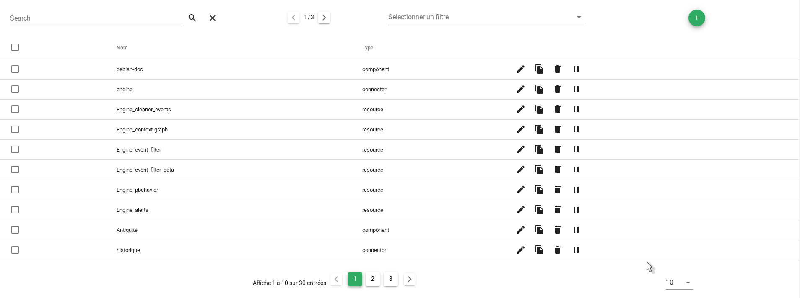

## Sommaire

### Guide utilisateur

1. [Entités](#entites)
2. [Recherche](#recherche)
3. [Filtres](#filtres)
4. [Création d'entités et de services](#creation-dentites-et-de-services)
5. [Actions](#actions)
6. [Comportements périodiques](#comportements-periodiques)

### Guide exploitant
1. [Aide sur les variables](#aide-variables)
2. [Paramètres du widget](#parametres-du-widget)

## Guide utilisateur

### Entités

Le tableau d'entités présente la liste de toutes les entités. Une ligne correspond à une entité.
Les colonnes affichées sont personnalisables (*Cf: [Guide exploitant](#guide-exploitant)*).
En plus de détails de l'entité, chaque ligne expose une liste d'actions opérables sur l'entité (*Cf: [Actions](#actions)*).

Au clic sur une entité (en dehors du texte des colonnes), des détails supplémentaires concernant l'entité s'affichent (comportements périodiques, informations, impacts et dépendances, etc.).

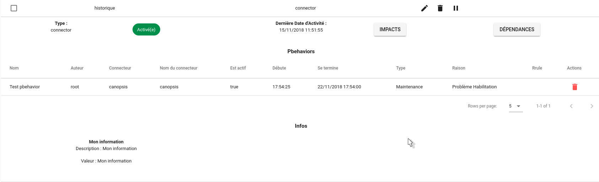.

### Recherche

Le champ de recherche permet de réaliser une recherche parmi les entités.

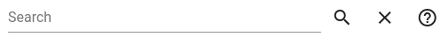

Pour faire une recherche 'simple', il suffit d'entrer les termes de la recherche dans le champ de texte, puis d'appuyer sur la touche Entrée, ou de cliquer sur l'icone 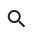

Dans l'explorateur de contexte, il est possible d'effectuer des recherches plus avancées. Une aide concernant la syntaxe à utiliser est disponible en survolant avec la souris l'icone d'aide 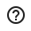. Une documentation est également disponible pour cet aspect [ici](../../recherche/index.md) !

Pour supprimer la recherche, cliquez sur l'icone 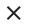

### Filtres

Le sélecteur de filtre permet d'appliquer un filtre sur l'Explorateur de contexte. Seuls les entités correspondant aux critères du filtres seront affichées.

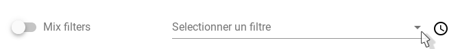

Pour sélectionner un filtre, il suffit de cliquer sur le champ 'Sélectionner un filtre'. Une liste des filtres disponibles apparaît.
Cliquez sur un filtre. Celui-ci est sélectionné, et directement appliqué.
Pour ne plus appliquer de filtre, il suffit de cliquer sur l'icône présente au bout du champ de sélection de filtre. L'explorateur de contexte se rafraichit, le champ de sélection revient dans état initial, le filtre n'est plus appliqué !

#### Mix filters

L'option "Mix filters", présente à gauche du sélecteur de filtre permet de cumuler plusieurs filtres.

Pour activer cette option, cliquez sur le bouton .
Une fois l'options activée, un sélecteur apparaît à droite du bouton d'activation 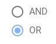. Ce sélecteur permet de choisir l'opérateur utilisé pour réunir les filtres.

- "AND": Les critères présents dans tout les filtres doivent êtres vérifiés
- "OR": Les critères présents dans un ou plusieurs des filtres doivent êtres vérifiés.

Une fois l'opérateur sélectionné, il ne vous reste plus qu'à sélectionner les filtres à appliquer dans le menu déroulant de sélection de filtres.

### Création d'entités et de services

<!-- XXX: probablement à refaire après Canopsis 4.3.0 -->

Depuis l'Explorateur de contexte, il vous est possible de créer des entités et des services.

Pour accéder aux fenêtres de création, survoler le bouton .
Au survol de ce bouton, un menu s'ouvre avec deux boutons disponibles.

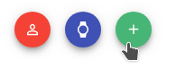.

La première icône à gauche permet de créer une entité, la deuxième permet de créer un service.

#### Création d'entité

Au clic sur l'icône de création d'entité, une fenêtre s'ouvre.

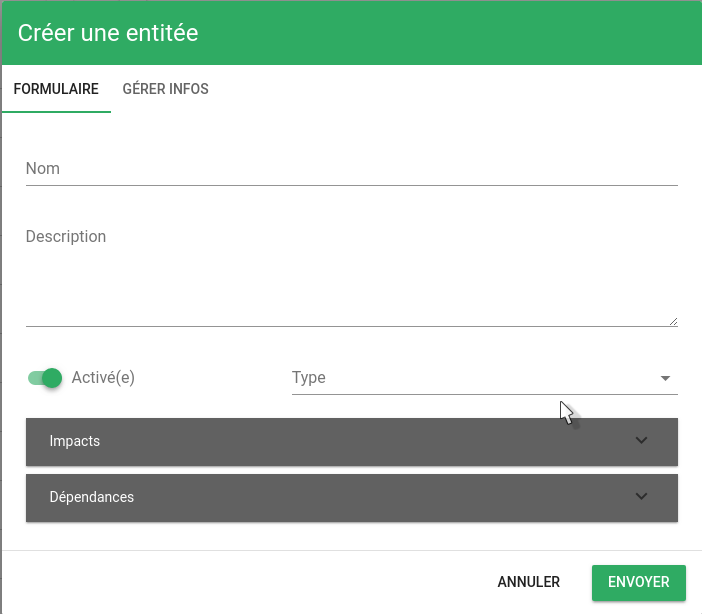

Le 1er onglet, 'Formulaire', vous demande de renseigner les informations principales de l'entité :

- Nom (*requis*)
- Description
- Activé(e) : Définit si l'entité est activée, ou non.
- Type (*requis*) : Définit le type d'entité (connecteur, composant ou ressource)
- Impacts et Dépendances : Permet de définir les entités que l'entité que vous êtes en train de créer impacte, et celles dont elle dépend. Pour ajouter des entités dans une de ces listes, réalisez une recherche grâce au champ de recherche, puis cliquez sur l'icône 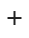. La liste des entités sélectionnées apparaît au dessus du tableau d'entités utilisés pour ajouter des entités.

Le 2ème onglet permet de gérer les infos contenues dans le champ 'infos' de l'entité. Les infos se composent d'un nom, d'une description et d'une valeur.
Pour ajouter une information, remplissez les champs demandés, puis cliquez sur le bouton 'Ajouter'. L'information apparaît dans la liste située au dessus du formulaire.

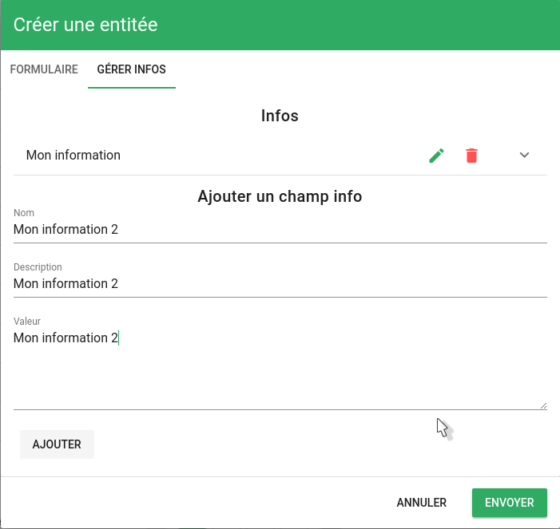

Au clic sur une information dans la liste des infos, les détails de cette information apparaissent.
Deux actions sont disponibles pour chaque information.

- Editer : Permet d'éditer une information. Au clic sur l'icône , le formulaire situé en dessous s'auto-complète avec les détails de l'information à éditer. Editez les informations, puis cliquez sur le bouton 'Ajouter'. Votre information est éditée.
- Supprimer : Permet de supprimer une information. Il vous suffit de cliquer sur l'icône . Votre information a été supprimée !

Cliquez ensuite sur le bouton 'Envoyer' pour sauvegarder votre entité !

<!-- XXX: toute cette partie est obsolète avec la 4.3.0 -->

#### Création de service

Au clic sur l'icône de création de services, une fenêtre s'ouvre.

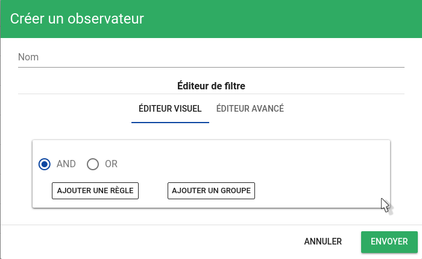

Pour créer un service, il vous suffit d'entrer deux informations :

*  Nom (*requis*)
*  Filtre : Pour plus de détails sur les filtres et leur création, voir : [Les filtres](../../filtres/index.md)

Cliquez ensuite sur le bouton 'Envoyer'. Votre service est créé !

### Actions

Pour chaque entité de l'explorateur de contexte, trois actions sont disponibles :

- **Éditer** : Au clic sur l'icône d'édition , une fenêtre s'ouvre. Celle-ci reprend les informations de l'entité ou de le service (*Cf: [Création d'entités et de services](#creation-dentites-et-de-services)*). Après avoir modifié les informations souhaitées, cliquez sur 'Envoyer'. Une fenêtre vous informe que l'édition a été effectuée avec succès.
- **Dupliquer**: Au clic sur l'icône , une fenêtre s'ouvre. Celle-ci reprend les informations de l'entité ou de le service que vous souhaitez dupliquer. Après avoir entré les informations souhaitées, cliquez sur 'Envoyer'. Une fenêtre vous informe qu'une nouvelle entité a été créée avec succès !
- **Supprimer** : Permet de supprimer une entité/un service. Au clic sur l'icône de suppression 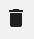, une fenêtre de confirmation s'ouvre. Cliquez sur 'Oui' pour confirmer la suppression de l'entité/de le service.
- **Ajouter un comportement périodique** : Permet d'ajouter un comportement périodique à l'entité/à le service. Au clic sur l'icône , une fenêtre de création de comportement périodique s'affiche. Pour plus d'information, voir : [Les comportement périodiques - Pbehaviors](../../pbehaviors/index.md).

### Comportements périodiques

Depuis l'explorateur de contexte, il est possible d'ajouter un comportement périodique directement sur une entité, ou sur un sélection d'entités.

Pour plus de détails sur l'ajout de comportements périodiques, voir : [Les comportement périodiques - Pbehaviors](../../pbehaviors/index.md).

Pour ajouter un comportement périodique sur une entité, cliquez sur l'icône  sur la ligne de l'entité sur laquelle vous souhaitez ajouter le comportement.

Pour ajouter un comportement périodique sur une sélection d'entités, sélectionnez les entités en cochant les cases (présentes en début de ligne de chaque entités). Une fois une entité ou plus sélectionnées, deux icônes sont apparues en haut de l'explorateur de contexte. La première icône permet de supprimer toutes les entités sélectionnées, le deuxième permet d'ajouter un comportement périodique à ces entités. Cliquez sur le bouton . Une fenêtre de création de comportement périodique apparaît alors.

## Guide exploitant

Vous pouvez configurer les widgets (taille, remplacement, nom, etc.) directement dans une vue via le mode édition (*Cf: [Vues - Documentation de la grille d'edition](../../vues/edition-grille.md)*).

### Aide - Variables

Durant la configuration de votre widget Exporateur de contexte, notamment la liste des colonnes, il vous sera possible d'accéder à des variables concernant les entités.

Afin de connaitre les variables disponibles, une modale d'aide est disponible.

Pour y accéder, entrez dans le mode d'édition (*Cf: [Vues - Mode d'édition](../../vues/index.md#mode-édition)*).

Un bouton d'action supplémentaire "Liste des variables disponibles" apparaît alors pour chaque entité du tableau.

Au clic sur ce bouton, une fenêtre s'ouvre. Celle-ci liste toutes les variables disponibles dans vos différents paramètres. Un bouton, à droite de chacune des variables, vous permet de copier directement dans le Presse-papier le chemin de cette variable.

### Paramètres du widget

1. Titre
2. Paramètres avancés
  1. Colonne de tri par défaut
  2. Nom des colonnes
  3. Filtres
  4. Types d'entités

#### Titre (*optionnel*)

Ce paramètre permet de définir le titre du widget, qui sera affiché au dessus de celui-ci.

Un champ de texte vous permet de définir ce titre.

#### Paramètres avancés

##### Colonne de tri par défaut

Ce paramètre permet de définir la colonne par laquelle trier les alarmes.

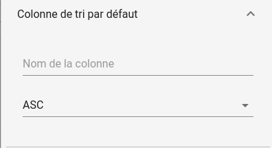

Un champ de texte vous permet d'abord de définir la colonne à utiliser. Il faut ici entrer la **valeur** de la colonne, et non son nom (*Cf: [Paramètre "Nom des colonnes"](#nom-des-colonnes)*).

Un sélecteur vous permet ensuite de définir le sens de tri :

*  "ASC" = Ascendant
*  "DESC" = Descendant

##### Nom des colonnes

Ce paramètre permet de définir quels colonnes seront affichées dans l'explorateur de contexte.

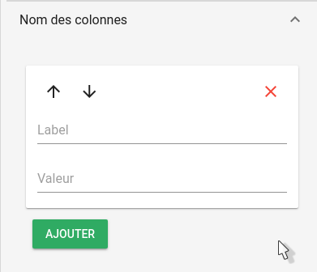

Afin d'**ajouter une colonne**, cliquez sur le bouton 'Ajouter'.
Une colonne vide est alors ajoutée. Afin de finaliser l'ajout, il est nécessaire de remplir les champs demandés.
Le champ "Label" définit le nom de la colonne, qui sera affiché en haut de tableau. Le champ "Valeur" définit la valeur que doit prendre ce champ. Tous les champs de l'entité sont directement disponibles.

Exemple : "name", qui contient le nom de l'entité, ou encore "type", qui contient le type de l'entité.

Pour supprimer une colonne, cliquez dans la liste des colonnes sur la croix rouge présente en haut à droite de la case de la colonne que vous souhaitez effacer.

Dans la liste des colonnes sont égalements présentes, pour chaque colonne, des flèches permettant de modifier l'ordre des colonnes. Les colonnes sont présentées dans l'ordre de haut en bas. Pour modifier la place d'une colonne, cliquez sur une des flèches. Pour faire monter/descendre une colonne dans la liste.

##### Filtres

Ce paramètre permet de sélectionner un filtre à appliquer à l'explorateur de contexte, et d'en créer de nouveaux.

Un champ de sélection permet d'abord de choisir un filtre à appliquer à l'explorateur de contexte parmi les filtres existants. Sélectionnez le filtre que vous souhaitez appliquer parmi les filtres disponibles. Une fois les paramètres sauvegardés, le filtre sera appliquer à l'explorateur de contexte (*Cf: [filtres](#filtres)*).

Pour créer un nouveau filtre, cliquez sur le bouton 'Ajouter'. Une fenêtre de création de filtre s'ouvre. Pour plus de détails sur les filtres et leur création, cliquez [ici](../../filtres/index.md).
Une fois votre filtre créé, celui-ci apparaît dans la liste disponible en dessous du sélecteur de filtre. Cette liste vous permet d'éditer, ou de supprimer les filtres.

L'option "Mix filters" est également disponible depuis ce menu. Pour plus de détails concernant cette option, voir  [Mix filters](#mix-filters).

#### Types d'entités

Ce paramètre permet de sélectionner les différents types d'entités que vous souhaitez voir apparaître dans l'explorateur de contexte.

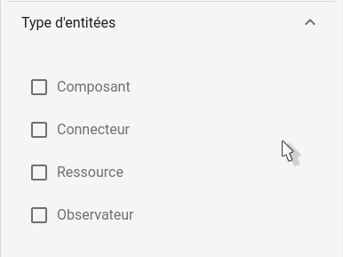

Les types d'entités sont : Composant, Connecteur, Ressource et Service.

Il vous suffit de cocher les cases correspondantes aux types d'entités que vous souhaitez voir apparaître.
