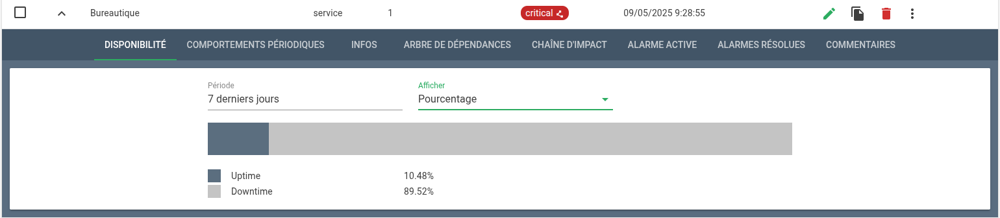
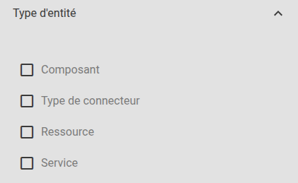

# Explorateur de contexte

L'Explorateur de contexte est un widget central dans Canopsis. Il permet d'afficher, filtrer, rechercher et manipuler l'ensemble des [entités](../../../vocabulaire/#entite) du système : composants, connecteurs, ressources et services. 

C'est, en quelque sorte, le référentiel interne de toutes les entités connues de la plateforme.

Ce widget est composé de plusieurs zones clés :

* Un tableau personnalisable listant les entités
* Une barre de recherche avancée
* Un système de filtres (simples ou combinés)
* Des actions de gestion d'entités (création, modification, suppression, duplication)
* Un accès direct aux comportements périodiques

## Utilisation courante

### Entités

Le tableau d'entités présente la liste de toutes les entités. Une ligne correspond à une entité.  
En plus de détails de l'entité, chaque ligne expose une liste d'actions opérables sur l'entité.

Des détails supplémentaires concernant l'entité s'affichent en la "dépliant" (comportements périodiques, informations, impacts et dépendances, etc.).

.

### Recherche

Le champ de recherche permet de réaliser une recherche parmi les entités.

Pour faire une recherche 'simple', il suffit d'entrer les termes de la recherche dans le champ de texte, puis d'appuyer sur la touche Entrée, ou de cliquer sur l'icone :material-magnify:

Dans l'explorateur de contexte, il est possible d'effectuer des recherches plus avancées à l'aide de l'icône :material-tune:.

Pour supprimer la recherche, cliquez sur l'icone :material-close:.

### Catégorie

Une entité peut être positionnée dans une "catégorie" au moment de sa création ou de son import.  
L'explorateur de contexte permet de filtrer les entités selon ces catégories.

### Filtres

Le sélecteur de filtre permet d'appliquer un [filtre](../../patterns) sur l'Explorateur de contexte. Seules les entités correspondant aux critères du filtre seront affichées.

L'option "Combiner les filtres", présente dans l'entête du sélecteur de filtre, permet de cumuler plusieurs filtres avec un **ET logique**.

### Filtre "Aucun événement"

L'explorateur de contexte permet de filtrer les entités pour lesquelles aucun événement n'a été reçu depuis un certain temps.  
Ces entités sont régies par les [règles d'inactivité](../../../menu-exploitation/regles-inactivite/).

### Création d'entités "services"

Depuis l'Explorateur de contexte, il vous est possible de créer des entités de type "Service".

Pour accéder aux fenêtres de création, cliquer sur le bouton .

Tous les paramètres concernant les services sont [documentés ici](../../../services).

### Actions

En fonction du type d'entité, plusieurs actions sont disponibles :

* **Éditer** : Au clic sur l'icône d'édition :material-pencil:, une fenêtre s'ouvre. Celle-ci reprend les informations de l'entité. Après avoir modifié les informations souhaitées, cliquez sur 'Soumettre'. Un tooltip vous informe que l'édition a été effectuée avec succès.

* **Dupliquer**: Au clic sur l'icône :material-content-copy:, une fenêtre s'ouvre. Celle-ci reprend les informations de l'entité que vous souhaitez dupliquer. Après avoir entré les informations souhaitées, cliquez sur 'Soumettre'. Un tooltip vous informe qu'une nouvelle entité a été créée avec succès !

* **Supprimer** : Permet de supprimer une entité. Au clic sur l'icône de suppression :material-delete:, une fenêtre de confirmation s'ouvre. Cliquez sur 'Oui' pour confirmer la suppression de l'entité.

* **Comportement périodique** : Permet d'ajouter un comportement périodique à l'entité. Au clic sur l'icône :material-pause:, une fenêtre de création de comportement périodique s'affiche. Pour plus d'information, voir : [Les comportement périodiques - Pbehaviors](../../../menu-exploitation/comportements-periodiques/).

* **Lister les variables** : Permet de lister toutes les variables relatives à l'entité. Au clic sur l'icône :material-help:, une fenêtre s'ouvre et propose une liste brute de variables.

## Paramètres du widget

Vous pouvez configurer les widgets (taille, remplacement, nom, etc.) directement dans une vue via le mode édition (*Cf: [Vues - Documentation de la grille d'edition](../../vues/edition-grille.md)*).

### Titre (*optionnel*)

Ce paramètre permet de définir le titre du widget, qui sera affiché au dessus de celui-ci.

Un champ de texte vous permet de définir ce titre.

### Paramètres avancés

#### Colonne de tri par défaut

Ce paramètre permet de définir la colonne par laquelle trier les alarmes.

Un sélecteur vous permet ensuite de définir le sens de tri :

*  "ASC" = Ascendant
*  "DESC" = Descendant

#### Colonnes

Les paramètres qui sont décrits dans ce paragraphe concernent les éléments suivants :

* Nom des colonnes : colonnes affichées dans la liste des entités
* Nom des colonnes pour l'arborescence des dépendances : colonnes visbles dans l'onglet "Arbre de dépendances"
* Nom des colonnes pour les alarmes actives : colonnes visbles dans l'onglet "Alarme active"
* Nom des colonnes pour les alarmes résolues : colonnes visbles dans l'onglet "Alarmes résolues"

Afin d'**ajouter une colonne**, cliquez sur le bouton :material-plus:.  
Il vous reste alors à sélectionner la colonne souhaitée dans la liste.  

!!! tip "Astuce"
    Vous pouvez modifier le label de la colonne en activant l'option "Etiquette personnalisée".  
    Cela est très utile lorsque vous utilisez des informations enrichies.

Pour supprimer une colonne, cliquez dans la liste des colonnes sur la croix rouge présente en haut à droite de la case de la colonne que vous souhaitez effacer.

L'ordre des colonnes est modifiable par drag'n drop.

!!! tip "Recommandation"
    Il est recommandé de définir un [modèle de colonnes/template](../../../menu-administration/parametres/#modeles-de-widgets) pour faciliter la maintenance générale.

#### Paramètres de l'arborescence des dépendances

Ce paramètre est directement dépendant de la configuration de [calcul d'état/sévérité](../../../menu-administration/parametres-de-calculd-etat-sévérité/) réalisée.

| Option                                      | Signification |
| ------------------------------------------- | ------------------ |
| Afficher toutes les dépendances             | L'onglet Arbre de dépendances affiche toutes les dépendances de l'entité |
| Afficher les dépendances définissant l'état | L'onglet Arbre de dépendances n'affiche que les dépendances responsables de la sévérité de l'entité |
| Afficher le sélecteur                       | L'onglet Arbre de dépendances propose à l'utilisateur de choisir une des deux options |

#### Paramètres du graphique de disponibilité

En activant cette option, vous pouvez choisir les paramètres par défaut qui seront utilisés pour présenter la "disponibilité" de l'entité.  
Ces paramètres concernent la période temporelle à considérer ainsi que le type d'affichage en pourcentage ou en durée de la disponibilité.

#### Paramètres du diagramme de cause racine

Les dépendances d'une entité peuvent être visualisées sous forme de diagramme, accessible depuis la colonne de criticité/sévérité.  
Vous pouvez choisir de présenter les dépendances avec leur sévérité ou leur priorité.

#### Filtres

Ce paramètre permet créer des [filtres](../../patterns/) qui seront disponibles dans l'explorateur de contexte.  
Il est également possible de sélectionner un filtre par défaut à appliquer.

L'ordre des filtres est modifiable par drag'n drop.

#### Types d'entités

Ce paramètre permet de "spécialiser" l'explorateur de contexte en filtrant sur un ou des types d'entités.

Les types d'entités sont : Composant, Connecteur, Ressource et Service.

Il vous suffit de cocher les cases correspondantes aux types d'entités que vous souhaitez voir apparaître.

#### Largeur-position "Plus d'infos"

Vous pouvez définir la "largeur" et la "position" de la fenêtre qui est affichée lorsqu'une entité est "dépliée".

#### Exporter CSV

Les entités sont exportables au format CSV. Ce menu permet de sélectionner les colonnes que vous souhaitez exporter.  
