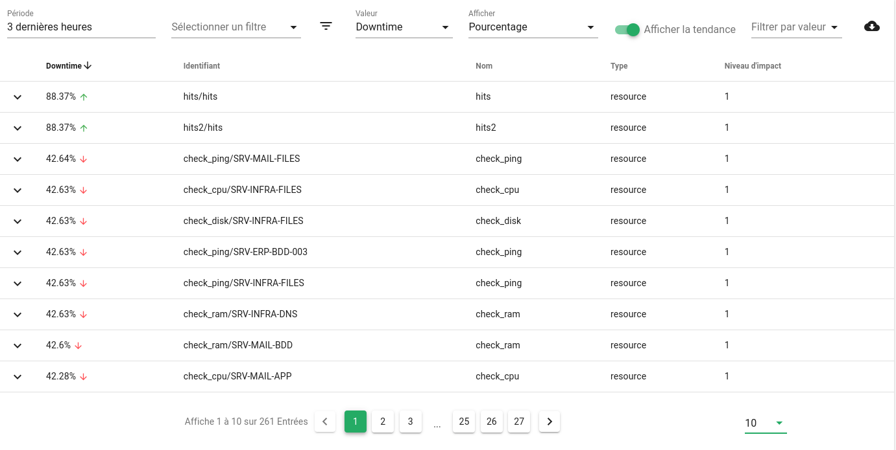

# Disponibilité

Canopsis mesure les temps de disponibilité et d'indisponibilité de chaque entité.  
Ce widget permet de les retranscrire avec des fonctions de recherche et de filtrage.

## Sommaire

### Guide utilisateur

1. [La disponibilité](#la-disponibilité)

## La disponibilité

**Disponibilité / Uptime**

Il s'agit de la durée pendant laquelle une entité est considérée comme opérationnelle. Pour chaque entité, le paramètre `État de disponibilité` (hi_avail_param) est défini, ce qui détermine la sévérité minimum à partir de laquelle l'entité est considérée comme opérationnelle. Par défaut, cette sévérité vaut "OK", donc un état Mineur signifie qu'une entité n'est pas opérationnelle et hors service.

**Indisponibilité / Downtime**

Il s'agit de la durée pendant laquelle une entité est hors service et/ou en comportement périodique de type Pause. Les entités sont considérées comme hors service si leur sévérité est supérieure au paramètre `État de disponibilité`. 

**Temps total d'activité = temps de disponibilité + temps d'indisponibilité = 100% de disponibilité de l'entité**

Les entités sont inactives lorsqu'elles sont en maintenance, ce qui signifie qu'elles sont en comportement périodique de type "Inactif" ou "Maintenance". Le temps d'inactivité n'est pas compté comme un paramètre distinct dans le cadre du widget de disponibilité.

En termes de valeurs absolues, pour la dernière journée, le temps actif total peut être inférieur à 24h car une entité peut être en pause de type Inactif ou Maintenance.

Le temps de fonctionnement et le temps d'arrêt peuvent être comptés en pourcentage (calculés à partir du temps actif total) ou en valeurs absolues (durée en jours, heures, minutes).

**Tendances**

Il s'agit du résultat de la comparaison des valeurs de disponibilité de la période précédente équivalente. Ce résultat peut être plus élevé, égal ou plus bas qu'auparavant. Lorsque l'affichage des tendances est activé, la flèche correspondante est affichée. Cette comparaison s'applique uniquement aux valeurs relatives en pourcentage. 

Les tendances pour les périodes "Dernière heure", "Dernier jour", "Dernière semaine", "Dernier mois", "3 derniers mois", "6 derniers mois" sont le résultat de la comparaison avec la période précédente complète.

Les tendances pour "Aujourd'hui", "Semaine en cours", "Mois en cours" sont le résultat de la comparaison de la période courante incomplète avec la période précédente. 
Par exemple, le temps de disponibilité pour aujourd'hui (qui n'est pas encore fini) est comparé à hier (24h).

