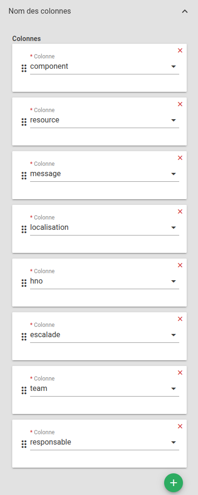
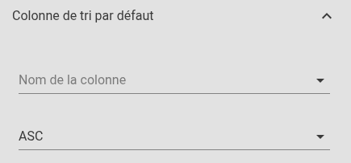

# Données externes

Le widget Données externes permet d'afficher, consulter et manipuler des [collections de données][donnees-externes] structurées préalablement déclarées dans Canopsis.  
Ces données sont souvent utilisées pour enrichir dynamiquement les alarmes ou entités via les mécanismes d'enrichissement externe.

Dans le cas où les données d'enrichissement doivent être gérées par des utilisateurs et non des administrateurs de Canopsis, l'interface web met à disposition un widget "Données externes".

Ce widget reprend les fonctionnalités principales abordées dans [cette documentation][donnees-externes], à savoir :

* Import de données via fichiers CSV
* Manipulation des enregistrements
* Export des données au format CSV

## Utilisation courante

### Recherche

Un champ de recherche vous permet de filtrer l'affichage sur des enregistrements contenant la chaîne de caractères souhaitée.  
Notez qu'il est possible de trier les enregistrements par colonne en ordre croissant ou décroissant.

### Exporter en CSV

Le widget permet d'exporter les données de la source au format CSV; Cela permet de retravailler les enregistrements dans un outil tiers si besoin.

### Insérer des enregistrements

Les boutons :material-file-upload: et :material-plus: permettent respectivement d'importer de nouvelles données au format CSV et d'insérer un enregistrement en saisissant une valeur pour chaque champ.

### Actions

Plusieurs actions sont disponibles :

* **Éditer** : Au clic sur l'icône d'édition :material-pencil:, une fenêtre s'ouvre, reprenant les informations de l'enregistrement. Après avoir modifié les informations souhaitées, cliquez sur 'Soumettre'. Un tooltip vous informe que l'édition a été effectuée avec succès.

* **Dupliquer**: Au clic sur l'icône :material-content-copy:, une fenêtre s'ouvre. Celle-ci reprend les informations de l'enregistrement que vous souhaitez dupliquer. Après avoir entré les informations souhaitées, cliquez sur 'Soumettre'. Un tooltip confirme la réussite de l'action.

* **Supprimer** : Permet de supprimer un enregistrement. Au clic sur l'icône de suppression :material-delete:, une fenêtre de confirmation s'ouvre. Cliquez sur 'Oui' pour confirmer la suppression.

## Paramètres du widget

### Titre (*optionnel*)

Ce paramètre permet de définir le titre du widget, qui sera affiché au-dessus de celui-ci.

Un champ de texte vous permet de définir ce titre.

### Données externes

Ce paramètre vous permet de sélectionner la collection de données que vous souhaitez consulter ou modifier.

### Paramètres avancés

#### Nom des colonnes

Afin d'**ajouter une colonne**, cliquez sur le bouton :material-plus:.
Il vous reste alors à sélectionner la colonne souhaitée dans la liste.

Pour supprimer une colonne, cliquez dans la liste des colonnes sur la croix rouge présente en haut à droite de la case de la colonne que vous souhaitez effacer.

L'ordre des colonnes est modifiable par drag'n drop.

#### Paramètres des colonnes

Les 2 paramètres proposés permettent de jouer sur l'aspect final du tableau.

* **Glisser/déposer le colonnes** : permet à l'utilisateur de positionner les colonnes dans l'ordre souhaité.
* **Redimensionner les colonnes** : par défaut Canopsis calcule les largeurs des colonnes en fonction des labels, de leur contenu.  Cette option permet à l'utilisateur de définir la largeur souhaitée.

#### Colonne de tri par défaut

Ce paramètre permet de définir la colonne par laquelle trier les alarmes.

Un sélecteur vous permet ensuite de définir le sens de tri :

*  "ASC" = Ascendant
*  "DESC" = Descendant

#### Nombre d'éléments par page par défaut

Vous avez la possibilité de définir un nombre d'enregistrements à afficher par page.

#### Densité de table par défaut

Dans Canopsis, il existe 3 densités de table qui permettent de jouer sur le nombre d'enregistrements qu'une page peut afficher :

* Vue confort
* Vue compacte
* Vue ultra compacte

#### Exporter CSV

Les entités sont exportables au format CSV. Ce menu permet de sélectionner les colonnes que vous souhaitez exporter.

[donnees-externes]: ../../../menu-exploitation/donnees-externes.md
