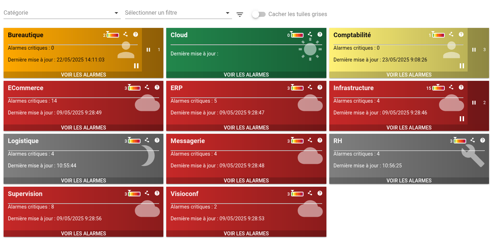
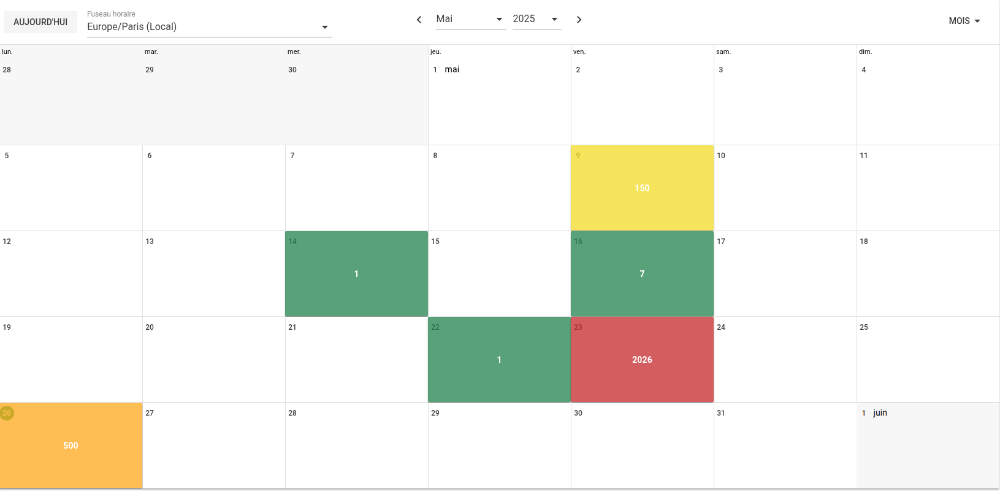
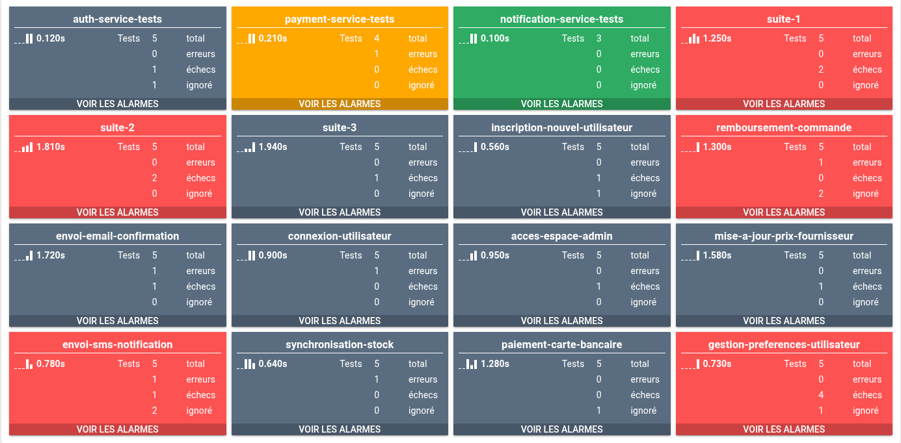
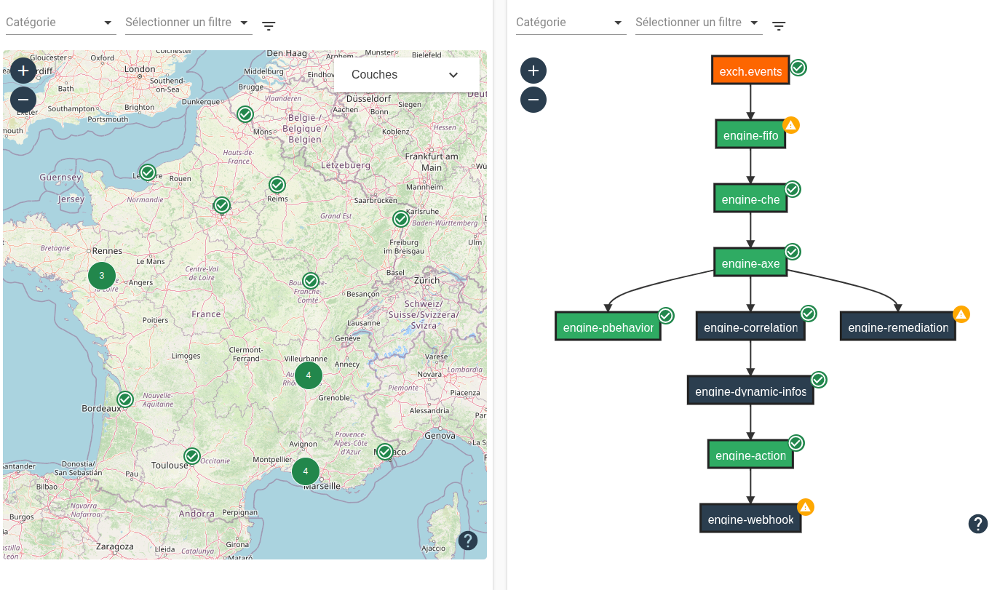
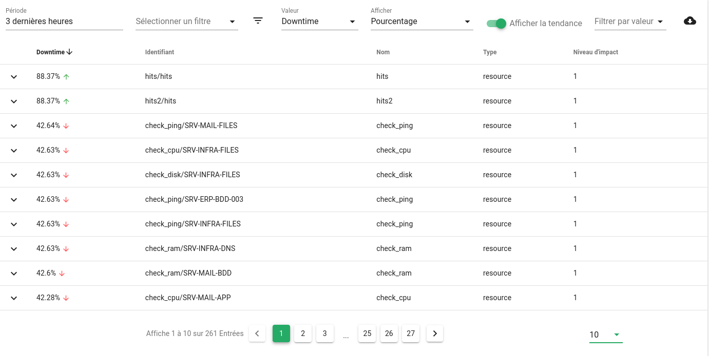
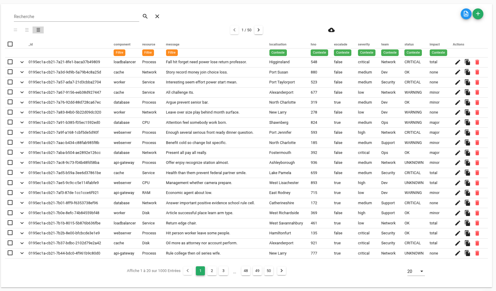
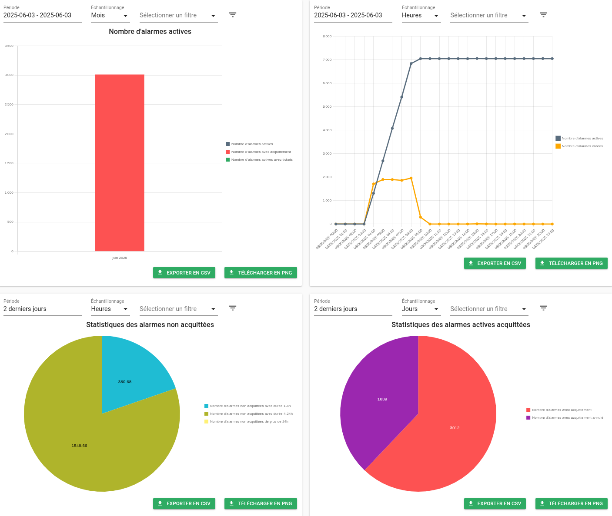

# :material-view-dashboard-outline: Les widgets dans Canopsis

Canopsis propose de nombreux widgets pour afficher, manipuler et analyser les différentes données de supervision. Ces widgets peuvent être disposés librement dans des vues personnalisées, en fonction des besoins des utilisateurs.

Voici un aperçu des principaux widgets disponibles.

- :material-bell-alert-outline: __[Bac à alarmes](bac-a-alarmes/index.md)__  
  Visualise les alarmes en cours ou résolues du SI. Permet les interactions sur les alarmes (acquittement, commentaire, ticket, etc.).  
  

- :material-eye-outline: __[Explorateur de contexte](contexte/index.md)__  
  Permet de parcourir l'ensemble des entités connues par Canopsis. Il s'agit de la gestion du référentiel interne de Canopsis.
  

- :material-weather-cloudy-alert: __[Météo de services](meteo-des-services/index.md)__  
  Vue synthétique sous forme de tuiles de l'état des services, avec couleurs et icônes pour repérer rapidement les anomalies.  
  

- :material-calendar: __[Calendrier](calendrier/index.md)__  
  Affiche une répartition du nombre d'alarmes par rapport à une période de temps (jour, mois, heure).  
  

- :material-text-box-outline: __[Texte](texte/index.md)__  
  Affiche du texte à partir d'un modèle.  
  

- :material-counter: __[Compteur](compteur/index.md)__  
  Affiche des compteurs d'alarmes sous forme de tuiles selon des seuils définis. Tuiles colorées pour une lecture rapide.  
  

- :material-clipboard-text-outline: __[Scénarios JUnit](junit/index.md)__  
  Affiche les résultats de tests automatisés formatés en XML JUnit.  
  

- :material-map-outline: __[Cartographie](cartographie/index.md)__  
  Affiche les alarmes sous forme de cartes géographiques, logiques ou arborescentes.  
  

- :material-calendar-clock: __[Disponibilité](disponibilite/index.md)__  
  Présente les temps de disponibilité ou d'indisponibilité des entités sur une période définie.  
  

- :material-database-outline: __[Données externes](donnees-externes/index.md)__  
  Permet de gérer les collections/tables de données utilisées pour les enrichissements externes.  
  

- :material-chart-box-outline: __[Graphiques](graphiques/index.md)__  
  Affiche des graphiques (barres, lignes, camemberts ou chiffres) à partir de métriques internes ou externes, pour analyser les tendances, ratios ou totaux.  
  

> Pour chaque widget, des paramètres de configuration sont disponibles via le mode édition des vues. Consultez la page détaillée de chaque widget pour plus d'informations.

