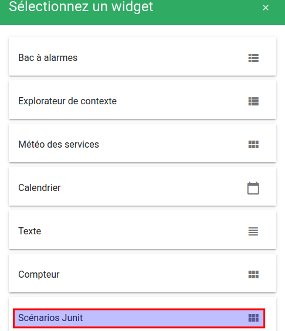
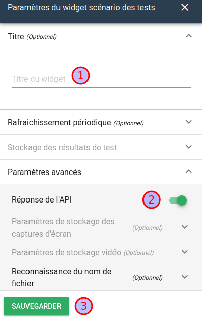
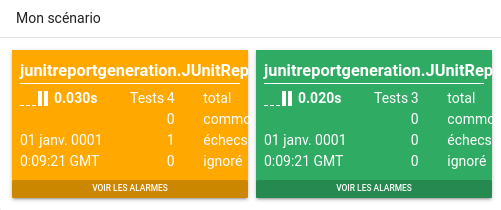

# JUnit

!!! Info
    Disponible uniquement en édition Pro. (Canopsis ≥ [4.3.0](../../../../notes-de-version/4.3.0.md))

Ce module est capable de recevoir des résultats d'exécution de scénarios au format XML [JUnit](https://fr.wikipedia.org/wiki/JUnit).

Il comprend :

* Un récepteur (via API) de fichiers XML au format JUnit.
* Un moteur capable de parser, générer des alarmes à partir des résultats reçus.
* Un widget pour l'interface graphique capable de présenter les résultats sous diverses formes.

{: .link width=80%"}

## Sommaire

1. [Configuration](#configuration)<br>
2. [Création du widget](#creation-du-widget)<br>
3. [Publication de résultat](#publication-de-resultat)<br>

## Configuration

!!! Info
    Le share JUnit API doit être partagé entre l’API de Canopsis et le connecteur JUnit.

La configuration peut être changée dans le fichier [canopsis.toml](../../../../guide-administration/administration-avancee/modification-canopsis-toml.md).

*Configuration par défaut :*
```
[Canopsis.file]
…
# Local storage for Junit artifacts.
Junit = "/opt/canopsis/var/lib/junit-files"
# Temporary local storage for Junit data which are uploaded by API.
JunitApi = "/tmp/canopsis/junit"
```

## Création du widget

Aller dans la vue créée. Dans le menu latéral, cliquer sur **Ajouter un widget** :


Sélectionner le *widget* **Scénarios JUnit** :



Configurer le scénario en activant la réponse de l’API :



État du widget à sa création :


## Publication de résultat

Publier les résultats via l’[API de Canopsis](https://doc.canopsis.net/guide-developpement/swagger/#/junit).

*Par exemple via cURL :*
```
curl --location \
--request POST 'http://<canopsis.url>:8082/api/v4/junit/upload/reports?authkey=<01234567-89ab-cdef-0123456789ab>' \
--header 'Content-Type: multipart/form-data' \
--form 'files=@"</path/to/result.xml>"'
```

Le retour de l'API doit être le suivant en cas de succès :
```
{"upload_errors":{}}
```

Le résultat sera affiché lors du rafraichissement du *widget* :



*Exemple de résultat publié :*


