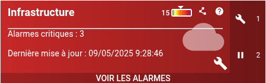
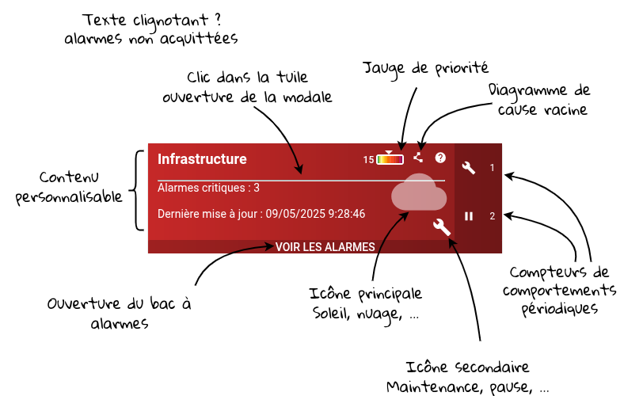
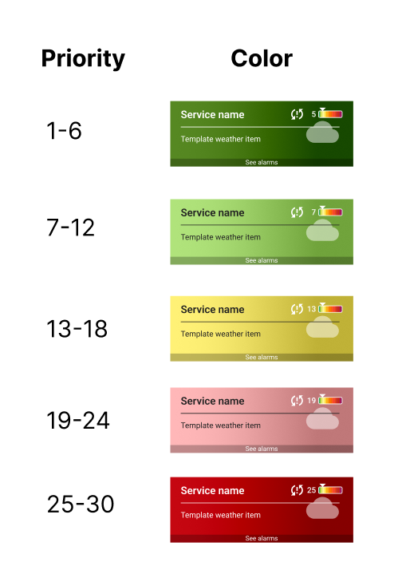
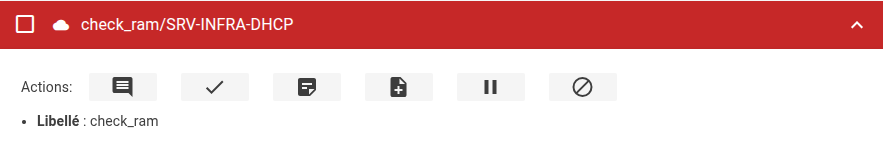
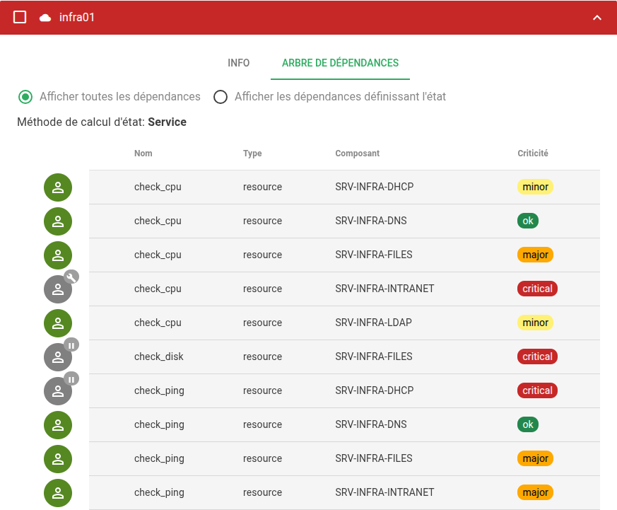
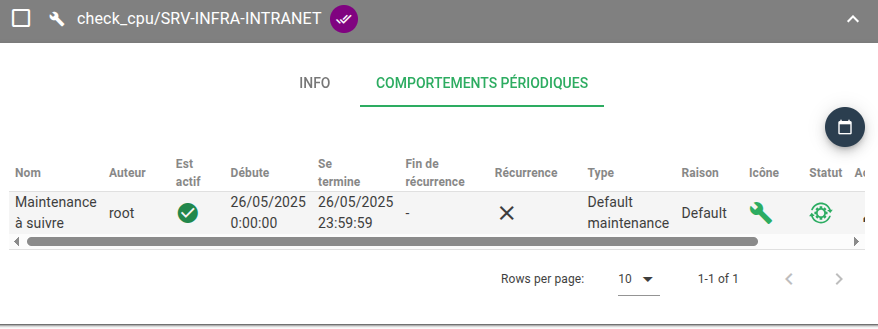

# Météo des services

Le widget **Météo de services** permet d'afficher en un coup d'oeil l’état de plusieurs services du SI.  
Il s’agit d’une **représentation synthétique et visuelle** de la santé des services métier, avec une codification par couleur et icône.

C’est un outil précieux pour les exploitants souhaitant identifier rapidement les dégradations ou indisponibilités de services critiques.


## Utilisation courante

### Présentation générale

La météo de services est composée de tuiles.

Exemple d'une tuile :



Chaque **tuile** représente un [service](../../../services) et indique son état actuel, calculé en fonction des entités rattachées au service et de leur criticité.

L'état est basé sur :

* La sévérité : sévérité calculée d'après les dépendances du service Info / Mineure / Majeure / Critique (par défaut : pire sévérité ; ou autre algorithme)

ou

* La priorité : produit sévérité × impact (0 à 30 avec échelle de couleurs)

### Anatomie d'une tuile



#### Contenu personnalisable

La tuile d'une météo possède une zone personnalisable grâce au [Template - Tuile](#template-tuile).  
Différentes variables sont accessibles et peuvent être utilisées pour cette personnalisation.  

#### Icônes

_Icône principale_

L'icône principale représente l'état général du service sous-jaccent.  

Il peut être équivalent à une sévérité avec les icônes :  

* :material-weather-cloudy: : La sévérité du service est `Critique`
* :material-account: : La sévérité du service est `Mineure` ou `Majeure`
* :material-weather-sunny: : La sévirité du service est `Ok`. 

Le calcul de sévérité est réalisé selon un algorithme qui peut être :

* La pire sévérité des dépendances du service; Il s'agit du mode de calcul par défaut
* Une règle de gestion définie par des [paramètres de calcul de sévérité](../../../menu-administration/parametres-de-calculd-etat-sévérité/)

L'état général du service peut également être représenté par un comportement périodique

* :material-wrench: : Le service ou toutes ses dépendances sont en comportement périodique de type "maintenance"
* :material-pause: : Le service ou toutes ses dépendances sont en comportement périodique de type "pause"
* :material-weather-night: : Le service ou toutes ses dépendances sont en comportement périodique de type "inactif"
* Autre icône : Le service ou toutes ses dépendances sont en comportement périodique avec un type personnalisé

_Icône secondaire_

L'icône secondaire est une icône représentant un type de comportement périodique.  
Il s'agit du type avec la priorité la plus haute actuellement appliqué aux dépendances du service.  

#### Bac à alarmes

Sur le partie inférieure des tuiles, une indication "Voir les alarmes" est cliquable et permet un accès direct à la liste des alarmes liées au service de la tuile.

#### La couleur

La couleur d'une tuile réprésente soit la criticité, soit la priorité du service.  

_Criticité_

La couleur de la tuile correspond alors à la criticité du service. Elle est calculée selon une [règle de calcul de sévérité](../../../menu-administration/parametres-de-calculd-etat-sévérité/). Par défaut on considère la pire criticté des entités dépendantes.

> **Exemple**
>
> Un service surveille deux entités, A et B:
> 
> - A a une criticité "Mineure"
> - B a une criticité de "Critique"
>
> La criticité du service sera alors "Critique".

_Priorité_

La couleur de la tuile correspond à l'état d'impact du service. Cette valeur est le produit de l'alarme la plus critique parmi les entités surveillées par ce service et du niveau d'impact défini de ce dernier.

> **Exemple**
>
> Un service surveille deux entités, A et B:
> 
> - A a un criticité "Mineure" (Valeur = 1) 
> - B a une criticité "Critique" (Valeur = 3)
> - Et le niveau d'impact du service est 5
>
> L'état d'impact du service est donc de `3 * 5 = 15`

Voici la palette de couleurs correspondant à l'état d'impact :




!!! info "Information"
    Quelque que soit le paramètre retenu, la jauge de priorité est disponible sur la tuile. Elle indique tout simplement la valeur de la priorité actuelle du service.


#### Le point d'interrogation

Cette icône cliquable permet l'affichage de la valeur de toutes les variables du service. 

Ces variables peuvent être utilisées dans l'édition des templates.

#### Le clignotement

Tant qu'une alarme non acquittée est présente sur une dépendance du service, la tuile "clignote".  

* La tuile clignote : il y a au moins une alarme non prise en charge
* La tuile ne clignote pas : toutes les alarmes liées à ce service sont acquittées

#### Compteurs

La partie droite d'une tuile présente différents types de compteurs : 

* Compteurs de comportements périodiques : nombre de comportements périodiques par type positionnés sur les dépendances du service
* Compteurs d'alarmes : nombre d'alarmes par criticité présentes parmi les dépendances du service

### La modale

Au clic sur une tuile de la météo de services, une fenêtre s'ouvre.

Le contenu de cette fenêtre est configurable depuis les paramètres du widget.

Celle-ci contient 

* La liste des entités surveillées
* Les comportements périodiques associés au service
* Les commentaires associés au services

Au clic sur l'une des entités, plusieurs onglets sont présentés en fonction de l'état de la dépendance :

- "Info" : Affiche les informations configurées dans le template des entités qui se trouve dans les paramètres avancés du widget. Ainsi que la listes des actions possibles.



- "Arbre de dépendances" : Affiche l'arbre de dépendances de l'entité sélectionnée.



- "Comportements périodiques" : Affiche la liste des comportements périodiques impactants l'entité



### Les actions

Dans la liste des entités affichées, des actions sont disponibles sur chacune d'entre elles. Les actions disponibles dépendent de l'état de l'entité.


- :material-comment: *Commenter l'alarme* 
- :material-check: *Acquitter l'alarme* / *Supprimer l’acquittement*
- :material-note-plus: *Associer un ticket* / *Déclarer un ticket*
- :material-pause: *Comportement périodique de type pause*
- :material-cancel: *Annuler l'alarme*


## Paramètres du widget

### Aide - Variables

Durant la configuration de votre widget Météo de services, notamment les Templates, il vous sera possible d'accéder à des variables concernant les services.

> **Exemple**
>
> Il vous sera possible d'afficher, pour chacune des tuiles de la météo de services, le nom du service, ou son identifiant, etc.

Afin de connaitre les variables disponibles, cliquer sur [le point d'interrogation](#le-point-dinterrogation) d'une tuile.

### Titre (*optionnel*)

Ce paramètre permet de définir le titre du widget, qui sera affiché au dessus de celui-ci.

Un champ de texte vous permet de définir ce titre.

#### Editeur de filtre (*optionnel*)

Ce paramètre permet de définir le filtre à appliquer à la météo de services.
Ce filtre permet de n'afficher qu'une partie des services.
Pour plus de détails sur les filtres et leur création, voir la partie sur [Les filtres](../../patterns/).

### Paramètres du bac à alarmes

Vous trouvez ici tous les paramètres relatifs au bac à alarme qui s'ouvre sous forme de modale lorsque l'utilisateur clique sur "Voir les alarmes" en bas d'une tuile.

### Limite

Il s'agit du nombre de tuiles maximum souhaité pour un widget météo des services.

### Indicateur de couleur

La couleur d'un tuile correspond t-elle à la sévérité ou la priorité du service ?


### Nom des colonnes pour l'arborescence des dépendances

Afin d'**ajouter une colonne**, cliquez sur le bouton :material-plus:.
Il vous reste alors à sélectionner la colonne souhaitée dans la liste.

!!! tip "Astuce"
    Vous pouvez modifier le label de la colonne en activant l'option "Etiquette personnalisée".
    Cela est très utile lorsque vous utilisez des informations enrichies.

Pour supprimer une colonne, cliquez dans la liste des colonnes sur la croix rouge présente en haut à droite de la case de la colonne que vous souhaitez effacer.

L'ordre des colonnes est modifiable par drag'n drop.

!!! tip "Recommandation"
    Il est recommandé de définir un [modèle de colonnes/template](../../../menu-administration/parametres/#modeles-de-widgets) pour faciliter la maintenance générale.


### Paramètres de l'arborescence des dépendances

Ce paramètre est directement dépendant de la configuration de [calcul d'état/sévérité](../../../menu-administration/parametres-de-calculd-etat-sévérité/) réalisée.

| Option                                      | Signification |
| ------------------------------------------- | ------------------ |
| Afficher toutes les dépendances             | L'onglet Arbre de dépendances affiche toutes les dépendances de l'entité |
| Afficher les dépendances définissant l'état | L'onglet Arbre de dépendances n'affiche que les dépendances responsables de la sévérité de l'entité |
| Afficher le sélecteur                       | L'onglet Arbre de dépendances propose à l'utilisateur de choisir une des deux options |


### Paramètres avancés

#### Colonne de tri par défaut

Ce paramètre permet de trier les tuiles selon un attribut pré-défini par ordre alphabétique.  

!!! attention
    Le tri implémenté est sensible à la casse et fait que les majuscules sont traitées avant les minuscules.

Par défaut, les attributs disponibles pour le tri sont :

* `Nom` 
* `Criticité`

#### Nombre d'éléments par page par défaut

Il s'agit du nombre d'entités présentes par page sur la modale.

#### Paramètres du diagramme de cause racine

Les dépendances d'une entité peuvent être visualisées sous forme de diagramme, accessible depuis la colonne de criticité/sévérité.
Vous pouvez choisir de présenter les dépendances avec leur sévérité ou leur priorité.

#### Template - Tuile

Ce paramètre permet de personaliser les informations affichées à l'intérieur des tuiles de la météo de service.

Le langage utilisé ici est le [Handlebars](../../../cas-d-usage/template_handlebars/).

Cliquez sur le bouton 'Afficher/Editer'. Une fenêtre s'ouvre avec un éditeur de texte. Renseignez le template souhaité et cliquez sur 'Soumettre'.

!!! tip "Astuce"
    L'icône `(x)` de la barre d'édition vous permet de visualiser toutes les variables mises à disposition de la tuile.

#### Template - Modale

Ce paramètre permet de personnaliser les informations affichées à partir d'un clic sur une tuile de météo.

Il vous est possible ici d'afficher, à n'importe quel endroit de la modale, la liste des entités concernées par le service sur lequel vous avez cliqué. Pour ce faire, insérez dans le template:

```
{{ entities }}
```

Cela aura pour effet d'insérer dans la modale la liste des entités. Par défaut, le nom de l'entité sera affiché pour chacune d'entre elles. Il vous est possible de modifier la valeur affichée ici. Tous les champs de l'entité sont disponibles. Pour ce faire, ajoutez un argument ```name``` à la balise précédemment ajoutée. Il vous est donc possible d'écrire, par exemple :

```
{{ entities name="entity.entity_id" }}
```

Pour chaque entité de la liste, l'id de l'entité sera affiché, à la place de son nom.

On peut également entrer :

```
{{ entities name="entity.infos.customer.value" }}
```

Pour chaque entité de la liste, la valeur de leur champ enrichi customer sera affiché, à la place du nom.


#### Template - Entités

Ce paramètre permet de personnaliser les informations affichées en dépliant une entité;

**Attention: La liste des entités n'est affichée que si cela a été précisé dans le [Template - Modale](#template-modale).**


#### Colonnes Mobiles, Tablette, Bureau

Ces paramètres vous permettent de sélectionner le nombre de tuiles qui seront affichées en largeur selon le périphérique utilisé.

#### Marges

Ce paramètre permet de régler les espaces séparant les tuiles de la Météo de services.

Celui-ci est séparé en quatre, vous permettant de régler l'espace que vous souhaitez pour chaque côté des tuiles (haut, bas, droite et gauche).

Pour modifier ce paramètre, faites glisser le sélecteur, afin de choisir une valeur entre 0 et 5 (0 correspondant à l'absence de marge, 5 le maximum de marge).

Par défaut, ce paramètre est réglé sur une valeur de 1 pour chacun des côtés des tuiles.

#### Hauteur

Ce paramètre permet de régler la hauteur des tuiles de la Météo de services.

Pour le modifier, faites glisser le sélecteur, afin de choisir une valeur entre 1 (hauteur minimale) et 20 (hauteur maximale).

Par défaut, ce paramètre est réglé sur une valeur de 1.

#### Compteurs

Vous pouvez choisir les compteurs qui seront affichés sur la partie droite des tuiles de météo

* Compteurs de comportements périodiques
* Compteurs d'états d'entités

#### Affichages divers

Vous pouvez choisir d'afficher ou non les éléments suivants :

* La jauge de priorité
* L'option qui permet de cacher les tuiles avec un comportement périodique actif
* L'icône secondaire

#### Appliquer les comportements périodiques également aux dépendances

Si cette option est cochée alors la mise en place d'un comportement périodique sur un service propagera celui-ci à ses dépendances.

#### Type de modale

* Plus d'infos : Le clic sur la tuile ouvre la modale
* Bac à alarmes : Le bandeau "Voir les alarmes" est affiché
* Les deux : Les deux options précédentes combinées

#### Paramètres d'état

Vous avez la possibilité de définir l'aspect des tuiles lorsqu'une action est requise ou non.  
Par exemple, si une alarme d'un service n'est pas acquittée, la tuile clignote. Elle peut également avoir une couleur spécifique dans ce cas.
