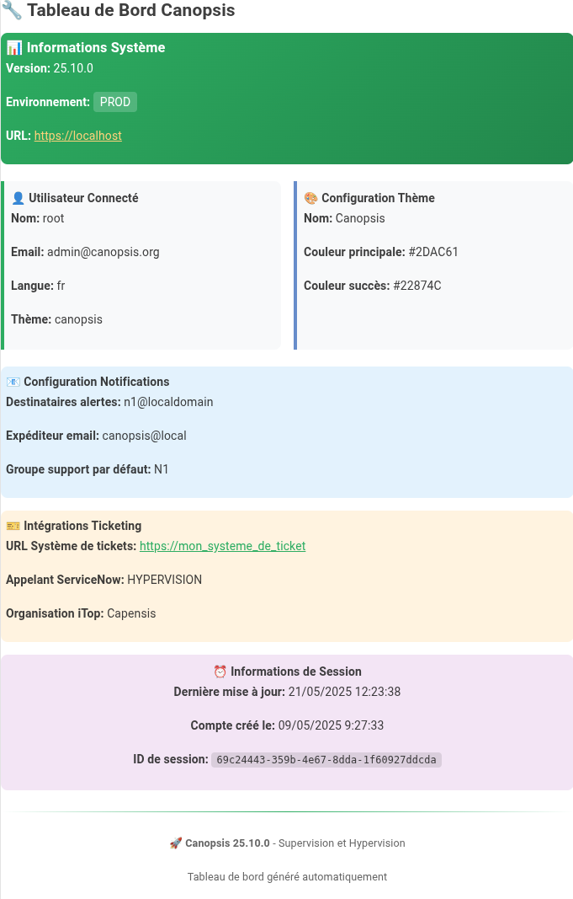
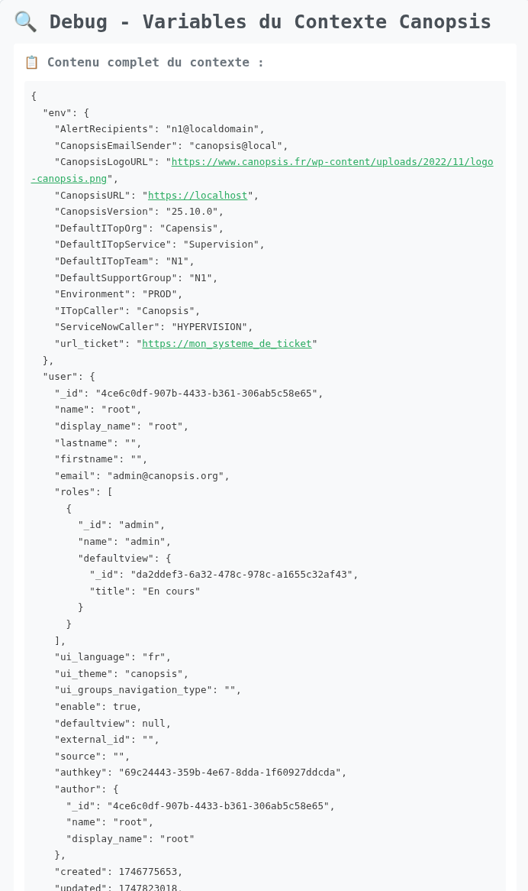

# Texte

Le widget Texte permet d’afficher librement du contenu destiné aux utilisateurs de l’interface Canopsis.  

C’est un widget polyvalent, souvent utilisé pour :

* Ajouter du contexte ou des consignes aux vues métiers
* Intégrer des liens vers des ressources externes (wiki, ticketing, dashboards…)
* Afficher des visualisations personnalisées via des iframe
* Mettre en valeur des informations dynamiques via le templating Handlebars

Ce widget supporte :

* Le templating Handlebars : accès aux variables d’environnement, helpers Canopsis personnalisés, conditions, itérations, etc.
* Le HTML standard pour une mise en forme fine
* L’intégration de contenus externes via iframe

La liste des [helpers disponibles](../../helpers/) permet d'enrichir dynamiquement le contenu affiché.



## Utilisation courante

Le widget permet d'afficher du texte formatté, il vous reste donc à lire le contenu !

## Paramètres du widget

### Aide - Contexte

Pour connaitre l'esnemble des variables disponibles à partir du widget Texte, vous pouvez utiliser un template qui va parcourir le contexte et afficher ces variables.

```html
<div style="font-family:monospace;padding:20px;background:#f8f9fa;border:1px solid #dee2e6;border-radius:8px">
  <h1 style="color:#495057;margin-bottom:20px">🔍 Debug - Variables du Contexte Canopsis</h1>
  
  <div style="background:white;padding:15px;border-radius:4px;margin-bottom:20px">
    <h2 style="color:#6c757d;font-size:18px;margin-bottom:15px">📋 Contenu complet du contexte :</h2>
    <pre style="background:#f8f9fa;padding:10px;border-radius:4px;overflow-x:auto;white-space:pre-wrap;word-break:break-all">{{json this}}</pre>
  </div>

  <div style="background:white;padding:15px;border-radius:4px;margin-bottom:20px">
    <h2 style="color:#6c757d;font-size:18px;margin-bottom:15px">🔑 Variables racine détectées :</h2>
    <div style="display:grid;grid-template-columns:repeat(auto-fill, minmax(200px, 1fr));gap:10px">
      {{#each this}}
        <div style="background:#e9ecef;padding:8px;border-radius:4px;font-size:14px">
          <strong>{{@key}}</strong>
          <div style="font-size:12px;color:#6c757d;margin-top:4px">
            {{#if this}}Valeur présente{{else}}Valeur vide/null{{/if}}
          </div>
        </div>
      {{/each}}
    </div>
  </div>

  {{#if user}}
  <div style="background:white;padding:15px;border-radius:4px;margin-bottom:20px">
    <h2 style="color:#6c757d;font-size:18px;margin-bottom:15px">👤 Objet user :</h2>
    <pre style="background:#f8f9fa;padding:10px;border-radius:4px;overflow-x:auto">{{json user}}</pre>
  </div>
  {{/if}}

  <div style="background:#d1ecf1;padding:15px;border-radius:4px;border-left:4px solid #bee5eb">
    <h3 style="color:#0c5460;margin-top:0">📝 Instructions :</h3>
    <ol style="color:#0c5460;margin:0">
      <li>Copiez le contenu JSON affiché ci-dessus</li>
      <li>Partagez-le pour analyse</li>
      <li>Un template adapté sera créé avec les vraies variables</li>
    </ol>
  </div>

  <div style="margin-top:20px;padding:10px;background:#fff3cd;border-radius:4px;font-size:14px;color:#856404">
    <strong>Note :</strong> Ce template utilise le helper {{json}} qui devrait être disponible selon la documentation Canopsis fournie.
  </div>
</div>
```

Le résultat aura la forme suivante



Toutes les variables présentes dans ce résultat peuvent être formattées via des [helpers handlebars]((../../helpers/)

### Titre (*optionnel*)

Ce paramètre permet de définir le titre du widget, qui sera affiché au-dessus de celui-ci.

Un champ de texte vous permet de définir ce titre.

### Template

Le widget met à disposition un éditeur de texte avec des capacités HTML.  
En utilisant le contexte vu [précédemment](#aide-contexte), vous pourrez rendre dynamique le contenu du widget.  

Voici un exemple permettant de créer un dashboard simple :

```html
{{! ===== WIDGET TEXTE CANOPSIS - TEMPLATE DE VITRINE ===== }}
<h2>🔧 Tableau de Bord Canopsis</h2>
<div style="background:linear-gradient(135deg, #2DAC61, #22874C);color:white;padding:6px;border-radius:8px;margin:15px 0">
	<h3>📊 Informations Système</h3>
	<p>
		<strong>Version:</strong>
		 {{env.CanopsisVersion}}
	</p>
	<p>
		<strong>Environnement:</strong>
		<span style="background:rgba(255,255,255,0.2);padding:4px 8px;border-radius:4px">{{env.Environment}}</span>
	</p>
	<p>
		<strong>URL:</strong>
		<a href="{{env.CanopsisURL}}" style="color:#FFD27A">{{env.CanopsisURL}}</a>
	</p>
</div>
<div style="display:grid;grid-template-columns:repeat(auto-fit, minmax(250px, 1fr));gap:15px;margin:20px 0">
	<div style="background:#f8f9fa;padding:8px;border-left:4px solid #2DAC61;border-radius:0 8px 8px 0">
		<h4>👤 Utilisateur Connecté</h4>
		<p>
			<strong>Nom:</strong>
			 {{user.display_name}}
		</p>
		<p>
			<strong>Email:</strong>
			 {{user.email}}
		</p>
		<p>
			<strong>Langue:</strong>
			 {{user.ui_language}}
		</p>
		<p>
			<strong>Thème:</strong>
			 {{user.ui_theme}}
		</p>
	</div>
	<div style="background:#f8f9fa;padding:8px;border-left:4px solid #678CCA;border-radius:0 8px 8px 0">
		<h4>🎨 Configuration Thème</h4>
		<p>
			<strong>Nom:</strong>
			 {{theme.name}}
		</p>
		<p>
			<strong>Couleur principale:</strong>
			<span>{{theme.colors.main.primary}}</span>
		</p>
		<p>
			<strong>Couleur succès:</strong>
			<span>{{theme.colors.state.ok}}</span>
		</p>
	</div>
</div>
<div style="background:#e3f2fd;padding:6px;border-radius:8px;margin:15px 0">
	<h4>📧 Configuration Notifications</h4>
	<p>
		<strong>Destinataires alertes:</strong>
		 {{env.AlertRecipients}}
	</p>
	<p>
		<strong>Expéditeur email:</strong>
		 {{env.CanopsisEmailSender}}
	</p>
	<p>
		<strong>Groupe support par défaut:</strong>
		 {{env.DefaultSupportGroup}}
	</p>
</div>
<div style="background:#fff3e0;padding:6px;border-radius:8px;margin:15px 0">
	<h4>🎫 Intégrations Ticketing</h4>
	<p>
		<strong>URL Système de tickets:</strong>
		<a href="{{env.url_ticket}}">{{env.url_ticket}}</a>
	</p>
	<p>
		<strong>Appelant ServiceNow:</strong>
		 {{env.ServiceNowCaller}}
	</p>
	<p>
		<strong>Organisation iTop:</strong>
		 {{env.DefaultITopOrg}}
	</p>
</div>
<div style="background:#f3e5f5;padding:8px;border-radius:8px;margin:15px 0;text-align:center">
	<h4>⏰ Informations de Session</h4>
	<p>
		<strong>Dernière mise à jour:</strong>
		 {{timestamp user.updated}}
	</p>
	<p>
		<strong>Compte créé le:</strong>
		 {{timestamp user.created}}
	</p>
	<p>
		<strong>ID de session:</strong>
		<code style="background:rgba(0,0,0,0.1);padding:2px 6px;border-radius:4px">
			{{user.authkey}}
		</code>
	</p>
</div>
<hr style="border:none;height:1px;background:linear-gradient(to right, transparent, #2DAC61, transparent);margin:25px 0">
<div style="text-align:center;color:#666;font-size:0.9em">
	<p>
		🚀 
		<strong>Canopsis {{env.CanopsisVersion}}</strong>
		 - Supervision et Hypervision
	</p>
	<p>
		Tableau de bord généré automatiquement
	</p>
</div>
```
