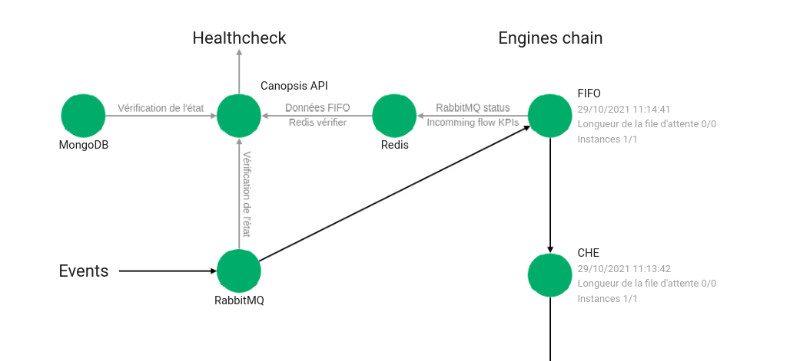
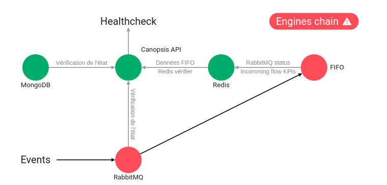
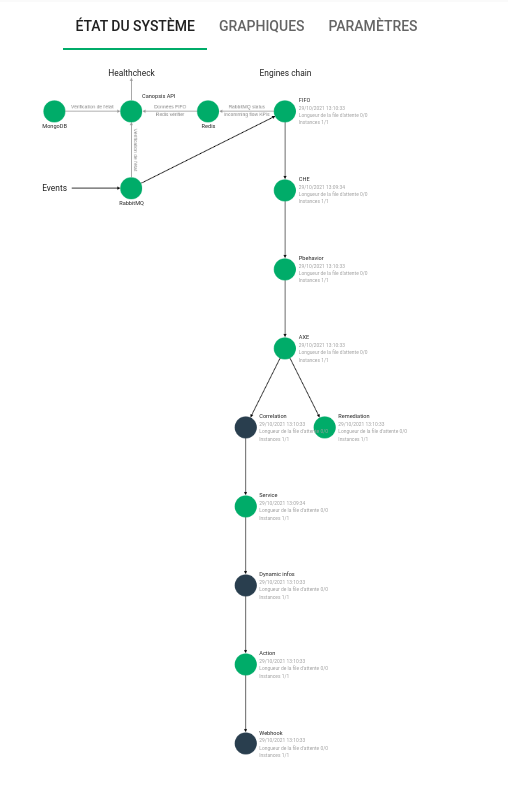
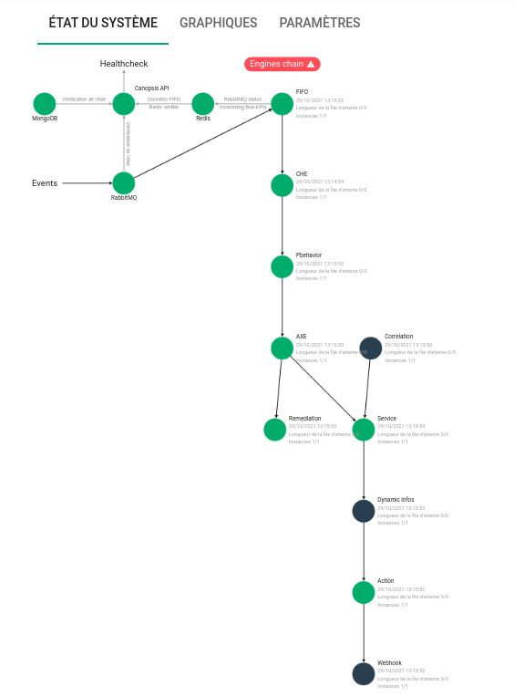
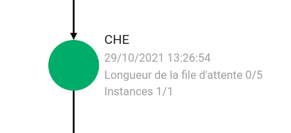
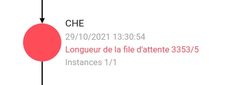
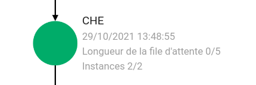
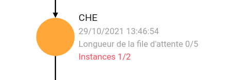
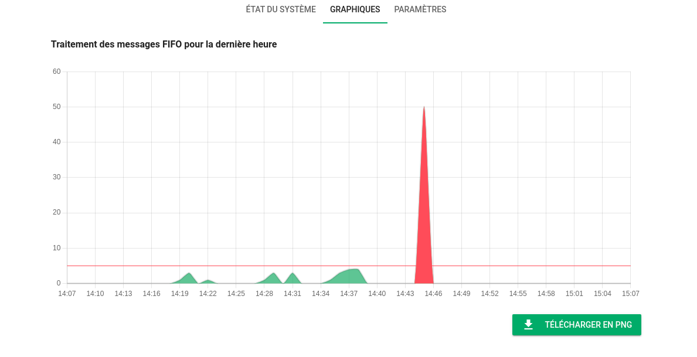
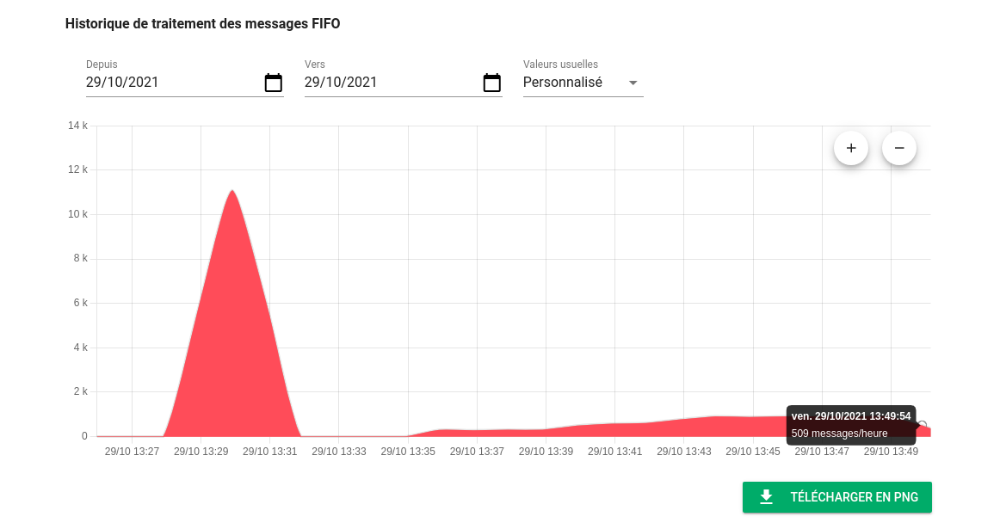

# Bilan de santé

!!! info "Information"
    Pour le moment, le module Healthcheck de l'interface graphique nécessite une [activation manuelle d'HTTPS](../../guide-administration/administration-avancee/configuration-composants/reverse-proxy-nginx-https.md) afin d'être pleinement fonctionnel.

Le module `Healthcheck` inclus dans Canopsis Edition Pro permet de connaitre l'état de chaque composant technique de Canopsis.  
Les composants éligibles sont : 

* [API Canopsis](#api-canopsis)
* [Cache Redis](#cache-redis)
* [Base de données MongoDB](#base-de-donnees-mongodb)
* [Bus RabbitMQ](#bus-rabbitmq)
* [Moteurs Canopsis](#moteurs-canopsis)

Le menu `Administration->Bilan de santé` vous permet  d'accéder aux résultats du module Healthcheck.



Chaque pastille représente l'état du composant indiqué et peut être verte, rouge, ou grise.



Par ailleurs, l'état global ou l'état de chaque composant est mis à disposition dans le bandeau de l'application.


!!! Note
    Le contrôle des composants est effectué une fois par minute.

En parallèle de l'état de santé des composants, vous avez accès à des graphiques montrant le nombre de messages traités dans Canopsis.

## État de santé des composants

### API Canopsis

Lorsque l'API de Canopsis est indisponible, vous ne pouvez plus accéder à l'interface graphique.  
La réponse technique lors de [l'appel à l'API](../../guide-developpement/swagger-community/index.md) pour la route `healthcheck`sera de la forme :

    <html>
    <head><title>502 Bad Gateway</title></head>
    <body>
    <center><h1>502 Bad Gateway</h1></center>
    <hr><center>nginx</center>
    </body>
    </html>

Il s'agit en réalité de la réponse renvoyée par le reverse proxy `nginx`.

**Remédiation associée**

=== "Paquets CentOS 7"

    ```sh
    systemctl restart canopsis-service@canopsis-api.service
    ```

=== "Docker Compose Community"

    ```sh
    CPS_EDITION=community docker compose restart api
    ```

=== "Docker Compose Pro"

    ```sh
    CPS_EDITION=pro docker compose restart api
    ```

Si cela ne permet pas de rétablir le service, une analyse de logs est nécessaire.

### Cache Redis

Lorsque le système de cache `redis` est indisponible, la pastille associée passe au rouge.  
Canopsis ne peut alors pas fonctionner correctement.

[La réponse renvoyée par l'API Canopsis](../../guide-developpement/swagger-community/index.md) sur la route `healthcheck` vous précisera alors le dysfonctionnement de Redis

**Remédiation associée**

=== "Paquets CentOS 7"

    ```sh
    systemctl restart redis.service
    ```

=== "Docker Compose Community"

    ```sh
    CPS_EDITION=community docker compose restart redis
    ```

=== "Docker Compose Pro"

    ```sh
    CPS_EDITION=pro docker compose restart redis
    ```

Si cela ne permet pas de rétablir le service, une analyse de logs est nécessaire.

### Base de données MongoDB

Lorsque la base de données `mongoDB` est indisponible, la pastille associée passe au rouge.  
Canopsis ne peut alors pas fonctionner correctement.

[La réponse renvoyée par l'API Canopsis](../../guide-developpement/swagger-community/index.md) sur la route `healthcheck` vous précisera alors le dysfonctionnement de MongoDB.

**Remédiation associée**

=== "Paquets CentOS 7"

    ```sh
    systemctl restart mongod.service
    ```

=== "Docker Compose Community"

    ```sh
    CPS_EDITION=community docker compose restart mongodb
    ```

=== "Docker Compose Pro"

    ```sh
    CPS_EDITION=pro docker compose restart mongodb
    ```

Si cela ne permet pas de rétablir le service, une analyse de logs est nécessaire.

### Bus RabbitMQ

Lorsque la base de données `rabbitmq` est indisponible, la pastille associée passe au rouge.  
Canopsis ne peut alors pas fonctionner correctement.

[La réponse renvoyée par l'API Canopsis](../../guide-developpement/swagger-community/index.md) sur la route `healthcheck` vous précisera alors le dysfonctionnement de RabbitMQ.

**Remédiation associée**

=== "Paquets CentOS 7"

    ```sh
    systemctl restart rabbitmq.service
    ```

=== "Docker Compose Community"

    ```sh
    CPS_EDITION=community docker compose restart rabbitmq
    ```

=== "Docker Compose Pro"

    ```sh
    CPS_EDITION=pro docker compose restart rabbitmq
    ```

Si cela ne permet pas de rétablir le service, une analyse de logs est nécessaire.

### Moteurs Canopsis

Le contrôle de bon fonctionnement des moteurs comporte plusieurs volets.  

#### L'enchainement des moteurs

La transmission d'événements d'un moteur à un moteur respecte un [ordre précis](../../guide-developpement/schemas/all-engines.md). 
Lorsque l'ordre est respecté, le schéma d'enchainement reste au vert.



Si cet ordre n'est pas celui constaté sur l'environnement contrôlé, alors le module de healthcheck réagit.



Dans le cas présent, on constate que le moteur `engine-correlation` n'est alimenté par aucun autre moteur.

**Remédiation associée**

Vous devez vous assurer que les options de lancement des moteurs sont correctement positionnées.

#### L'empilement de messages dans les files d'attente

Chaque moteur de Canopsis est associé à une file d'attente de messages.  
Si le nombre de messages dépasse une limite, on peut en déduire que le moteur n'arrive pas à consommer les messages dans les temps.  
Il peut alors s'agir d'un problème de performance dégradée ou d'un potentiel plantage du moteur qui n'arriverait plus du tout à consommer les messages.  

Le paramètre définissant la limite est un paramètre global à toutes les files d'attente de moteurs. Il est défini dans l'onglet `Paramètres` de la page de Bilan de santé.




**Remédiation associée**

Si le moteur en défaut continue à dépiler des messages dans sa file, cela signifie que la plate-forme n'est pas suffisamment dimensionnée pour accepter ce trafic.  
Les pistes à envisager dans ce cas sont : 

* Les requêtes non ou mal indexées dans la base de données MongoDB (Collscan à rechercher dans les logs)
* Les ressources locales allouées sont consommées.
* Envisager une instance supplémentaire du moteur

#### Le nombre d'instances minimal ou optimal d'un moteur n'est pas respecté

Le nombre d'instances minimal et optimal d'un moteur peut être défini dans le menu `Paramètres` du Bilan de santé.  
Si le nombre minimal d'instances n'est pas respecté, alors un avertissement est montré par le module.

Par exemple, avec la configuration suivante


Lorsque deux instances sont en cours d'exécution, le module indique 



Si une seule instance est en cours d'exécution, le module indique 



Le nombre d'instances optimal n'est pas exploité dans l'interface graphique. Il est à exploiter au travers de l'API.

## Graphiques

Dans le menu `Graphiques` du module de bilan de santé, vous accédez 

* au graphique montrant le nombre de messages traités dans la dernière heure



* à l'historique du nombre de messages traités dans Canopsis



## Sonde liveness

Le module `Healthcheck` met à disposition une route d'API, non authentifiée, permettant de savoir si l'ensemble des modules Canopsis sont opérationnels.  

Cet appel d'API
```
curl -X GET -H "Content-type: application/json" http://localhost:8082/api/v4/cat/healthcheck/live
```

renvoie : `{"ok":true}` lorsque tous les composants Canopsis sont OK et `{"ok":false}` lorsqu'un composant est défaillant.  

