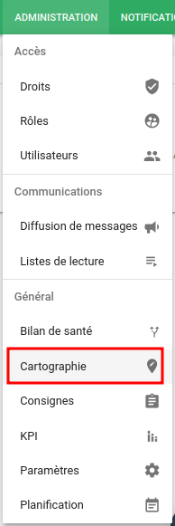
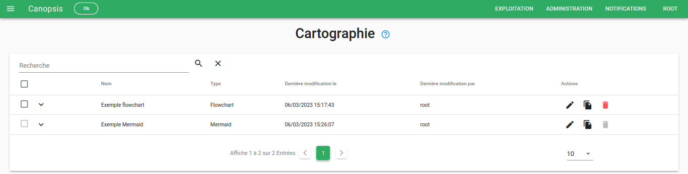
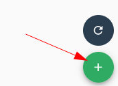
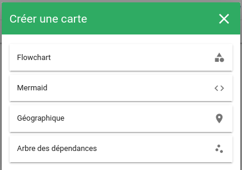
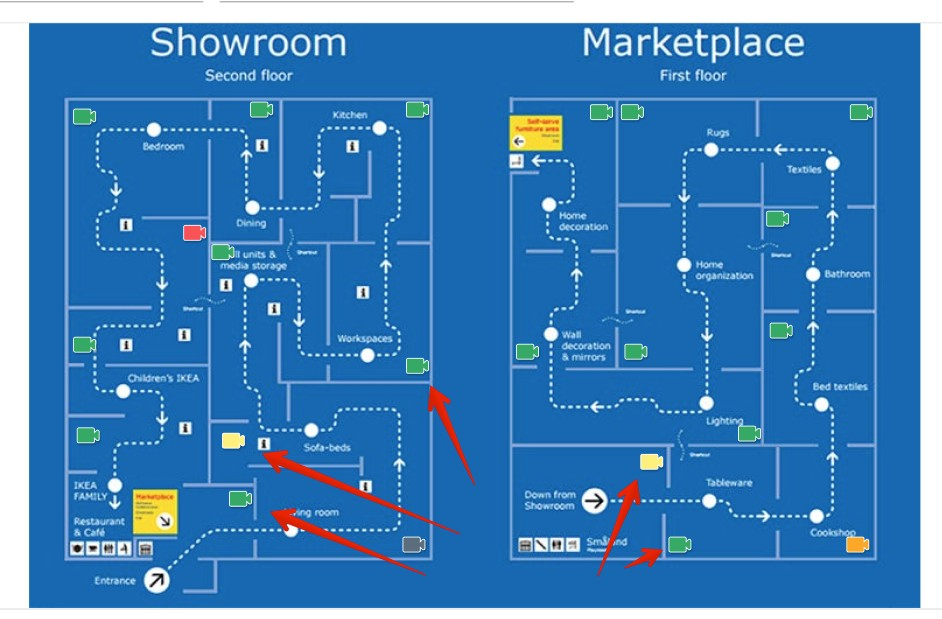
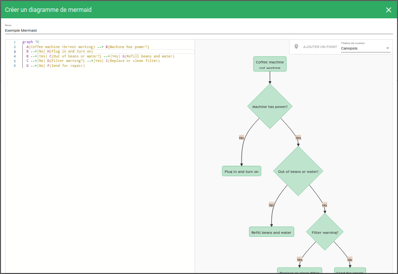
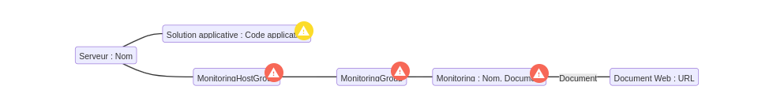
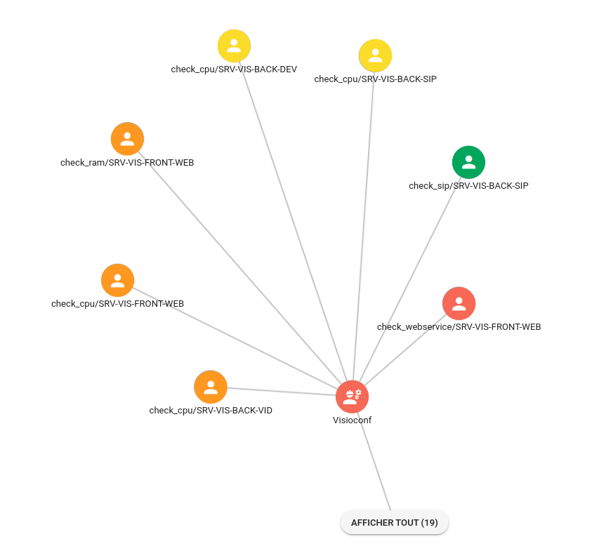

# Cartographie

Canopsis vous permet de créer plusieurs types de widgets cartographiques à différents niveaux d'abstractions, d'une carte géographique à 
 une carte logique.
Rendez-vous dans le menu `Administration -> Cartographie`.

## Liste

La vue principale affiche une liste de toutes les cartes qui ont été créés avec cet outil.  

## Créer une carte

Pour créer une carte, cliquer sur le bouton **+** dans le menu d'action rapide.

<<<<<<< HEAD
Il vous sera alors proposé plusieurs types de carte, à plusieurs niveaux d'abstraction.
=======
Il vous sera alors proposé plusieurs types de carte.
>>>>>>> b5d3a96adf (fix typo)

### Flowchart

Ce type de carte permet de dessiner une carte de type diagramme.

### Mermaid

Le format [**Mermaid**](https://mermaid-js.github.io/mermaid/) vous permet de créer des diagrammes et des visualisations en utilisant du texte et du code.  
Il s'agit d'un outil de création de diagrammes et de graphiques basé sur JavaScript qui rend les définitions de texte inspirées de Markdown pour créer et modifier les diagrammes de manière dynamique.

Exemple de rendu

### Arbre de dépendances

Voici un exemple d'arbre de dépendances:

## Utilisation

Une fois votre widget de cartographie créé, il est possible de l'ajouter a votre vue comme n'importe quel [widget](../../guide-utilisation/interface/index.md)

