# Consignes
## Mise en œuvre de la remédiation

!!! Abstract "Pages associées"
    cette page fait partie d'une série de trois documentations au sujet de la
    remédiation dans canopsis :
    
    1. la page [la remédiation dans canopsis][remed-index] présente la
    fonctionnalité et montre l'exécution d'une consigne pour l'utilisateur
    final ;
    2. la page en cours décrit la configuration de la remédiation dans canopsis
    pour la gestion des consignes et des jobs ;
    3. le guide d'administration
    [la remédiation et les jobs dans canopsis][admin-remed] traite de
    l'architecture technique et de la configuration à réaliser pour exécuter des
    jobs dans les ordonnanceurs supportés.

### Introduction

!!! Note
    Disponible à partir de Canopsis 4.0.0

Cette documentation vous permet de mettre en œuvre une remédiation de bout en bout.

Comme expliqué en [préambule][remed-index], l'anatomie d'une remédiation suit le
schéma ci-après :

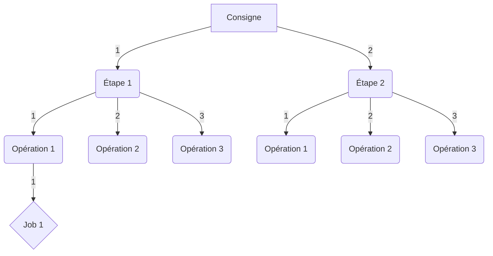

### Accès

Le menu `Administratration -> Consignes` vous permet d'accéder à la liste des consignes.  
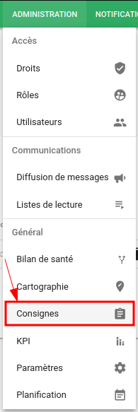

Sur cette page, vous trouverez la liste des consignes, leur état et quelques boutons d'actions rapides. Le processus de création de consigne est détaillé dans le chapitre [Créer une consigne](#creer-une-consigne).

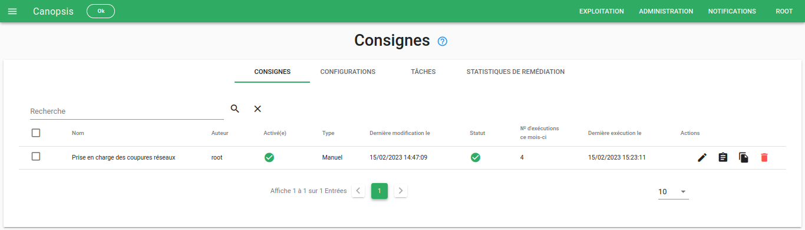

### Les droits

Le module de remédiation est soumis au [système de droits](./droits.md) sur l'interface et sur
les API.

**Interface**

Ces droits sont configurés dans le panneau de droits sous l'onglet
« [Technical](./droits.md#technical) ».

| Droits sur l'interface       | Définition                                         |
|:---------------------------- |:-------------------------------------------------- |
| `Remediation`                | Accès au panneau d'administration des remédiations |
| `Remediation configuration`  | Accès aux configurations d'ordonnanceurs           |
| `Remediation instruction`    | Accès aux consignes                                |
| `Remediation job`            | Accès aux jobs d'ordonnanceurs                     |

**API**

Ces droits sont configurés dans le panneau de droits sous l'onglet « [API](./droits.md#api) ».

| Droits sur les API       | Définition                                          |
|:------------------------ |:--------------------------------------------------- |
| `Instructions`           | Manipulation des consignes                          |
| `Runs instructions`      | Exécuter une consigne                               |
| `File`                   | Manipulation des fichiers inclus dans les consignes |
| `Job configs`            | Manipulation des configurations des ordonnanceurs   |
| `Jobs`                   | Manipulation des jobs d'ordonnanceurs               |

### Créer une consigne

Pour créer une consigne, rendez-vous dans le menu d'administration de la
remédiation, onglet « CONSIGNES ».

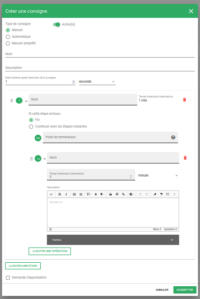

Saisissez à présent les différentes étapes et opérations de votre consigne.
Voici un exemple :

**Nom et description de la consigne**

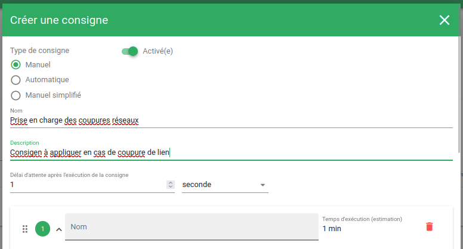

**Étape 1**

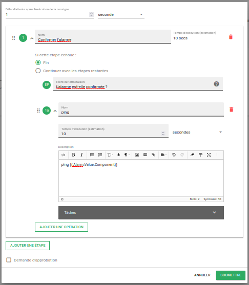

Puis, ajouter l'**Étape 2**

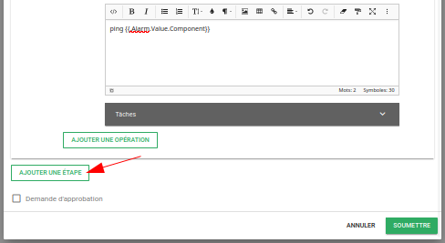

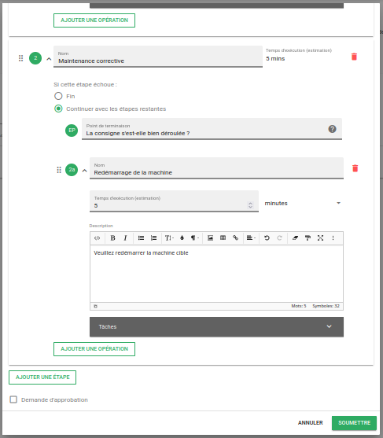

!!! Note
    Veuillez noter que les templates des opérations peuvent utiliser des
    [variables de payload][templates-payload].

    Ainsi vous disposez principalement des variables `.Alarm` et `.Entity`.

Une fois créée, votre consigne sera affichée dans la liste des consignes.

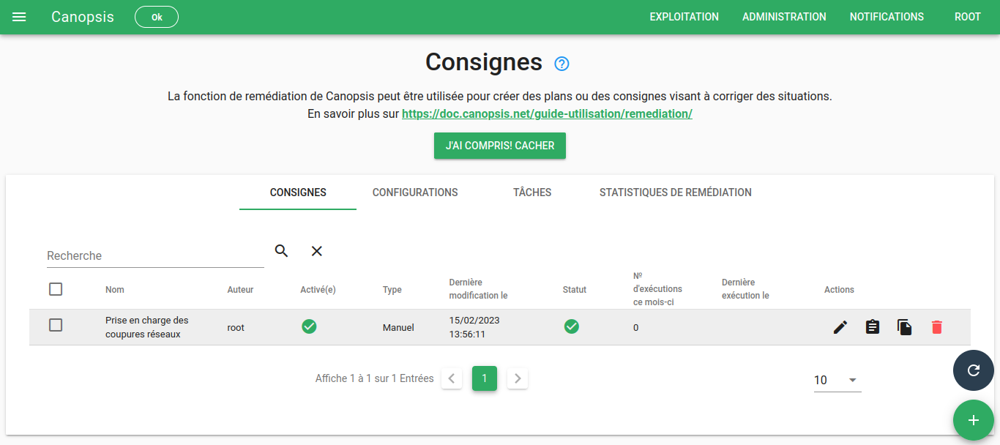

[templates-payload]: ../../../guide-administration/architecture-interne/templates-golang/#templates-pour-payload

### Assigner une consigne à des alarmes

Lorsque votre consigne a été créée, vous devez l'assigner à une ou des alarmes.
Pour cela, vous allez pouvoir sélectionner ces alarmes grâce à des patterns
spécifiques de l'alarme ou de l'entité associée à l'alarme.
Utilisez pour cela le bouton d'action situé à droite de votre consigne.

Puis, associez vos alarmes en saisissant les patterns souhaités. Dans notre
exemple, il s'agit d'assigner la consigne aux alarmes dont la ressource contient
`ping`.

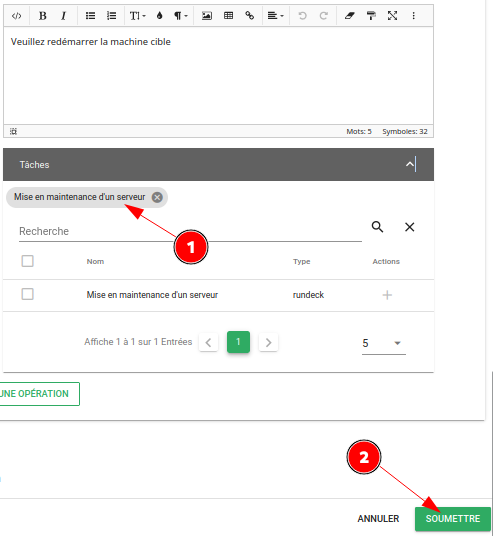

À ce stade, vous pouvez vérifier dans un bac à alarmes que les alarmes
sélectionnées par les patterns remplissent bien les conditions de votre consigne.

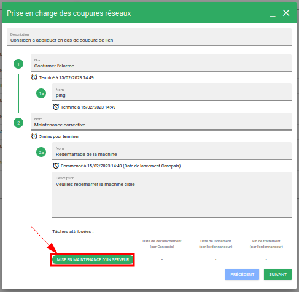

## Configuration

Cet onglet permet de gérer vos configurations d'ordonnanceurs.  

### Ajouter un ordonnanceur

Pour être en mesure de relier un job à une opération, il est nécessaire de
définir une configuration d'ordonnanceur, ainsi que le job en lui-même.  
Pour cela, rendez-vous dans le menu « CONFIGURATIONS » du panneau
d'administration des remédiations.

En cliquant sur le « + » en bas à droite, vous accéderez au formulaire suivant :

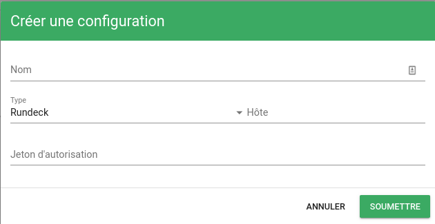

Explications sur les champs demandés :

* Nom : nom de la configuration qui sera utilisée dans la définition du job
* Type : `Rundeck` ou `Awx` fonction de votre ordonnanceur
* Hôte : adresse HTTP de votre ordonnanceur
* Jeton d'autorisation : jeton lié à votre utilisateur déclaré dans
l'ordonnanceur

!!! Note
    La configuration de cette liaison entre Canopsis et Rundeck ou AWX est
    expliquée plus en détails dans le
    [guide d'administration de la remédiation][admin-remed].

## Tâches

### Créer une tâche
Lorsque la configuration d'ordonnanceur est prête, vous pouvez déclarer un
*job*.

Rendez-vous dans le menu « JOBS » du panneau d'administration des remédiations.

En cliquant sur le « + » en bas à droite, vous accéderez au formulaire suivant :

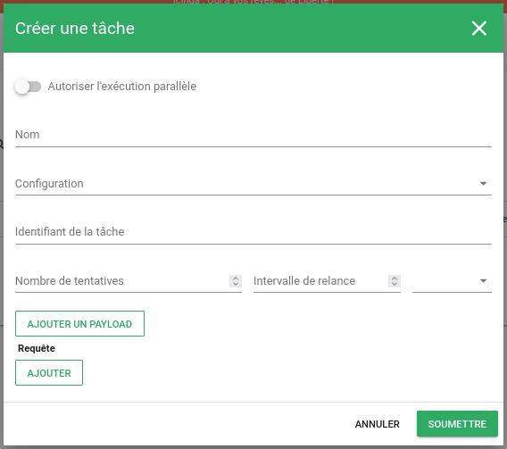

Explications sur les champs demandés :

* Nom : nom du job qui sera utilisé dans une consigne
* Configuration : sélection d'une configuration précédemment créée
* Job ID : identifiant du job donné par l'ordonnanceur
* Payload : corps du message qui sera transmis à l'ordonnanceur au moment de
l'exécution du job

!!! Note
    L'association de job Rundeck ou AWX est illustrée dans le
    [guide d'administration de la remédiation][admin-remed].

#### Payload

Le *payload* (corps de message) associé à un job permet de variabiliser son
exécution et ainsi passer des paramètres utiles à l'ordonnanceur de tâches.

2 objets sont disponibles dans ce payload :

1. `.Alarm`
2. `.Entity`

L'utilisation des payloads dans Rundeck et AWX est développée dans le
[guide d'administration de la remédiation][admin-remed-payloads].

[remed-index]: ../remediation/index.md
[admin-remed]: ../../guide-administration/remediation/index.md
[admin-remed-payloads]: ../../guide-administration/remediation/index.md#utilisation-des-payloads

### Associer un job à une opération

!!! attention
    Pour qu'un job soit disponible, une configuration spécifique est nécessaire.
    [Consultez ce paragraphe pour cela](#ajouter-un-ordonnanceur).

Vous avez la possibilité d'associer un job d'ordonnanceur à une opération dans
une consigne.

Pour cela, dans votre consigne, il vous suffit de sélectionner les jobs qui
seront présentés à l'utilisateur de la consigne pour exécution.  

Pour confirmer que le job est bien associé, la petite pastille s'affiche (**1**).  

Au moment de l'exécution de la consigne, les jobs associés pourront être
exécutés.  

## Statistiques de remédiation

Cette vue simple, permet d'afficher les statistiques de traitement de vos consignes.  
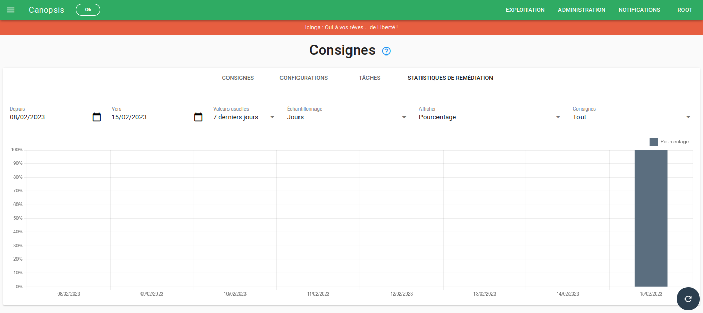
