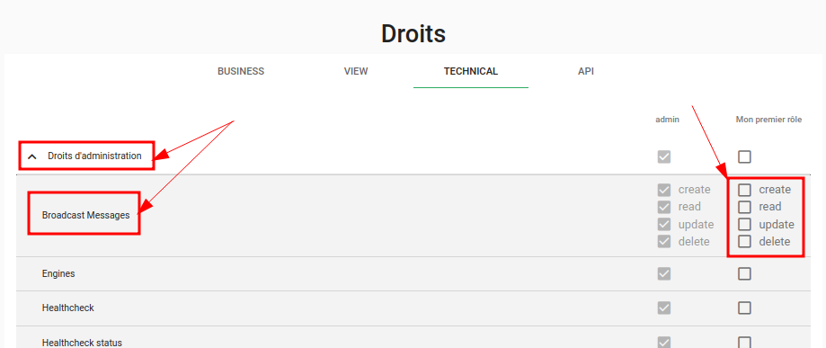
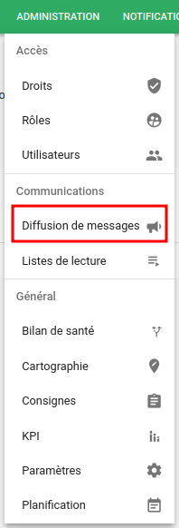
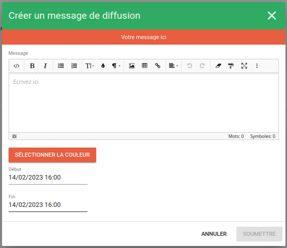
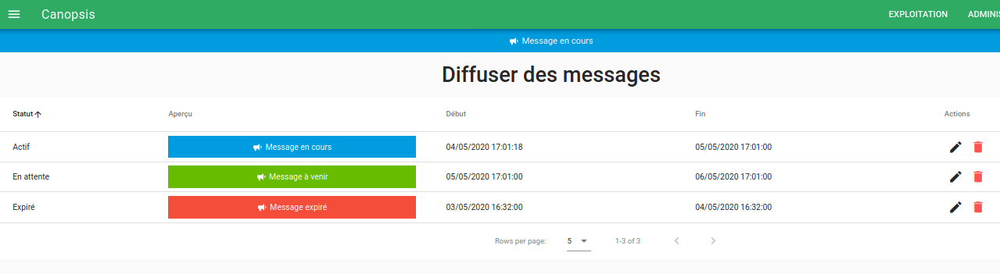

# Diffusion de messages

Vous pouvez diffuser des messages par le biais de l'interface de Canopsis.

Ces messages seront affichés dans des bandeaux situés en haut de la page. Il sont programmables, personnalisables et apparaîtront à l'écran de façon dynamique, sans avoir besoin de rafraîchir la vue en cours.

## Accès au paramétrage des messages

L'accès au paramétrage de ces bandeaux d'information nécessite des droits spécifiques. Ouvrez le menu Administration puis cliquez sur Droits et sur l'onglet Technical.

Faites défiler la liste des droits jusqu'à voir ceux qui concernent les "Broadcast Messages".

Cochez les cases nécessaires pour octroyer les droits voulus aux profils désignés :

- Create : donne le droit de créer des bandeaux.

- Read : permet l'accès au CRUD de diffusion des messages uniquement.

- Update : donne le droit de mettre à jour les messages existants.

- Delete : autorise le profil à supprimer des messages dans le CRUD.

## Paramétrage des bandeaux

L'accès au paramétrage des bandeaux se fait ensuite via le menu Administration dans lequel est apparu une nouvelle entrée.

Cliquez sur le bouton `+` en bas à droite de la page pour ouvrir la modale de création d'un nouveau message à diffuser.

Un aperçu du résultat final de votre message est disponible en haut de la fenêtre.

Les options de configuration sont les suivantes :

- Message : votre message à diffuser.

- Sélectionnez la couleur d'arrière plan : plusieurs modes sont disponibles.

    - Grâce à une palette de couleurs prédéfinies.

    - En entrant le code hexadécimal de la couleur.

    - En mode RBG et alpha (valeurs comprises entre 0 et 1).

    - En mode HSL et alpha.

- Début : permet la sélection de la date et de l'heure de démarrage de la diffusion.

- Fin : indique la date et l'heure de fin de diffusion.

En fonction des dates de début et de fin que vous aurez sélectionnées, 3 statuts de messages seront visibles dans l'interface.

Vous pouvez voir le message dont le statut est "Actif" apparaître en haut de la page. Les autres statuts sont "Expiré" ou "En attente".
