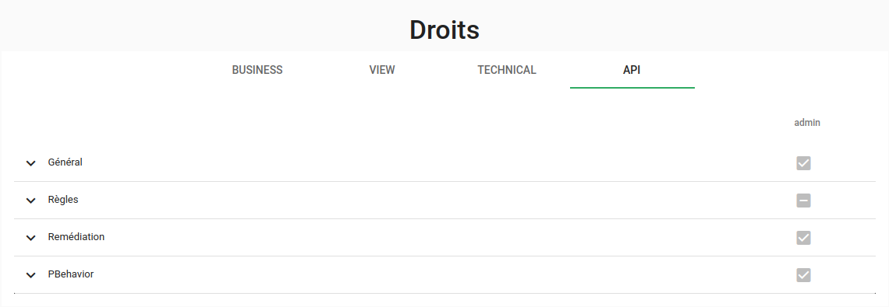

# Droits

Cette section décrit la gestion des droits utilisateurs et des rôles.

Pour accéder à ce menu, cliquez sur Administration > Droits :

## Gestion des droits

Après la création d'un nouveau [rôle](./roles/) il est nécessaire d'y associer des droits pour utiliser Canopsis.

La vue principale se compose d'un tableau avec plusieurs onglets que nous allons détailler.

À noter que le rôle admin ne peut éditer ses droits, ils sont tous activés par défaut.

### Business

Cette vue regroupe les droits relatifs à la gestion des évènements.  
Vous trouverez plus de détails en cliquant sur la flèche pour dérouler la liste (**1**).  
Il est possible d'ajouter des droits de manière globale en cliquant sur la case à droite de la section (**2**) ou, affiner les droits de chaque section (**3**).

### View

Cet onglet permet de gérer les droits relatifs aux actions sur les **Alarmes**, **L'explorateur de Contexte** et les **Listes de lecture**.

Il est possible de spécifier les droits suivants par élément :

  - **read**: Donne accès à la fonctionnalité (lecture);
  - **update**: Permet d'éditer l'élement (modification);
  - **delete**: Permet de supprimer l'élement.

Exemple avec la gestion des droits d'une liste de lecture, on sélectionne les droits voulus pour le rôle (**1**) puis on valide les changements en cliquant sur soumettre (**2**).

### Technical

Cet onglet permet de gérer les droits suivants:

  - Droits d'administration: Permet de gérer l'accès de vos rôles aux différentes options du menu **Administration**;
  - Droits d'exploitation: Permet de gérer l'accès de vos rôles aux différentes options du menu **Exploitation**;
  - Droits de notification: Permet de gérer les **notifications**;
  - Droits de profil: Permet de gérer les **profils**.

### API

Cet onglet permet de gérer les droits relatifs aux APIs.

