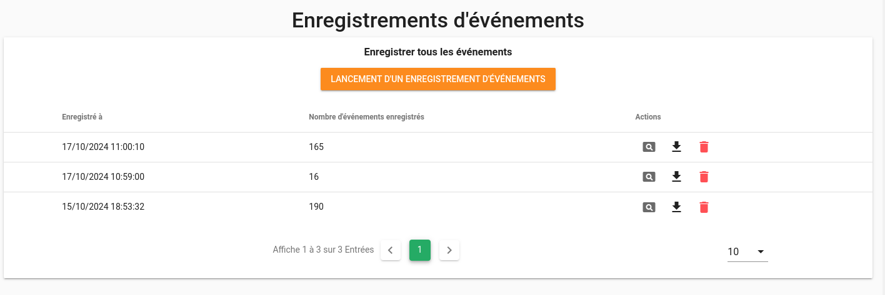
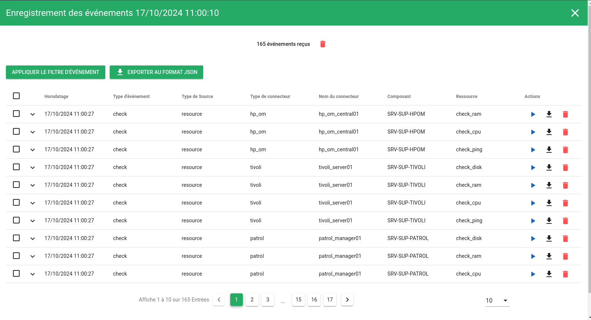

# Enregistrements d'événements

Canopsis met à disposition une version graphique de l'outil [Amqp2tty](../../../guide-de-depannage/amqp2tty).  
La commande ̀`amqp2tty` permet d'afficher sur une console les événements bruts présents dans le bus de données RabbitMQ avant transformation par Canopsis.  

Le module `Enregistrements d'événements` est la version graphique de `amqp2tty`.

## Liste des enregistrements

Lorsque vous accédez au module, la liste des enregistrements existants apparait.  
Pour chaque enregistrement, vous pouvez connaitre l'horaire ainsi que le nombre d'événements contenus.  
Vous pouvez également exécuter les actions suivantes :

* Consulter le contenu de l'enregistrement
* Télécharger l'enregistrement au format JSON
* Supprimer l'enregistrement

## Lancement d'un enregistrement

!!! info "Information"

    Seul un enregistrement à la fois peut-être exécuté

Lorsque vous déclenchez le lancement d'un enregistrement, un éditeur de patterns vous est proposé.  
Une fois le pattern renseigné, cliquez sur "Soumettre" pour lancer effectivement l'enregistrement.  

A ce stade, une nouvelle ligne est ajoutée à la liste des enregistrements, elle est mise à jour régulièrement pendant l'enregistrement.  
Vous pouvez stopper l'enregistrement à tout moment. Notez qu'il nest pas possible de consulter le contenu de l'enregistrement qui est en cours.  

## Consulter un enregistrement

Sur chaque ligne d'enregistrements, vous avez à disposition l'action qui vous permet de consulter le contenu.  
Un popup s'ouvre et vous présente chaque événement reçu. Les colonnes du tableau ne sont pas paramétrables.  

Vous pouvez 

* Appliquer un filtre sur ces résultats pour n'en sélectionner qu'une partie
* Exporter au format JSON le contenu
* Supprimer l'enregistrement complet ou certains événements
* Ré émettre un événement reçu en particulier avec l'action "Renvoyer l'événement"
* Ré émettre un ensemble d'événements reçus avec l'action de masse "Renvoyer les événements"

