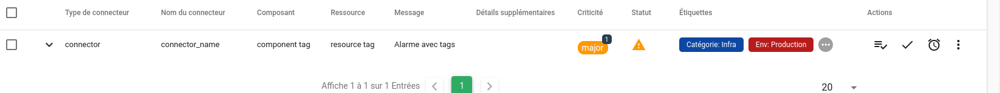
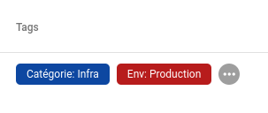
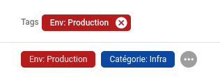
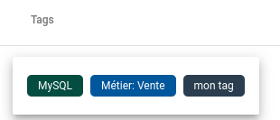
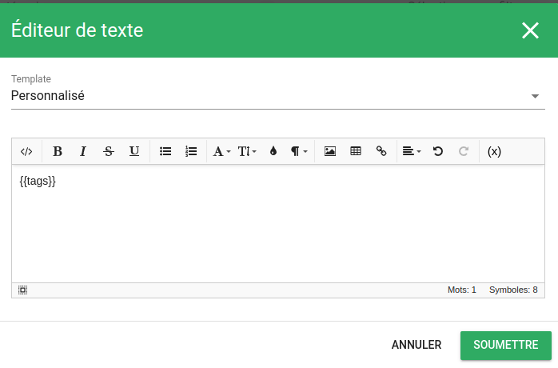
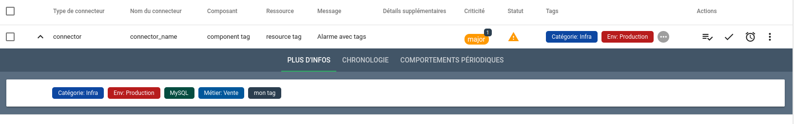

# Gestion des tags

## Définition

Les `Tags` ou `Etiquettes` sont des informations associées à des alarmes permettant par exemple de :

* Catégoriser les alarmes (applicatives, techniques, ...)
* Définir l'environnement des alarmes (production, qualification, ...)
* Définir l'impact potentiel d'une alarme
* etc

Les tags peuvent être portés directement dans des événements entrants ou être définis par des règles de gestion.

## Tags présents dans les événements

Dans les événements, les tags prennent la forme suivante :

```json
{
  "tags": {
    "tag1" : "valeur1",
    "tag2" : "",
    "tagn" : "valeur n"
}
```

Prenons l'exemple de cette publication d'événement :

```sh
curl -X POST -u root:root -H "Content-Type: application/json" -d '{
  "connector" : "connector",
  "connector_name" : "connector_name",
  "event_type" : "check",
  "source_type" : "resource",
  "component" : "component tag",
  "resource" : "resource tag",
  "state" : 2,
  "output" : "Alarme avec tags",
  "tags" : {
          "MySQL" : "",
          "Env": "Production",
          "Catégorie" : "Infra",
          "Métier" : "Vente"
  }
}' 'http://localhost:8082/api/v4/event'
```

Le bac à alarmes montrera une colonne `Tags` de la façon suivante




## Règles de gestion des tags

Au delà des tags portés par les événements, Canopsis met à disposition un gestionnaire de tags capable de présenter :

* Les tags issus des événements : ils sont dits "importés"
* Les tags pilotés par Canopsis directement : ils sont dits "Crées"

Ce gestionnaire est disponible dans le Menu "Administration-> Gestion des tags"

Les tags issus des événements ne peuvent pas être supprimés. L'administrateur peut toutefois changer la couleur associée.  


| Champ | Description |
|-------| ------------|
| **Nom du tag**  | Nom du tag |
| **Sélectionner la couleur** | Permet de sélectionner la couleur du tag |
| **Modèles des alarmes** | Le tag est associé aux alarmes qui correspondent au modèle |
| **Modèles des entités** | Le tag est associée aux alarmes dont l'entité correspond au modèle |


## Interface graphique

L'exploitation des tags se fait essentiellement au travers du bac à alarmes.

Vous avez la possibilité d'ajouter une colonne `Tags` qui vous présentera les tags sous forme de bouton cliquable.  



Un clic sur un tag permet de sélectionner uniquement les alarmes qui possèdent ce tag



Un clic sur les "3 points" permet de montrer l'ensemble des tags de l'alarme



Enfin, un [Helper Handlebars](../interface/helpers/index.md#helper-tags) `tags` est mis à disposition de Canopsis.  
Exemple dans une fenêtre "Plus d'infos" d'un bac à alarmes :




