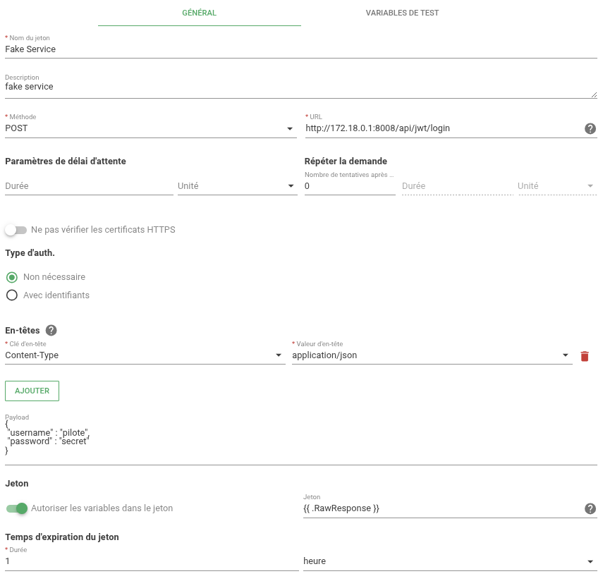
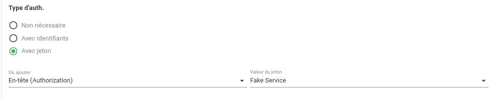

# Jetons d'authentification externe

## Définition

Un jeton d'authentification externe (ou external auth token) est un jeton délivré par un service d'authentification tiers et réutilisé par Canopsis pour authentifier des requêtes vers ce service (par exemple pour créer un ticket, interroger une CMDB, etc.).  
La fonctionnalité permet de configurer la requête d'obtention du jeton, d'extraire le jeton depuis la réponse, et de définir la durée de vie du jeton afin que Canopsis sache quand en demander un nouveau.

Cas d'usage typiques :

* Un outil qui renvoie un JWT en plaintext suite à une requête POST /api/jwt/login.
* Un outil qui renvoie un objet JSON { "token": "xxx", "expires_in": 3600 }.
* Un service qui requiert un header Authorization: <token> pour la création d'un ticket.

## Configuration

| Paramètre | Description |
| --- | --- |
| **Nom du jeton** | Nom du jeton |
| **Description** | Description du jeton |
| **Methode** | [Méthode HTTP](https://datatracker.ietf.org/doc/html/rfc7231#section-4.3) à utiliser. |
| **URL** | URL de la requête HTTP de l'outil d'authentification. |
| **Paramètres de délai d'attente** | Délai à attendre avant l'exécution de l'action. |
| **Répéter la demande** | Nombre de tentatives avant d'abandonner en cas de problème avec la requête. |
| **Ne pas vérifier les certificats HTTPS** | Si coché, la validité du certificat HTTPS n'est pas vérifiée et la requête est exécutée même si le serveur HTTP présente un certificat invalide. |
| **Type d'authentification ?** | Active/désactive l'authentification HTTP pour la requête. |
| **Non nécessaire ?** | Désactive l'authentification HTTP pour la requête. |
| **Avec identifiants ?** | Active l'authentification HTTP pour la requête. |
| **Identifiant utilisateur** | Nom d'utilisateur pour la requête HTTP. |
| **Mot de passe** | Mot de passe pour la requête HTTP. |
| **Entêtes** | Entêtes HTTP à ajouter à la requête. |
| **Payload** | Corps de la requête. Supporte les [Templates GO](../templates-go/index.md). |
| **Autoriser les variables dans le jeton** | Si coché, permet d'utiliser des variables pour récupérer le jeton (ex. `{{ .RawResponse }}` pour exploiter la réponse brute). |
| **Jeton** | Champ de réponse de l'API contenant le jeton |
| **Temps d'expiration du jeton** | Durée de validité du jeton |


## Exploitation

**Cycle de vie d'un jeton**

1. Canopsis appelle le endpoint configuré (méthode, URL, headers, payload).
2. La réponse est capturée.
3. Le champ Jeton (template) est évalué pour extraire le token.
4. Tant que le token est valide, Canopsis l'utilise pour signer les requêtes cibles (p.ex. header Authorization).
5. À l'expiration (ou en cas d'échec d'une requête nécessitant un token valide), Canopsis redemande un nouveau jeton.

**Mode d'insertion du token dans les requêtes sorties**

Dans la configuration de la cible webhook ([scénario](../menu-exploitation/scenarios.md) ou [règles de déclaration de tickets](../menu-exploitation/regles-declaration-tickets.md)) :

* Header brut : Authorization: {{ .Token }}.
* Header avec préfixe : Authorization: Bearer {{ .Token }}.
* Header personalisé : Custom: {{ .Token }}.
* Payload : Nom du paramètre : {{ .Token }}.
* URL : Nom du paramètre : {{ .Token }}.


## Exemple concret

Prenons l'exemple d'un service de ticketing qui nécessite l'obtention préalable d'un token JWT pour créer un ticket.  
L'obtention d'un token JWT s'effectue de la manière suivante :

```sh
curl -X POST -H "Content-Type: application/json" "http://localhost:8008/api/jwt/login" -d '{
 "username":"pilote",
 "password":"secret"
}'
```

La réponse brute renvoie directement le JWT (texte). 
En utilisant {{ .RawResponse }} Canopsis stocke la chaîne renvoyée comme token.  



Paramètres :

```
Méthode : POST
URL : http://localhost:8008/api/jwt/login
Headers : Content-Type: application/json
Payload : { "username":"pilote","password":"secret" }
Autoriser les variables dans le jeton : Oui
Jeton : {{ .RawResponse }}
Temps d'expiration du jeton : 1h
```

A ce stade, le scénario de création de ticket utilisera ce jeton dans un header `Authorization:` :


