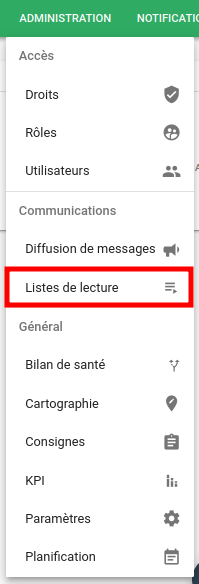
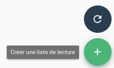
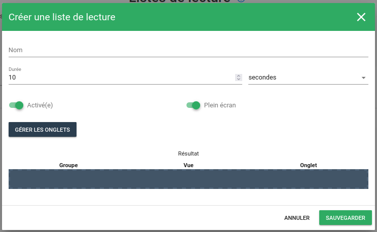
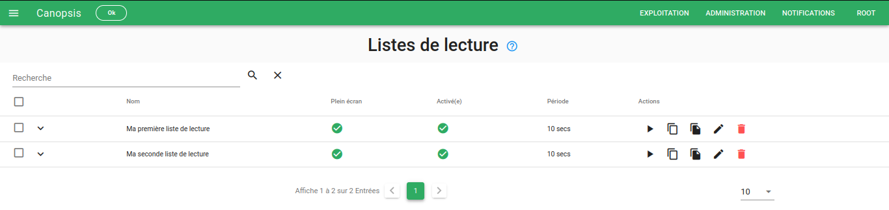
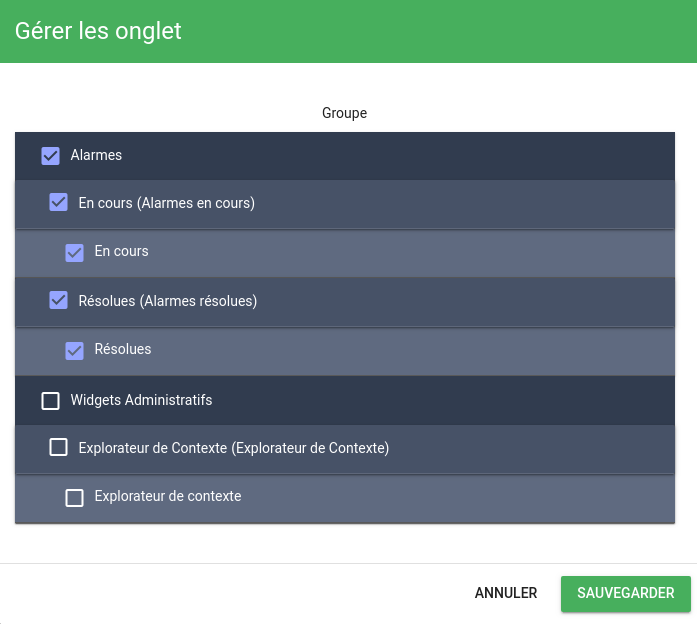
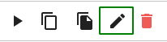
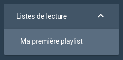

# Listes de lecture

Les listes de lecture sont composées de vues (plus précisément d'onglets de vues) qui sont affichées les unes à la suite des autres.

Elles peuvent être affichées en mode "plein écran" sur un téléviseur par exemple.

## Création d'une liste de lecture

Rendez-vous tout d'abord dans le menu Administration > Listes de lecture :

Il est ensuite possible de créer une liste de lecture en cliquant sur le bouton "+".

Une fenêtre apparaît :

Plusieurs informations concernant la liste de lecture sont demandées :

* Nom (*requis*): Nom de la liste de lecture
* Intervalle: Intervalle de temps entre l'affichage des vues
* Activée: La liste de lecture doit-elle être accessible, ou non ?
* Plein écran: La liste de lecture doit-elle être affichée en plein écran, ou non ?
* Gérer les onglets: Il s'agit de sélectionner les onglets de vues qui participent à cette liste de lecture.

Une fois les champs renseignés, cliquez sur "Sauvegarder". Votre liste de lecture apparaîtra dans la liste des listes de lecture.

### Gestion des onglets

Une liste de lecture est contituée d'un ensemble d'onglets appartenant eux-mêmes à des vues.

Le gestionnaire d'onglets permet de sélectionner et de définir l'ordre des onglets appartenant à une liste de lecture.

!!! attention
    Le rafraîchissement périodique des vues est désactivé dans les playlists.

Une fois les onglets sélectionnés, vous pouvez les ordonner par glisser/déposer.

## Édition/Suppression d'une liste de lecture

Une fois la liste de lecture créée, il est bien évidemment possible de modifier les informations la concernant (Nom, Intervalle, etc).

### Éditer une liste de lecture

Pour modifier une liste de lecture, utilisez le bouton d'édition .

Vous accéderez alors au formulaire d'édition.

### Supprimer une liste de lecture

La suppression de listes de lectures peut se faire de manière unitaire avec le bouton de suppression  
ou de manière massive en sélectionnant les listes de lecture à supprimer.

## Affichage et exploitation d'une liste de lecture

### Démarrer une liste de lecture

**À partir du menu latéral**

Lorsque vous avez accès à une liste de lecture, elle apparait automatiquement dans le menu latéral de Canopsis.

 

**À partir de l'URL directe**

Il est possible d'utiliser l'URL directe d'une liste de lecture pour la jouer dans un navigateur.

Pour cela, il vous faut cliquer sur le bouton permettant de recopier le lien de la liste de lecture et l'utiliser directement dans votre navigateur.
 

!!! note
    Vous pouvez utiliser le paramètre `autoplay=true` pour que la liste de lecture démarre automatiquement sans intervention

**À partir de la liste des listes de lecture**

Vous pouvez démarrer une liste de lecture à partir de la liste des listes de lectures en cliquant sur le bouton de lecture  

### Boutons de navigation

* Temps restant avant le chargement de la vue suivante
* Vue précédente
* Démarrer la liste de lecture / Mettre en pause la liste de lecture
* Vue suivante
* Mode plein écran
