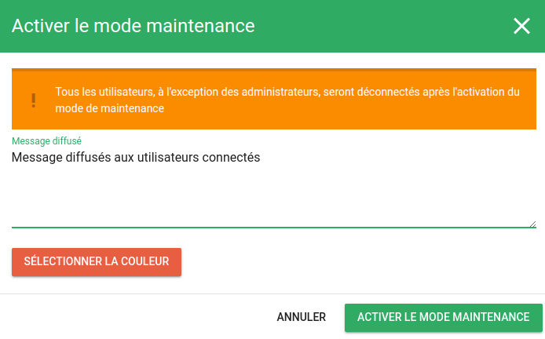
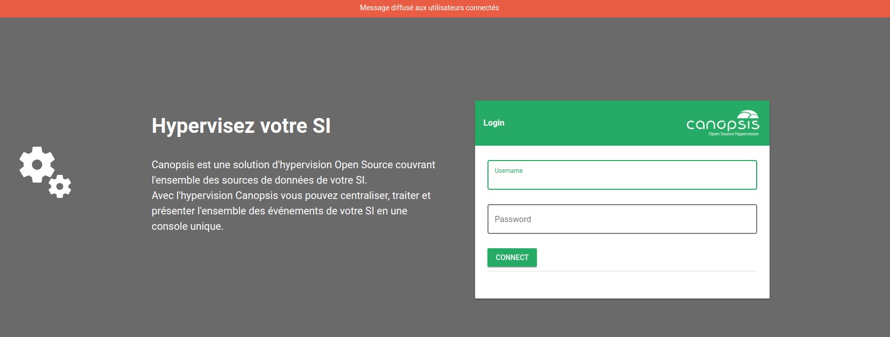
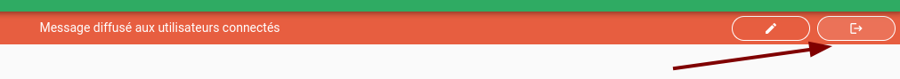

# Mode Maintenance

Lorsque vous devez intervenir sur Canopsis ou l'un de ses composants, vous avez la possibilité de basculer Canopsis en mode Maintenance.  
Les utilisateurs connectés sont prévenus par un popup et sont déconnectés peu de temps après.  

Seuls les utilisateurs ayant un profil "admin" peuvent encore se connecter et exploiter l'outil.

## Bascule en mode maintenance

Rendez-vous tout d'abord dans le menu Administration > Mode Maintenance :

Les utilisateurs alors connectés seront avertis et déconnectés de Canopsis.  
Il sera alors impossible pour un utilisateur non administrateur de se connecter à nouveau.  

L'apparence de la page de connexion est modifiée durant le temps de la maintenance.

## Sortie du mode maintenance

La sortie du mode maintenace s'effectue en cliquant sur le bouton de sortie

Dès lors, les utilisateurs peuvent à nouveau se connecter.
