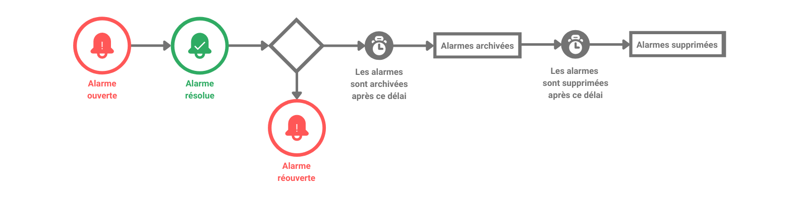
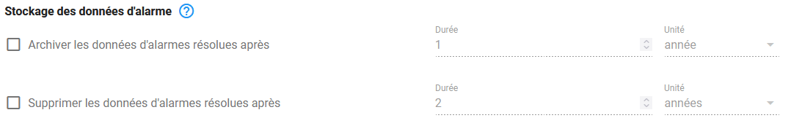

# Paramètres de stockage

Certaines données accumulées dans Canopsis peuvent être régulées par une politique de stockage. Les types de données éligibles sont : 

* [Les alarmes](#les-alarmes)
* [Les entités](#les-entites)
* [Les statistiques liées aux remédiations](#les-statistiques-liees-aux-remediations)
* [Les comportements périodiques](#les-comportements-periodiques)
* [Les résultats de scénarios Junit](#les-resultats-de-scenarios-junit)
* [Les statistiques Healthcheck](#les-statistiques-healthcheck)

!!! Note
    Cette politique de stockage est appliquée une fois par semaine. Vous pouvez définir le jour et l'heure d'exécution dans le fichier de configuration `canopsis.toml`
    ```ini
    [Canopsis.data_storage]
    TimeToExecute = "Sunday,23"
    ```

## Les alarmes

Le cycle de vie d'une alarme respecte le schéma suivant : 



Vous avez la possibilité de définir les délais avant archivage et avant suppression définitive des alarmes dans le menu `Administration->Paramètres->Paramètres de stockage`.



L'archivage des alarmes consiste à déplacer les alarmes éligibles (résolues et respectant le délai défini) dans une collection de données dédiée.  
Ces alarmes restent ainsi disponibles pour les administrateurs en cas de besoin.

La suppression des alarmes résolues est quant à elle définitive et a lieu après le délai défini.

Par ailleurs, les alarmes `ouvertes` (collection `periodical_alarm`) et les alarmes `résolues` (collection `resolved`) ne sont désormais plus stockées dans le même espace pour garantir la performance d'accès aux alarmes en cours.  

Le paramètre `TimeToKeepResolvedAlarms` permet de définir le délai à partir duquel une alarme résolue passera de la collection `ouvertes` à la collection `résolues`

Ce paramètre se situe dans le fichier de configuration `canopsis.toml`.

```ini
[Canopsis.alarm]
# TimeToKeepResolvedAlarms defines how long resolved alarms will be kept in main alarm collection
TimeToKeepResolvedAlarms = "720h"
```


## Les entités

Les entités désactivées peuvent être :

* archivées : déplacées dans une collection de données dédiée
* supprimées : supprimées définitivement de la collection d'archives

!!! Attention 
    Une option permet également l'archivage ou la suppression des impacts et dépendances de ces entités.  
    Pour les **connecteurs**, tous les composants et ressources dépendants sont archivés ou supprimés.  
    Pour les **composants**, toutes les ressources dépendantes sont archivées ou supprimées.

!!! Note
    Cette opération n'est pas éligible à l'ordonnancement général et ne peut s'effectuer qu'à la demande 

## Les statistiques liées aux remédiations

Les statistiques d'exécutions des remédiations peuvent être agrégées par semaine après le délai défini. Seul le nombre d'exécutions par semaine sera conservé.  

Ces statistiques sont totalement supprimées avec le délai défini.

## Les comportements périodiques

Les comportements périodiques peuvent être supprimés après le délai défini.  
Ils doivent néanmoins respecter les conditions suivantes :

* Etre inactifs
* Ne plus posséder de périodes de temps à venir

Le délai s'applique à partir de la fin de la  dernière période du comportement périodique.

## Les résultats de scénarios Junit

Les données associées aux scénarios Junit (fichiers XML, captures d'écran, vidéos) sont supprimés après le délai défini.

## Les statistiques Healthcheck

Les données concernant le nombre d'événements entrants dans Canopsis (moteur `fifo`) sont supprimées après le délai défini.
