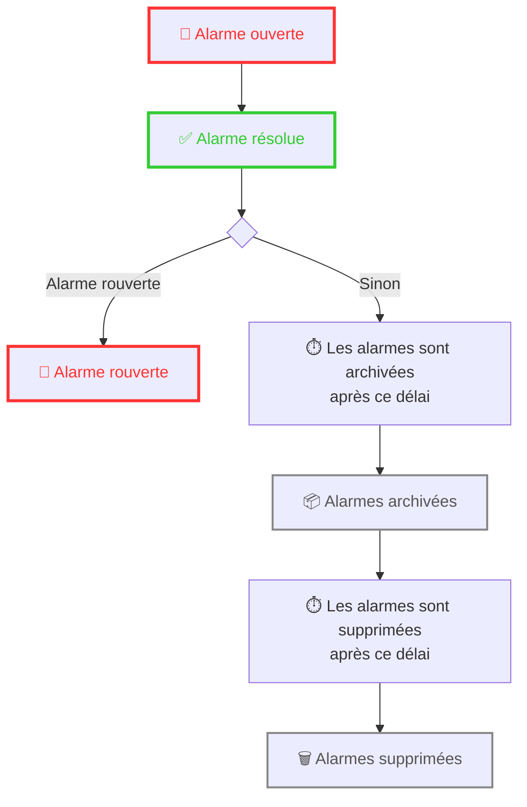

# Paramètres de stockage

Certaines données accumulées dans Canopsis peuvent être régulées par une politique de stockage.

!!! Note
    Cette politique de stockage est appliquée une fois par semaine. Vous pouvez définir le jour et l'heure d'exécution dans le fichier de configuration `canopsis.toml`.

    ```ini
    [Canopsis.data_storage]
    TimeToExecute = "Sunday,23"
    ```

Le tableau suivant décrit précisément chaque opération.  
La durée et l'unité sont configurables dans l'interface.


| Section | Opération | Action réalisée |
|---------|-----------|-----------------|
| [**Alarmes**](#alarmes)  | Archiver les alarmes résolues | Déplace les alarmes résolues dont `v.resolved` est plus ancien que l'intervalle défini de la collection `resolved_alarms` (TimeToKeepResolvedAlarms) vers la collection `archived_alarms`. |
|  | Supprimer les alarmes résolues | Supprime les alarmes archivées trop anciennes (`v.resolved`) de la collection `archived_alarms`. |
| [**Entités non liées**](#entites) | Archiver les entités sans événements | Déplace les entités "abandonnées" (avec `last_event_date` trop ancien ou `null`) de la collection `default_entities` vers la collection `archived_entities`. |
| [**Consignes**](#consignes) | Supprimer l'historique des consignes | Supprime les anciennes exécutions dans `instruction_execution` et les enregistrements associés de `job_history`. |
|  | Supprimer les statistiques de consignes | Définit une rétention sur la table TimescaleDB `instruction_execution_hourly` afin de supprimer automatiquement les lignes trop anciennes. |
|  | Supprimer le résumé des consignes | Définit une rétention sur la table TimescaleDB `instruction_execution_by_modified_on` afin de supprimer automatiquement les lignes trop anciennes. |
| [**Comportements périodiques**](#comportements-periodiques) | Supprimer les Comportements périodiques inactifs | Supprime les comportements de la collection `pbehavior` : ceux sans `rrule` et avec un `tstop` trop ancien, ou ceux avec `rrule_end` trop ancien. |
| [**JUnit**](#junit) | Supprimer les jeux de tests | Supprime les suites de tests de la collection `junit_test_suite` trop anciennes, efface les médias associés, et nettoie les IDs obsolètes dans les paramètres des widgets JUnit. |
| [**Healthcheck**](#healthcheck) | Supprimer le flux FIFO entrant | Définit une rétention sur la table TimescaleDB `message_rate_hourly` pour supprimer les lignes trop anciennes. |
| [**Webhooks**](#webhooks) | Supprimer l'historique des webhooks | Supprime les enregistrements trop anciens de la collection `webhook_history`. |
|  | Afficher les données d'authentification | Si désactivé, masque dans les logs tous les champs sensibles (tokens, mots de passe) en les remplaçant par `***`. |
| [**Métriques internes**](#metriques-internes) | Supprimer les métriques | Définit une rétention sur les tables TimescaleDB utilisées pour les métriques internes (KPI). |
| [**Métriques externes**](#metriques-externes) | Supprimer les métriques | Définit une rétention sur la table TimescaleDB `perf_data` (et ses agrégats associés) pour supprimer automatiquement les données trop anciennes. |
| [**Messages d'erreur des filtres d'événements**](#filtres-devenements) | Supprimer les messages d'erreur | Supprime les enregistrements anciens de la collection `eventfilter_failure`. |
| [**Tags externes des alarmes**](#tags-externes) | Supprimer les tags externes | Supprime les tags de la collection `alarm_tag` dont `last_event_date` est trop ancien, puis efface les couleurs associées dans `alarm_tag_color`. |
| [**Enregistrements d'événements**](#enregistrements-devenements) | Supprimer les enregistrements | Supprime les enregistrements anciens de la collection `event_records`. |


## Alarmes

Le cycle de vie d'une alarme respecte le schéma suivant : 


```mermaid
flowchart TB
    A[🔔 Alarme ouverte] --> B[✅ Alarme résolue]

    B --> D{  }
    D -->|Alarme rouverte| A2[🔔 Alarme rouverte]
    D -->|Sinon| E[⏱️ Les alarmes sont archivées<br/>après ce délai]

    E --> F[📦 Alarmes archivées]
    F --> G[⏱️ Les alarmes sont supprimées<br/>après ce délai]
    G --> H[🗑️ Alarmes supprimées]

    %% Styles
    style A stroke:#f33,stroke-width:3px,color:#f33
    style A2 stroke:#f33,stroke-width:3px,color:#f33
    style B stroke:#3c3,stroke-width:3px,color:#3c3
    style F stroke:#888,stroke-width:2px,color:#555
    style H stroke:#888,stroke-width:2px,color:#555
```

L'archivage des alarmes consiste à déplacer les alarmes éligibles (résolues et respectant le délai défini) dans une collection de données dédiée.  
Ces alarmes restent ainsi disponibles pour les administrateurs en cas de besoin.

La suppression des alarmes résolues est quant à elle définitive et a lieu après le délai défini.

Par ailleurs, les alarmes `ouvertes` (collection `periodical_alarm`) et les alarmes `résolues` (collection `resolved`) ne sont désormais plus stockées dans le même espace pour garantir la performance d'accès aux alarmes en cours.  

Le paramètre `TimeToKeepResolvedAlarms` permet de définir le délai à partir duquel une alarme résolue passera de la collection « ouvertes » à la collection « résolues »

Ce paramètre se situe dans le fichier de configuration `canopsis.toml`.

```ini
[Canopsis.alarm]
# TimeToKeepResolvedAlarms defines how long resolved alarms will be kept in main alarm collection
TimeToKeepResolvedAlarms = "720h"
```

## Entités

Les entités peuvent être régulées par une politique de stockage afin de limiter leur accumulation dans la base de données.  
Deux cas sont possibles :

* Entités désactivées : elles peuvent être archivées puis supprimées définitivement.
* Entités non liées : celles qui ne reçoivent plus d'événements peuvent également être archivées puis supprimées après le délai configuré.

### Archiver les entités désactivées

Une entité désactivée peut être déplacée vers une collection d'archives.  
Il est ensuite possible de la supprimer définitivement depuis cette archive.

!!! warning "Attention"
    Une option permet également d'archiver ou de supprimer automatiquement les impacts et dépendances :
    
    * pour les connecteurs, tous les composants et ressources dépendants sont archivés ou supprimés,
    * pour les composants, toutes les ressources dépendantes sont archivées ou supprimées.

!!! note
    Cette opération n'est pas soumise à l'ordonnancement hebdomadaire : elle ne peut être exécutée qu'à la demande de l'administrateur.

### Archiver les entités non liées

Les entités qui n'ont reçu aucun événement depuis un certain délai, ou dont `last_event_date` est null, sont considérées comme abandonnées.  
Elles peuvent alors être déplacées de la collection `default_entities` vers la collection `archived_entities`.

Cette opération peut être effectuée :

* à la demande (via le bouton présent dans l'en-tête de la page),
* ou de manière planifiée selon la politique de stockage configurée.

Dans les deux cas, il est nécessaire de définir le délai à partir duquel l'entité est considérée comme non liée.

## Consignes

Les statistiques d'exécution des remédiations sont conservées pendant le délai défini.
Passé ce délai :

* elles sont agrégées par semaine : seul le nombre total d'exécutions hebdomadaires est conservé ;
* puis elles sont supprimées définitivement lorsque la durée de rétention configurée est atteinte.

## Comportements périodiques

Les comportements périodiques sont soumis à une politique de suppression automatique.  
Un comportement peut être supprimé uniquement s'il respecte les conditions suivantes :

* il est inactif,
* il ne possède aucune période planifiée à venir.

Le délai de rétention configuré commence à courir à partir de la fin de la dernière période du comportement.
À l'issue de ce délai, le comportement est définitivement supprimé de la base de données.

## JUnit

Les données associées aux scénarios de tests JUnit (rapports XML, captures d'écran, vidéos, etc.) sont conservées pendant la durée définie.  
Au-delà de ce délai, elles sont supprimées définitivement de la base de données ainsi que des espaces de stockage associés.

## Healthcheck

Les mesures de santé collectées par Canopsis concernant le nombre d'événements entrants (moteur fifo) sont conservées pendant le délai configuré.  
Une fois ce délai atteint, ces données sont automatiquement supprimées afin de limiter l'espace occupé dans la base de données TimescaleDB (message_rate_hourly).

## Webhooks

Les historiques liés aux exécutions de webhooks sont stockés dans la collection `webhook_history`.  
Ils sont conservés pendant la durée configurée.  
Une fois ce délai atteint, ces enregistrements sont automatiquement supprimés.

Il est également possible de choisir si les données d'authentification (tokens, mots de passe, etc.) doivent apparaître en clair ou être masquées (\*\*\*) dans les journaux.

## Métriques internes

Les métriques internes générées par Canopsis (KPI) sont conservées dans des tables TimescaleDB spécifiques.  
Passé le délai configuré, ces données sont automatiquement supprimées pour éviter une croissance trop importante de la base de données.  

Les tables TimescaleDB concernées sont :

* `total_alarm_number`
* `non_displayed_alarm_number`
* `pbh_alarm_number`
* `instruction_alarm_number`
* `ticket_alarm_number`
* `correlation_alarm_number`
* `ack_alarm_number`
* `cancel_ack_alarm_number`
* `ack_duration`
* `resolve_duration`
* `user_activity`
* `user_sessions`
* `ticket_number`
* `sli_duration`
* `manual_instruction_assigned_alarms`
* `manual_instruction_executed_alarms`
* `instruction_assigned_instructions`
* `instruction_executed_instructions`
* `not_acked_in_hour_alarms`
* `not_acked_in_four_hours_alarms`
* `not_acked_in_day_alarms`

## Métriques externes

Les métriques externes issues des événements ([perf_data](../../guide-developpement/structures/index.md#detail-par-type-devenement)) sont stockées dans la table TimescaleDB `perf_data`.  
Elles sont conservées pendant la durée définie.  
Au-delà de ce délai, elles sont automatiquement supprimées, y compris leurs éventuels agrégats.

## Filtres d'événements

Lorsque des filtres d'événements génèrent des [erreurs](../menu-exploitation/filtres-evenements.md#gestion-des-erreurs), celles-ci sont stockées dans la collection `eventfilter_failure`.  
Ces messages d'erreur sont conservés pendant la durée configurée.
Une fois ce délai atteint, ils sont automatiquement supprimés.

## Tags externes

Les [tags](gestion-des-tags.md#tags-presents-dans-les-evenements) créés à partir d'événements sont conservés dans la collection `alarm_tag`.  
Si leur `last_event_date` est plus ancien que le délai configuré, ces tags sont supprimés, et leurs couleurs associées sont également nettoyées de la collection `alarm_tag_color`.

## Enregistrements d'événements

Les [enregistrements d'événements](enregistrements-d-evenements.md) permettent de rejouer ou analyser a posteriori certains flux d'événements.  
Ils sont conservés jusqu'à ce que la durée configurée soit atteinte, puis ils sont automatiquement supprimés de la collection `event_records`.

