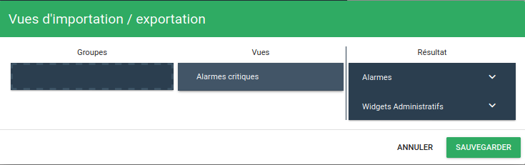

# Paramètres

Certains aspects de l'interface de Canopsis sont personnalisables.

Pour accéder à ces paramètres, cliquez sur le bouton « Paramètres », situé dans le menu « Administration », dans la barre en haut de la page.  


## Paramètres

La vue de base vous permet de paramètrer les options de l'interface web de votre canopsis.  
Les utilisateurs pourront surcharger ses valeurs à leur convenance.

### 1. Langue

Ce paramètre vous permet de choisir la langue par défaut de l'interface.

Deux langues sont actuellement disponibles : le français et l'anglais.

Pour changer la langue de l'interface, choisissez simplement la langue souhaitée dans le menu déroulant « Langue par défaut ».

### 2. Position du menu des vues

Par défaut dans Canopsis, le menu listant les vues disponibles sur situe dans la barre latérale gauche de l'application.


Il est néanmoins possible de placer cette barre vers le haut de la page, juste en dessous de la barre de titre.


Pour modifier ce paramètre, sélectionnez simplement l'affichage souhaité dans le menu déroulant « Type de navigation ».

### 3. Page de connexion (avancé)

Vous avez la possibilité de personnaliser la page de connexion de Canopsis.  
Les éléments paramétrables sont :

1. Titre de l'application
2. Description de l'application
3. Footer du formulaire
4. Logo applicatif sur le menu de l'application


Pour cela, vous devez pour le moment écrire un jeu de configuration dans un fichier json et le soumettre à l'API `user_interface`.  
Voici un exemple de configuration (`user_interface.json`) :

```json
{
  "login_page_description": "<h1 style='margin-top: 0.5em; font-size: 34px;'>Hypervisez votre SI</h1><p style='text-align: left; margin-top: 1.5em; font-size: 20px;'>Canopsis est une solution d'hypervision Open Source couvrant l'ensemble des sources de données de votre SI.<br> Avec l'hypervision Canopsis vous pouvez centraliser, traiter et présenter l'ensemble des événements de votre SI en une console unique.</p>",
  "app_title": "Canopsis",
  "footer" : "Rappels CNIL",
  "logo" : "data:image/png;base64, ..."
}
```

* Le champ `login_page_description` contient le titre et la description de l'application. Il s'agit d'une chaîne HTML.
* Le champ `app_title` contient le titre de l'application. Il s'agit d'une chaîne de caractère simple.
* Le champ `footer` contient le footer situé en dessous du formulaire de connexion. Il s'agit d'une chaîne HTML.
* Le champ `logo` doit être une image encodée en base64.

Pour soumettre cette configuration, vous pouvez utiliser `curl` comme suit :

```sh
curl -u root:root -X POST -H "Content-type: application/json" -d @user_interface.json http://localhost:8082/api/internal/user_interface
```

Le résultat renvoyé doit être de type :

````
true
````

## Import/Export

Cette fonctionnalité vous permet d'exporter des vues ou des groupes de vues sous forme de fichiers JSON. Il sera ensuite possible de les importer dans un autre Canopsis par exemple.

Pour y accéder, passez par le menu d'administration puis rendez-vous dans les paramètres. Cliquez ensuite sur l'onglet "Importation/Exportation".


Cet écran vous permet de sélectionner une ou plusieurs vues, un ou plusieurs groupes si besoin.

Le bouton "Exportation" s'active lors de la sélection d'un élément. Un clic sur ce bouton vous proposera de télécharger les éléments que vous souhaitez exporter sous forme d'un fichier JSON. Ce fichier pourra alors être importé sur une autre plateforme Canopsis par exemple.

Le bouton importation ouvre une première fenêtre vous demandant de sélectionner le fichier à importer depuis votre disque dur puis affiche l'interface d'importation.



A gauche se trouvent les éléments contenus dans le fichier d'import, à droite les groupes et les vues présents actuellement dans votre interface.

Vous pouvez déplier les groupes dans la colonne "Résultat" et y placer les éléments que vous souhaitez importer par glisser/déposer.

Le bouton "Sauvegarder" vous permettra d'appliquer ces changements.


## Modèles de widgets

Lorsque vous avez plusieurs widgets à configurer de manière identique, le travail peut vite devenir fastidieux.
Ces configurations vous permettent de définir des modèles qui seront exploitables de manière générale dans l'interface de Canopsis.

### Général

**Colonnes des alarmes**

Vous définissez ici des "jeux" de colonnes d'alarmes qui seront exploitables dans tout widget permettant de définir des colonnes d'alarmes :

* Bac à alarmes pour : la liste des alarmes, la liste des méta alarmes, la liste pour les causes racines
* Météo des services : la liste des alarmes lorsque l'on clique sur "Suivi des alarmes"

Lorsque la compatibilité existe, la configuration vous permet de définir un jeu de colonnes personnalisé ou hérité d'une modèle :


**Colonnes des entités**

Vous définissez ici des "jeux" de colonnes d'entités qui seront exploitables dans tout widget permettant de définir des colonnes d'entités :

* Explorateur de contexte
* Météo des services

### Bac à alarmes

**Plus d'infos**

Il s'agit ici de définir des modèles qui seront utilisés dans des fenêtre "Plus d'infos" associées à des bacs à alarmes.


**Export PDF**

Vous avez la possibilité de définir un modèle qui sera utilisé pour l'export d'alarmes au format PDF.

### Météo des services

Vous pouvez définir des modèles qui seront appliqués aux widgets de météo des services et ce à 3 niveaux

**Modèle de tuile**


**Modèle de modale**


**Modèle d'entité**


## Paramètres de notifications

Cet onglet vous permet d'éditer les notifications relatifs aux consignes.  


## Icônes

Dans Canopsis, le jeu d'icône [material Design](https://fonts.google.com/icons) est mis à disposition.  
Vous avez également la possibilité d'ajouter vos propres icônes au format **svg**.  

Vous pourrez ensuite en bénéficier dans les modules compatibles 

* Générateur de liens


* Comportements périodiques


* Modèles (Fenêtre plus d'infos, colonnes, etc)

Il est possible d'utiliser la balise `v-icon` avec les propriétés des composants décrites sur [vuefity v-icon](https://v2.vuetifyjs.com/en/api/v-icon/#props).

Pour les icônes [Material de base](https://fonts.google.com/icons) :

```html
<p>
  <v-icon color="red" large>help</v-icon>
</p>
```

Pour les icônes personnalisées, on préfixe avec `$vuetify.icons.` :

```html
<p>
  <v-icon small>$vuetify.icons.icône-perso</v-icon>
</p>
```
