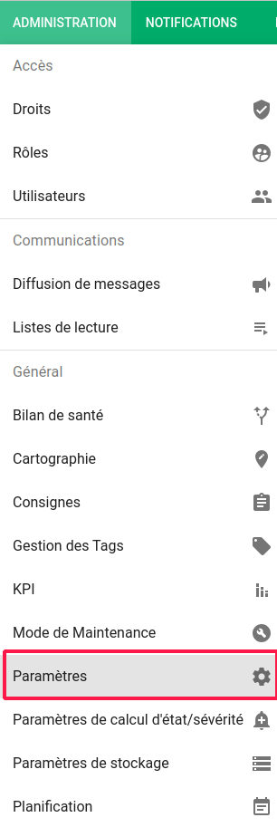

# Paramètres

Certains aspects de l'interface de Canopsis sont personnalisables.

Pour accéder à ces paramètres, cliquez sur le bouton « Paramètres », situé dans le menu « Administration », dans la barre en haut de la page.  


## Paramètres

La vue de base vous permet de paramètrer les options de l'interface web de votre canopsis.  
Les utilisateurs pourront surcharger ses valeurs à leur convenance.

### 1. Langue

Ce paramètre vous permet de choisir la langue par défaut de l'interface.

Deux langues sont actuellement disponibles : le français et l'anglais.

Pour changer la langue de l'interface, choisissez simplement la langue souhaitée dans le menu déroulant « Langue par défaut ».

### 2. Position du menu des vues

Par défaut dans Canopsis, le menu listant les vues disponibles sur situe dans la barre latérale gauche de l'application.


Il est néanmoins possible de placer cette barre vers le haut de la page, juste en dessous de la barre de titre.


Pour modifier ce paramètre, sélectionnez simplement l'affichage souhaité dans le menu déroulant « Type de navigation ».

### 3. Page de connexion (avancé)

Vous avez la possibilité de personnaliser la page de connexion de Canopsis.  
Les éléments paramétrables sont :

1. Titre de l'application
2. Description de l'application
3. Footer du formulaire
4. Logo applicatif sur le menu de l'application


Pour cela, vous devez pour le moment écrire un jeu de configuration dans un fichier json et le soumettre à l'API `user_interface`.  
Voici un exemple de configuration (`user_interface.json`) :

```json
{
  "login_page_description": "<h1 style='margin-top: 0.5em; font-size: 34px;'>Hypervisez votre SI</h1><p style='text-align: left; margin-top: 1.5em; font-size: 20px;'>Canopsis est une solution d'hypervision Open Source couvrant l'ensemble des sources de données de votre SI.<br> Avec l'hypervision Canopsis vous pouvez centraliser, traiter et présenter l'ensemble des événements de votre SI en une console unique.</p>",
  "app_title": "Canopsis",
  "footer" : "Rappels CNIL",
  "logo" : "data:image/png;base64, ..."
}
```

* Le champ `login_page_description` contient le titre et la description de l'application. Il s'agit d'une chaîne HTML.
* Le champ `app_title` contient le titre de l'application. Il s'agit d'une chaîne de caractère simple.
* Le champ `footer` contient le footer situé en dessous du formulaire de connexion. Il s'agit d'une chaîne HTML.
* Le champ `logo` doit être une image encodée en base64.

Pour soumettre cette configuration, vous pouvez utiliser `curl` comme suit :

```sh
curl -u root:root -X POST -H "Content-type: application/json" -d @user_interface.json http://localhost:8082/api/internal/user_interface
```

Le résultat renvoyé doit être de type :

````
true
````

## Import/Export

Cette fonctionnalité vous permet d'exporter des vues ou des groupes de vues sous forme de fichiers JSON. Il sera ensuite possible de les importer dans un autre Canopsis par exemple.

Pour y accéder, passez par le menu d'administration puis rendez-vous dans les paramètres. Cliquez ensuite sur l'onglet "Importation/Exportation".


Cet écran vous permet de sélectionner une ou plusieurs vues, un ou plusieurs groupes si besoin.

Le bouton "Exportation" s'active lors de la sélection d'un élément. Un clic sur ce bouton vous proposera de télécharger les éléments que vous souhaitez exporter sous forme d'un fichier JSON. Ce fichier pourra alors être importé sur une autre plateforme Canopsis par exemple.

Le bouton importation ouvre une première fenêtre vous demandant de sélectionner le fichier à importer depuis votre disque dur puis affiche l'interface d'importation.


A gauche se trouvent les éléments contenus dans le fichier d'import, à droite les groupes et les vues présents actuellement dans votre interface.

Vous pouvez déplier les groupes dans la colonne "Résultat" et y placer les éléments que vous souhaitez importer par glisser/déposer.

Le bouton "Sauvegarder" vous permettra d'appliquer ces changements.


## Paramètres d'état

Cet onglet permet de changer les valeurs relatifs aux états des services canopsis.  


## Paramètres de notifications

Cet onglet vous permet d'éditer les notifications relatifs aux consignes.  


## Paramètres de stockage

Certaines données accumulées dans Canopsis peuvent être régulées par une politique de stockage. Les types de données éligibles sont : 

* [Les alarmes](#les-alarmes)
* [Les entités](#les-entites)
* [Les statistiques liées aux remédiations](#les-statistiques-liees-aux-remediations)
* [Les comportements périodiques](#les-comportements-periodiques)
* [Les résultats de scénarios Junit](#les-resultats-de-scenarios-junit)
* [Les statistiques Healthcheck](#les-statistiques-healthcheck)

!!! Note
    Cette politique de stockage est appliquée une fois par semaine. Vous pouvez définir le jour et l'heure d'exécution dans le fichier de configuration `canopsis.toml`
    ```ini
    [Canopsis.data_storage]
    TimeToExecute = "Sunday,23"
    ```

### Les alarmes

Le cycle de vie d'une alarme respecte le schéma suivant : 


Vous avez la possibilité de définir les délais avant archivage et avant suppression définitive des alarmes dans le menu `Administration->Paramètres->Paramètres de stockage`.


L'archivage des alarmes consiste à déplacer les alarmes éligibles (résolues et respectant le délai défini) dans une collection de données dédiée.  
Ces alarmes restent ainsi disponibles pour les administrateurs en cas de besoin.

La suppression des alarmes résolues est quant à elle définitive et a lieu après le délai défini.

Par ailleurs, les alarmes `ouvertes` (collection `periodical_alarm`) et les alarmes `résolues` (collection `resolved`) ne sont désormais plus stockées dans le même espace pour garantir la performance d'accès aux alarmes en cours.  

Le paramètre `TimeToKeepResolvedAlarms` permet de définir le délai à partir duquel une alarme résolue passera de la collection `ouvertes` à la collection `résolues`

Ce paramètre se situe dans le fichier de configuration `canopsis.toml`.

```ini
[Canopsis.alarm]
# TimeToKeepResolvedAlarms defines how long resolved alarms will be kept in main alarm collection
TimeToKeepResolvedAlarms = "720h"
```


### Les entités

Les entités désactivées peuvent être :

* archivées : déplacées dans une collection de données dédiée
* supprimées : supprimées définitivement de la collection d'archives

!!! Attention 
    Une option permet également l'archivage ou la suppression des impacts et dépendances de ces entités.  
    Pour les **connecteurs**, tous les composants et ressources dépendants sont archivés ou supprimés.  
    Pour les **composants**, toutes les ressources dépendantes sont archivées ou supprimées.

!!! Note
    Cette opération n'est pas éligible à l'ordonnancement général et ne peut s'effectuer qu'à la demande 

### Les statistiques liées aux remédiations

Les statistiques d'exécutions des remédiations peuvent être agrégées par semaine après le délai défini. Seul le nombre d'exécutions par semaine sera conservé.  

Ces statistiques sont totalement supprimées avec le délai défini.

### Les comportements périodiques

Les comportements périodiques peuvent être supprimés après le délai défini.  
Ils doivent néanmoins respecter les conditions suivantes :

* Etre inactifs
* Ne plus posséder de périodes de temps à venir

Le délai s'applique à partir de la fin de la  dernière période du comportement périodique.

### Les résultats de scénarios Junit

Les données associées aux scénarios Junit (fichiers XML, captures d'écran, vidéos) sont supprimés après le délai défini.

### Les statistiques Healthcheck

Les données concernant le nombre d'événements entrants dans Canopsis (moteur `fifo`) sont supprimées après le délai défini.
