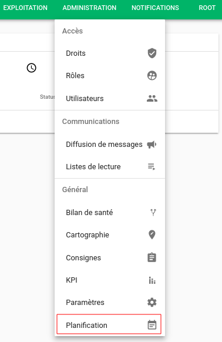
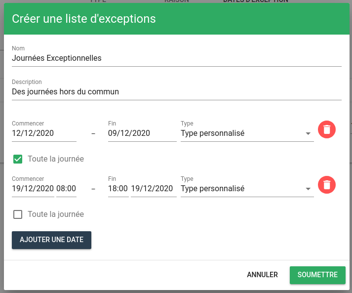

# Planification

Rendez-vous dans le menu Administration puis dans Administration de la planification.

## Type

Il indique la nature du comportement périodique, par exemple :

- La surveillance de l'entité a été mise en `pause`.
- Un `changement` est en cours sur l'application.
- Les entités sont en cours de `maintenance`.

Les types par défaut s'affichent à l'écran : `actif`, `inactif`, `maintenance` et `pause`. Ils ne peuvent être ni supprimés, ni modifiés. La priorité des types est gérée dans l'ordre croissant : `0` est la priorité la plus faible et `3` est la plus forte et sera traitée avant les autres. Un seul type de comportement périodique peut être actif sur une entité à un moment donné.

### Création d'un type personnalisé

Cliquez sur le bouton `+` en bas à droite de la fenêtre pour ouvrir la fenêtre de création.

Renseignez les différents champs, choisissez un type parmi la liste et affectez-lui une priorité et une icône.

!!! Attention
    Deux types ne peuvent avoir la même priorité.

Cliquez sur le bouton Soumettre et votre type personnalisé apparaît dans la liste.

## Raison

Elle permettra de préciser le motif de l'activation du comportement.

Par exemple, si une entité a été mise en `pause` la raison pourra préciser : `Problème de sonde` ou `Hors plage de maintenance`.

Cliquez sur l'onglet Raison. Par défaut, la liste des raisons est vide. Comme pour les types, vous pouvez cliquer sur le bouton `+` pour créer une nouvelle raison. Chaque raison doit avoir un nom et une description.

Voici, par exemple, une liste de raisons personnalisées :

## Configuration des dates d'exception

Il est également possible de configurer des dates d'exceptions dans l'onglet dédié. Pour cela, cliquez de nouveau sur le bouton `+` pour créer une liste d'exceptions.

Vous pourrez alors renseigner un nom, une description et ajouter des dates dans la liste. À chaque date vous pourrez associer un des types existants.

