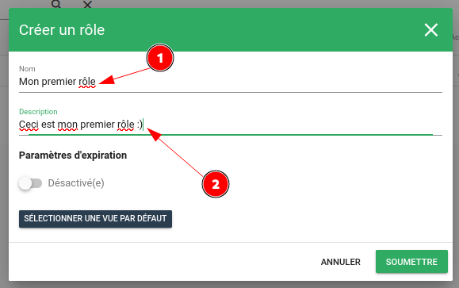
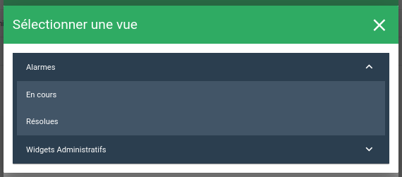

# Rôles

Cette section décrit page de gestion des rôles.  
Pour accéder à ce menu, cliquer sur Administration > Droits :

## Liste des rôles

La vue principale se compose d'un tableau avec plusieurs onglets que nous allons détailler.

À noter que le rôle admin ne peut éditer ses droits, ils sont tous activés par défaut.

## Création d'un rôle

Pour créer un nouveau rôle, cliquer sur le bouton de création (**+**) en bas à droite.  

Il suffit de remplir le formulaire proposé.  

  - Nom (**1**) : Saisir le nom de votre rôle, doit être unique. Paramètre obligatoire.
  - Description (**2**) : Saisir une description champ libre.

### Vue par défaut

Pour choisir la vue d'arrivé après connexion, cliquer sur le bouton .  
Le formulaire, vous permettra de choisir la vue :  

Pour supprimer la vue par défaut cliquer sur la croix rouge:  

### Paramètres d'expiration

Ces options permettent de définir le temps d'activité d'une session utilisateur. 

  - Activé(e) (**1**) : Active ou non les paramètres d'expiration.
  - Intervalle d'inactivité (**2**) : Intervalle de temps pendant lequel l'utilisateur doit effectuer une action. Au-delà de cette période, le compte est considéré comme inactif. Cette option permet d'affiner le nombre d'utilisateurs connectés en parallèle.
  - Intervalle d'expiration (**3**) : Temps maximal de validité d'un jeton. Lorsque ce temps est dépassé le jeton est invalidé et le compte devra de nouveau être authentifié.

## Édition/Suppression d'un rôle

Dans la vue principale, les boutons d'action rapides permettent d'éditer et/ou supprimer un rôle.

  - Éditer **1**: Ouvre le formulaire d'édition.
  - Supprimer **2**: Supprime le rôle.

