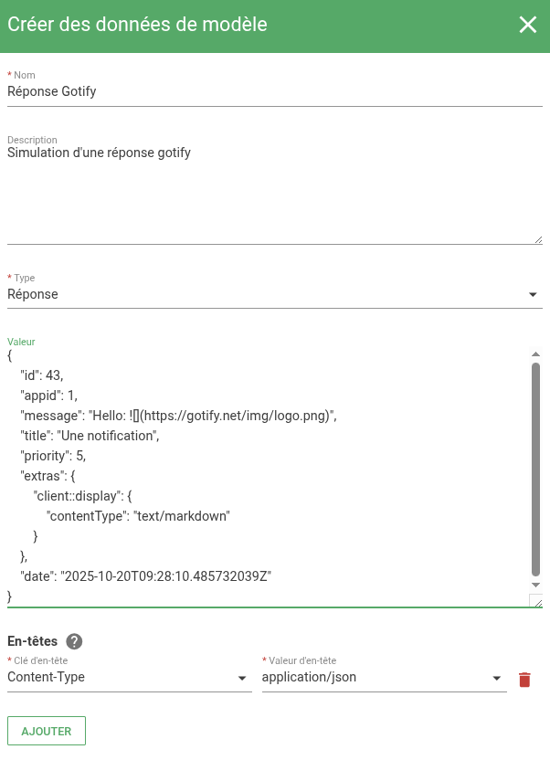
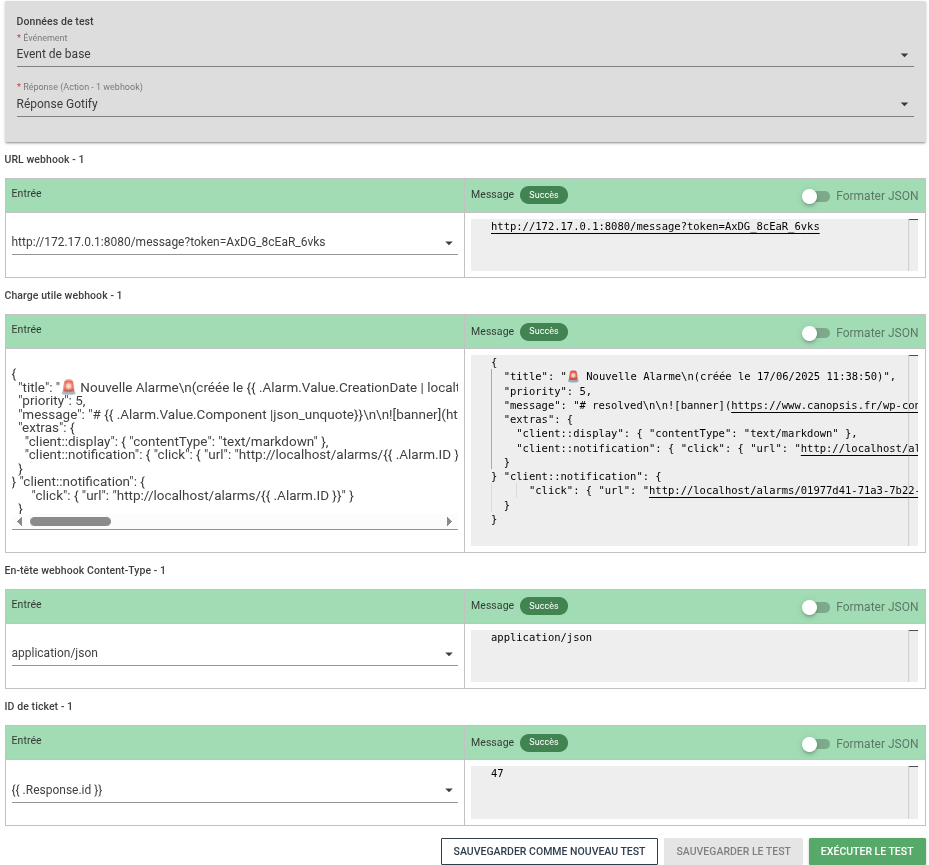

# Studio Templates

Le module « studio templates » vous permet de vérifier le rendu de vos [modèles (templates Go)](../templates-go/index.md) avant d'enregistrer une règle ou un widget.

Plutôt que de tester vos modifications directement en production, vous pouvez grâce à cette fonctionnalité :

* Créer un jeu de test : associez un nom et sélectionnez des données de test (événement, entité, réponse webhook, etc.) ;
* Prévisualiser le résultat : voyez instantanément comment vos modèles seront interprétés, avec les variables remplacées ;
* Identifier les erreurs : toute erreur de syntaxe ou donnée manquante est signalée immédiatement, avec mise en évidence du champ concerné ;
* Réutiliser vos tests : enregistrez, modifiez ou supprimez des jeux de tests et de données pour valider facilement vos futurs modèles.

Les **règles d'exploitation** suivantes sont éligibles aux tests de variables :

* [Filtres d'événements](../menu-exploitation/filtres-evenements.md)
* [Générateur de liens](../menu-exploitation/generateur-liens.md)
* [Informations dynamiques](../menu-exploitation/informations-dynamiques.md)
* [Règles de déclaration de tickets](../menu-exploitation/regles-declaration-tickets.md)
* [Règles de Méta alarmes](../menu-exploitation/regles-metaalarme.md)
* [Scénarios](../menu-exploitation/scenarios.md)

Également disponibles dans certains éléments d'**administration** :

* [Consignes et jobs de remédiation](../menu-administration/consignes.md)

## Données de test

Le studio repose sur des **données de test** qui simulent les entrées réelles.  
Deux types de données sont actuellement disponibles :

1. **Événement**  
2. **Réponse d'API**  

Ces données sont ensuite sélectionnables depuis l’onglet **Studio Templates** des règles et widgets compatibles.

### Evénements et Réponses

Vous pouvez ajouter vos propres événements et réponses d’API afin de simuler différents cas d’usage.

Par exemple, pour tester une règle de déclaration de ticket, vous pouvez préparer une **réponse d’API** reproduisant celle envoyée par votre outil de gestion des incidents.

| Paramètre | Description |
| --- | --- |
| **Nom** | Nom de l'événement de test |
| **Description** | Description |
| **Type** | Evénement ou Réponse |
| **Valeur** | L'événement au format JSON |
| **Utiliser un modèle pré-rempli** | Insertion d'un événement générique |
| **En-têtes** | Dans le cas d'une réponse d'API, en-têtes à insérer |

## Tests

Cet onglet vous permet d'agir sur les tests qui ont été créés dans les modules du menu exploitation/administration :

* Modifier le nom du test
* Supprimer le test

!!! informations "Information"
    Les tests en eux-mêmes doivent être créés directement depuis l'onglet "Studio Templates" de chaque module compatible.

## L'onglet "Studio Templates" des modules compatibles

Dans les règles éligibles, un nouvel onglet "Studio Templates" est présent.  
Il est actif dès lors qu'un [template](../templates-go/index.md) est présent.

La fonctionnalité permet de :

1. Sélectionner les données de tests
2. Visualiser le résultat avec les variables remplacées par leur valeur

### Sélection des données

Plusieurs choix s'offrent à vous :

1. Choisir les données qui seront utilisées pour le test
2. Choisir les données qui seront utilisées pour le test et les sauvegarder en tant que nouveau test
3. Choisir un test existant

#### Choisir les données qui seront utilisées pour le test

Chaque type de règle éligible aux tests possède son propre contexte.

Par exemple, un filtre d'événement requiert un événement en entrée tandis qu'une règle de déclaration de ticket requiert une alarme ainsi qu'une réponse d'API.

L'onglet de "Test de variables" vous suggère donc de saisir les données adéquates :

* Alarme : sélection d'une alarme via son [Nom d'affichage/Display Name](../../guide-administration/administration-avancee/modification-canopsis-toml.md#section-canopsisalarm)
* Réponse : sélection d'une réponse d'API
* Événement : sélection d'un événement


#### Choisir les données qui seront utilisées pour le test et les sauvegarder en tant que nouveau test

Lorsque vous avez choisi les données à utiliser, vous pouvez sauvegarder ces éléments en tant que test.  
Ce test sera alors réutilisable pour d'autres règles.

Le bouton concerné est intitulé : "Sauvegarder comme nouveau test".

#### Choisir un test existant

Si vous avez déjà sauvegardé des tests, il vous est possible de les sélectionner dans le menu "Nom du test".  
Toutes les valeurs sauvegardées seront alors présentées sur le formulaire.


### Visualisation des résultats

Chaque élement de configuration d'une règle utilisant une variable donne lieu à un bloc de visualisation de résultats.

Exemples :

* Une règle de filtre d'événement utilisant deux actions donnera lieu à deux blocs de visualisation de résultats
* Un règle de déclaration de ticket possédant deux étapes donnera lieu à deux blocs de visualisation de résultats contenant chacun des sous-entrées (URL, payload, en-têtes, etc.)

Le bouton "Exécuter le test" permet d'exécuter les différentes actions en remplaçant les variables par leur valeur issue des données de test.

## Exemples complets

Prenons l'exemple d'une [notification Gotify](https://gotify.net/).
Lorsqu'une alarme est créée, nous souhaitons déclencher une notification sur l'API de l'outil Gotify.

**Commençons par créer des données de test**

Lorsqu'une notification est envoyée au service Gotify, celui-ci répond en reprennant les différents attributs transmis ainsi qu'un `id` de notification.

Nous créons donc cette réponse :



```json
{
  "id": 47,
  "appid": 1,
  "message": "Hello: ",
  "title": "Une notification",
  "priority": 5,
  "extras": {
    "client::display": {
      "contentType": "text/markdown"
    }
  },
  "date": "2025-10-21T08:44:09.414089231Z"
}
```

Puis nous créons le webhook documenté sur [cet exemple](../templates-go/templates-go-casdusage.md#9-notification-sur-le-service-gotify).

Enfin, nous exécutons le test en ayant sélectionné un modèle d'événement ainsi que le modèle de réponse gotify précédemment créé.  
Le studio montre alors les résultats des valeurs de variables pour chaque bloc.



