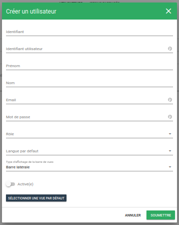

# Utilisateurs

Cette section décrit la page de gestion des utilisateurs.  
Pour accéder à ce menu, cliquez sur Administration > Utilisateurs :

## Liste des utilisateurs

La vue principale se compose d'un tableau avec plusieurs onglets que nous allons détailler.

À noter que le rôle admin ne peut éditer ses droits, ils sont tous activés par défaut.

### Création d'un utilisateur

Pour créer un nouvel utilisateur, cliquez sur le bouton de création (**+**) en bas à droite.  

Il suffit de remplir le formulaire proposé.  
Les champs falcutatifs sont notés en *italique*.  
Les champs obligatoires sont notés en **gras**.

  - *Identifiant*: Indique l'identifiant du nouvel utilisateur qui sera inséré en base de donnée. Si non renseigné, il sera créé automatiquement;
  - **Identifiant utilisateur**: Définit l'identifiant de l'utilisateur (nécessaire à la connexion);
  - *Prénom*: Prénom de l'utilisateur;
  - *Nom*: Nom de l'utilisateur;
  - **Email**: Couriel de l'utilisateur;
  - **Mot de passe**: Mot de passe pour la connexion. 8 caractères minimum;
  - **Rôle**: Associe l'utilisateur à un rôle;
  - *Langue par défaut*: Définit la langue de l'interface de l'utilisateur;
  - *Type d'affichage de la barre de vues*: Définit la position de la barre de menu;
  - **Activé(e)**: Active ou non l'utilisateur. Désactivé par défaut;
  - *Sélectionner une vue par défaut*: Définit la vue par défaut lors de la connexion de l'utilisateur, surcharge la valeur définie dans le [rôle](./roles.md#vue-par-defaut).

### Édition/Suppression d'un utilisateur

Dans la vue principale, les boutons d'action rapides permettent d'éditer et/ou supprimer un rôle.

  - Éditer **1**: Ouvre le formulaire d'édition.
  - Supprimer **2**: Supprime l'utilisateur.

## Jetons partagés

La liste des [vues partagées](../../notes-de-version/22.10.0.md#vues-partagees) est disponible sur cette page.

