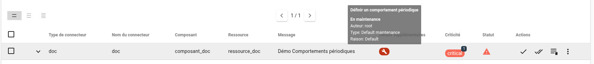
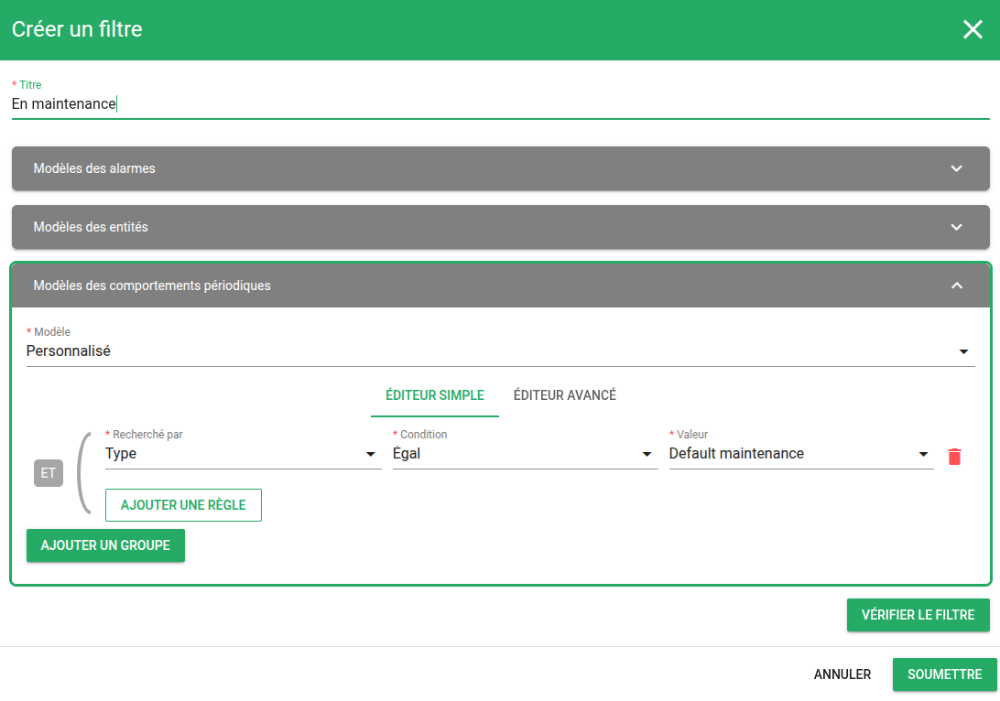
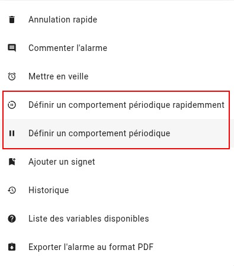
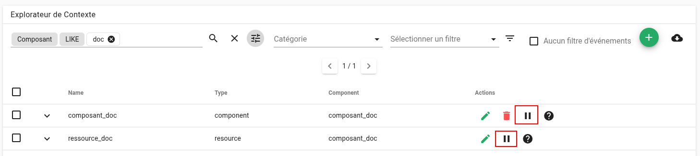
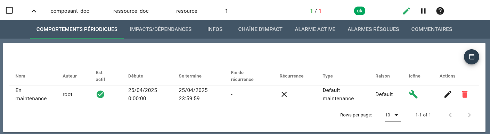

# Comportements périodiques

Les **Comportements Périodiques** – ou *PBehaviors* – permettent de planifier des périodes spécifiques durant lesquelles un changement de comportement est appliqué aux entités supervisées. Ces comportements sont particulièrement utiles pour adapter dynamiquement la gestion des alarmes en fonction de contextes métier comme des maintenances ou des périodes d’inactivité.

## Qu’est-ce qu’un PBehavior ?

Un PBehavior est une plage temporelle, ponctuelle ou récurrente, durant laquelle une [entité](../../vocabulaire/#entite) adopte un comportement particulier. Une entité, dans Canopsis, est une cible de supervision (par exemple : une application, un serveur ou un composant technique).

Les PBehaviors permettent par exemple :

- D'inhiber l'activation d'une alarme dans une période particulière
- D'éviter la génération de tickets pendant une maintenance planifiée
- De suspendre certaines règles métier
- De ne pas tenir compte de certaines alarmes dans le cadre d’un calcul de SLA
- De gérer les périodes de service des applications de l'entreprise

---

[TOC]

---

## Anatomie d'un comportement périodique

| Paramètre | Description |
| --- | --- |
| **Activé** | Si activé, le comportement sera appliqué, sinon il sera ignoré |
| **Nom** | Nom unique du comportement périodique |
| **Toute la journée** | Si coché, le comportement s'applique sans précision d'horaire |
| **Sans fin** | Disponible uniquement pour le type `Pause`, permet un comportement sans date de fin |
| **Début** | Date et heure de début du comportement |
| **Fin** | Date et heure de fin du comportement |
| **Raison** | Justification métier du comportement |
| **Type** | Actif, Inactif, Maintenance, Pause, ou tout type personnalisé (dérivant d’un type canonique) |
| **Couleur personnalisée** | Permet d'associer une couleur spécifique pour l'affichage |
| **Règle de récurrence (RRULE)** | Permet de répéter automatiquement le comportement (quotidien, hebdomadaire, etc.) |
| **Commentaires** | Informations libres supplémentaires |
| **Modèles** | Liste des entités ou modèles d'entités ciblées par le comportement |


### Périodes de temps, récurrence et exceptions

Les plages temporelles sont définies par une date de début et une date de fin, avec ou sans heure.  
Il est possible de définir des règles de récurrence au format `RRULE` ([tester une règle](https://jkbrzt.github.io/rrule/)) pour planifier des comportements récurrents.

Il est également possible :

- De spécifier des **exceptions** à une récurrence (ex. : jours fériés)
- D'**importer des fichiers ICS** pour intégrer un calendrier externe (Administration->Planification->Dates d'exception)

### Gestion des fuseaux horaires

Lorsque vous créez ou consultez un **comportement périodique**, le **fuseau horaire** de la configuration Canopsis est utilisé pour exprimer les dates et heures.

 Exemple de configuration dans [`canopsis.toml`](../../../guide-administration/administration-avancee/modification-canopsis-toml/#section-canopsistimezone) :

```toml
[Canopsis.timezone]
Timezone = "Europe/Paris"
```

!!! info "Bon à savoir"
    Les dates sont **stockées en UTC** dans la base de données, mais **affichées selon le fuseau horaire sélectionné** dans l’interface utilisateur.


## Types et raisons

Canopsis propose 3 **types canoniques**. Tout type personnalisé que vous ajoutez devra dériver de l’un de ces types :

| Type        | Description |
|-------------|-------------|
| **Inactive**    | L’entité est hors service durant cette plage de temps, aucune surveillance n’est attendue. |
| **Maintenance** | L’entité est en travaux : les alarmes peuvent survenir mais ne déclenchent pas d’actions métier. |
| **Pause**       | Comme `Maintenance`, mais sans obligation de définir une date de fin. Idéal pour les interruptions manuelles ou indéterminées. |

Chaque PBehavior est également associé à une **raison**, qui représente une justification métier (ex. : "mise à jour applicative", "test de charge", "retraitement manuel", etc.). Ces raisons sont utiles pour filtrer ou rechercher des comportements dans l’interface.

!!! info "Personnalisation"
    Il est possible de configurer les types personnalisés, les raisons associées, les couleurs et les exceptions de calendrier depuis :  
    **Administration > Planification**


## Intégration dans l’interface

### Bac à alarmes

Les Comportements Périodiques sont **intégrés au bac à alarmes**, ce qui permet :

- D’**afficher visuellement** les alarmes affectées par un PBehavior (icône et couleur spécifique dans la colonne `Détails supplémentaires`)



- De **filtrer** les alarmes selon la présence ou non d’un PBehavior actif



- De **créer un comportement** directement depuis une alarme active : menu `Actions` > `Définir un comportement périodique` ou `Actions` > `Définir un comportement périodique rapidement` ( pour des Pbehaviors pré-définis dans la configuration du widget de bac à alarme correspondant )



### Explorateur de contexte

Depuis l’**Explorateur de contexte**, vous pouvez :

- Créer un PBehavior depuis le menu contextuel sur une ou plusieurs entités



- Visualiser les comportements déjà planifiés pour une entité donnée



### Menu "Comportements périodiques"

Accessible depuis le menu **Exploitation > Comportements périodiques**, cette page permet :

- De consulter l’ensemble des PBehaviors définis
- D’en créer de nouveaux avec des options avancées (récurrence, couleurs, exceptions, etc.)
- De rechercher par type, raison, auteur, nom, etc.


