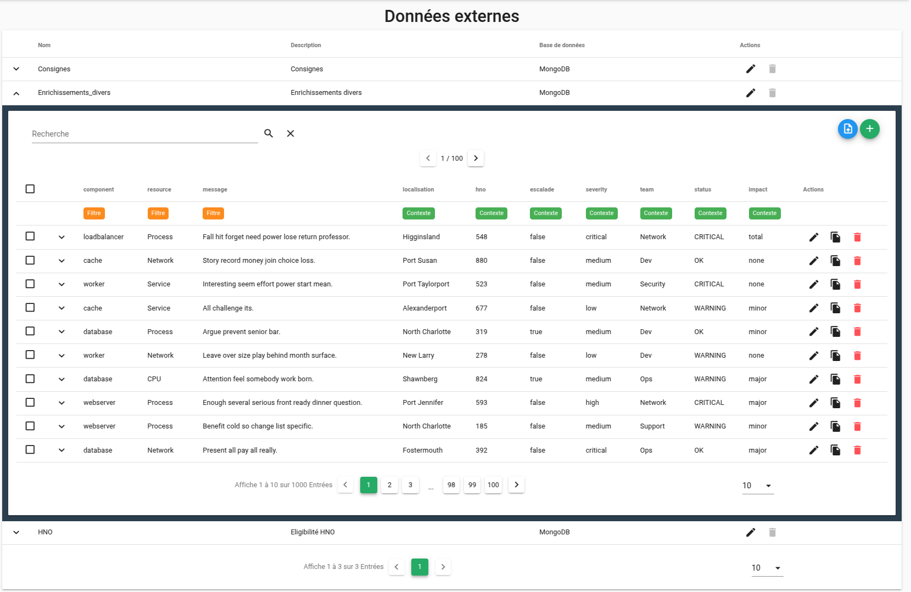
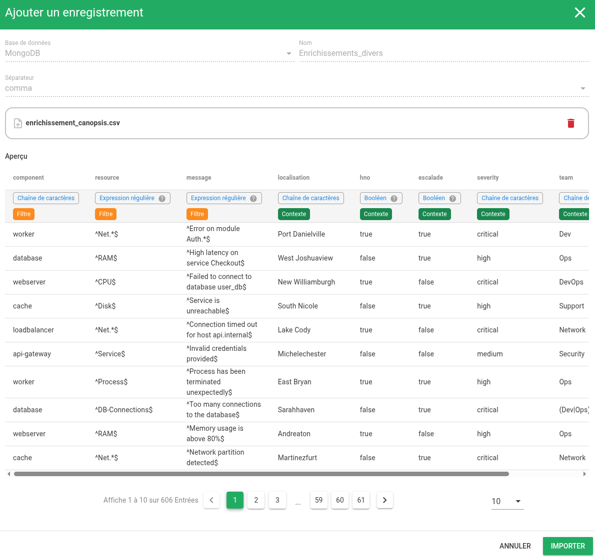
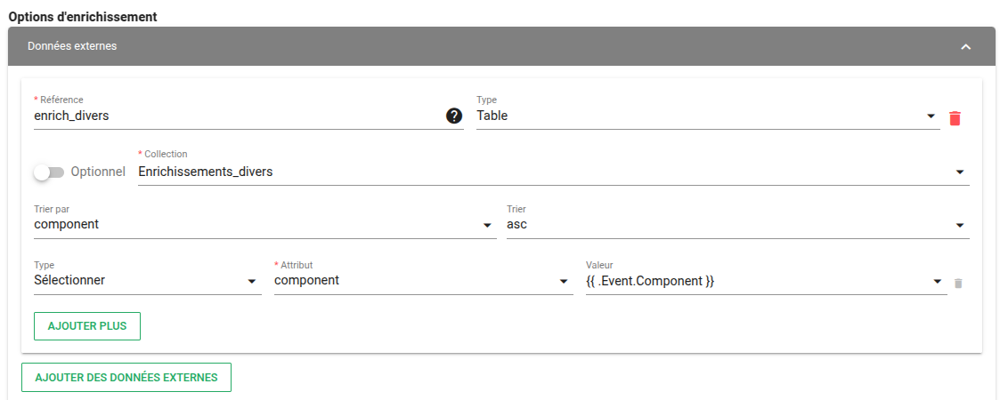
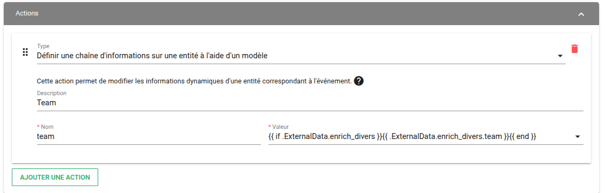
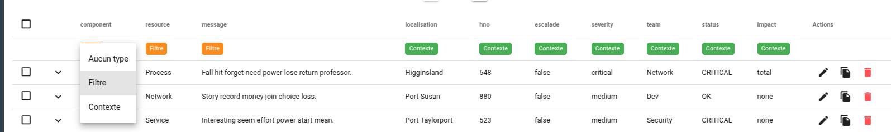

# Données externes

## Définition

Les règles de filtrage d'événements permettent d'enrichir les alarmes ainsi que les entités sur lesquelles portent les alarmes depuis une [source de données externes](../filtres-evenements/#source-externe).

La fonctionnalité "Données externes" permet de gérer ces données depuis l'interface graphique.  



## Gérer les sources de données

### Ajouter une source de données externes depuis l'interface graphique

Les données externes peuvent être stockées dans MongoDB (collection) ou dans PostgreSQL (table).  

Lorsque vous ajoutez une source, vous pouvez saisir les éléments suivants :  

| Paramètre | Description |
| --- | --- |
| **Base de données** | Type de base de données à utiliser : MongoDB ou PostgreSQL |
| **Nom** | Nom de la source de données externes |
| **Description** | Description de la source de données externes |


### Ajouter une source de données externes depuis le fichier de configuration `toml`

Si vous avez déjà mis en oeuvre des collections de données et que vous souhaitez les manipuler dans l'interface de Canopsis, vous devez les renseigner dans le [fichier de configuration **canopsis.toml**](../../../guide-administration/administration-avancee/modification-canopsis-toml/#description-des-options)

Par exemple, si vous souhaitez gérer les collections `HNO` et `Consignes`, veuillez renseigner la section **Canopsis.external_data** comme ceci : 

```yaml
[Canopsis.external_data]
Collections = ["HNO", "Consignes"]
```

!!! information "Information"
    Un lancement de la commande "canopsis-reconfigure" est nécessaire pour la prise en compte de tout changement.  
    [Exécuter canopsis-reconfigure](../../../guide-administration/administration-avancee/modification-canopsis-toml/#prise-en-compte-des-modifications)

### Importer des données

Une fois la source de données externes créée, vous pouvez importer des données depuis un fichier CSV.  
Lorsque le fichier CSV a été sélectionné, vous aurez accès à une pré visualisation des données sous forme de colonnes.



### Gérer les enregistrements

Dès lors qu'un import de données a été réalisé, vous pouvez effectuer les opérations suivantes sur chaque enregistrement :  

* Editer
* Supprimer
* Dupliquer

Vous pouvez également importer de nouveaux enregistrements et/ou insérer un enregistrement "manuellement" depuis l'interface graphique.

Pour rappel, ces tables ont vocation a être utilisées dans des règles d'enrichissement à 2 niveaux :

1. Comme un filtre permettant de sélectionner un enregistrement :
  

2. Comme une information enrichie : 


Pour faciliter la visualisation ainsi que la destination des données, l'interface propose de typer les colonnes : **Filtre** ou **Contexte** selon la situation.




## Widget "Données externes"

L'interface de Canopsis met à disposition un [Widget Données externes](../../interface/widgets/donnees-externes/) qui permet aux utilisateurs de consulter et de manipuler les données qui servent aux enrichissements externes.
