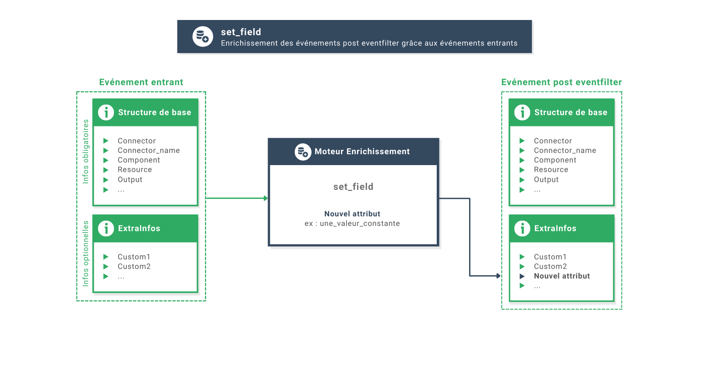
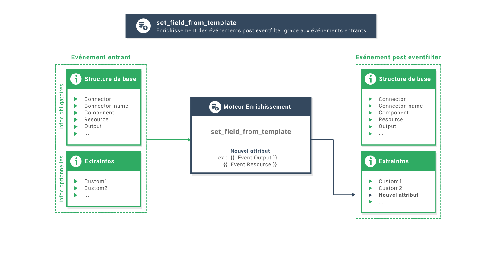
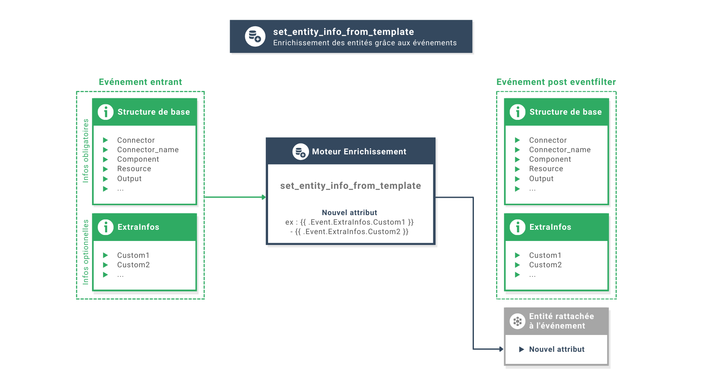
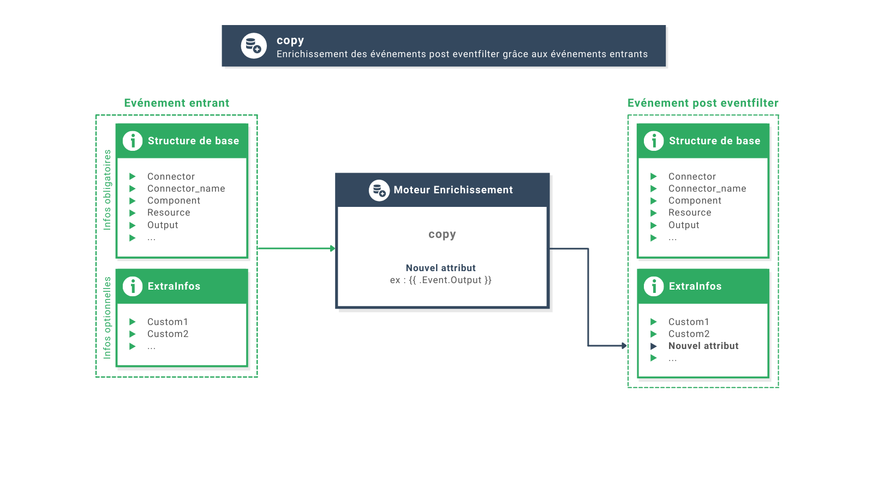
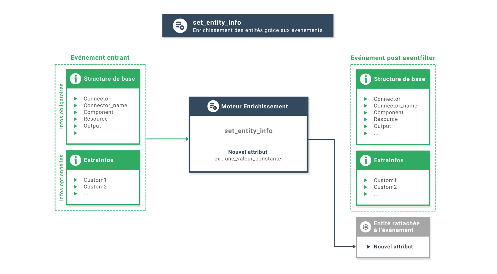
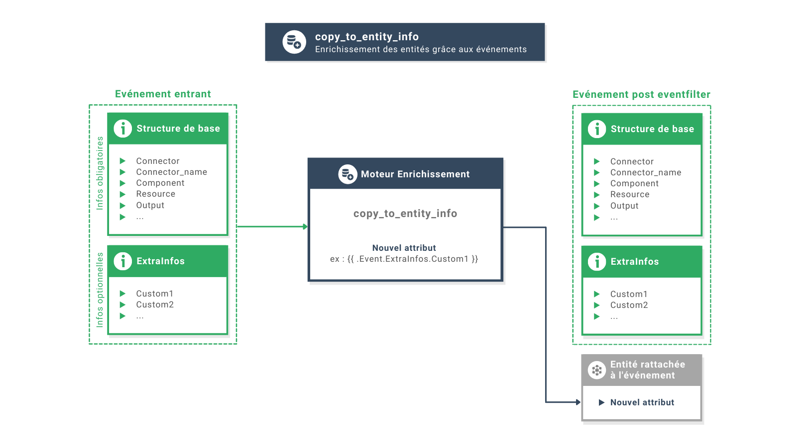
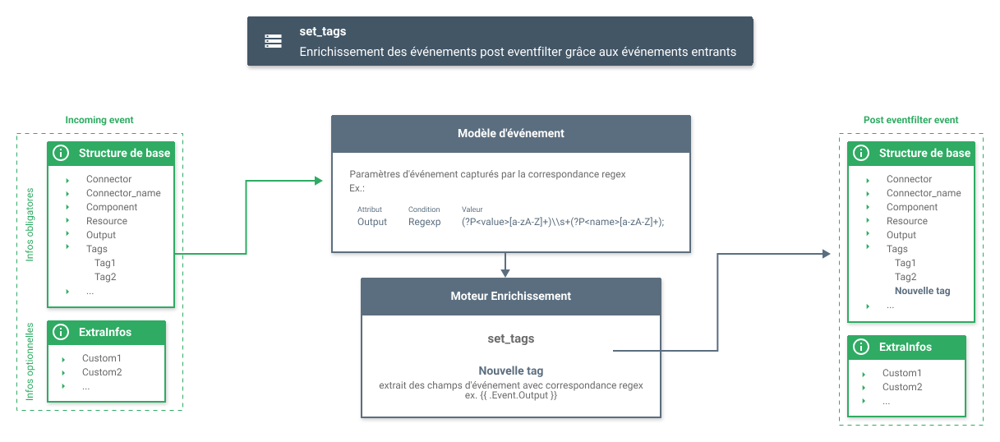
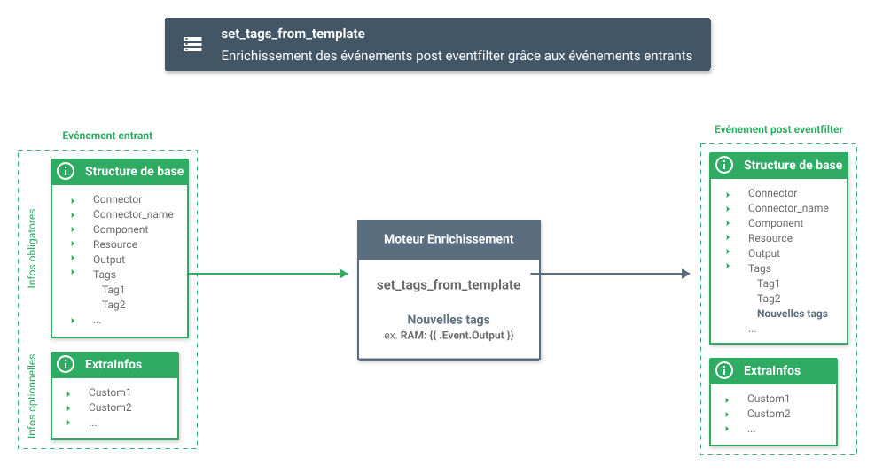
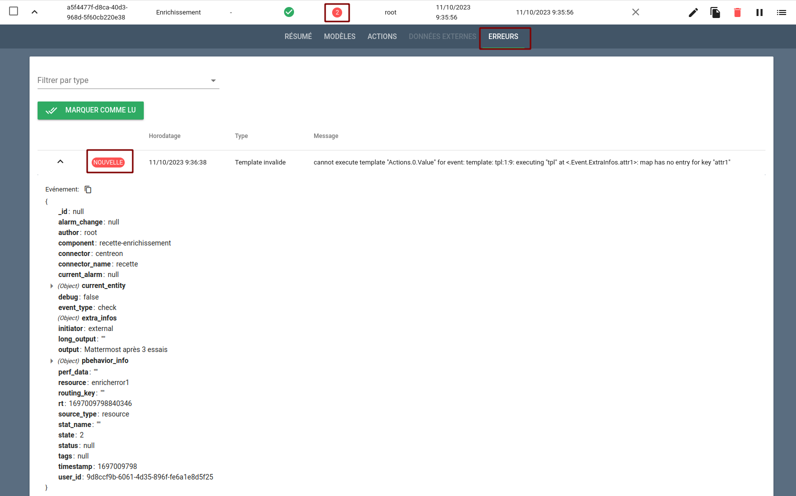

# Filtres d'événements

## Définition

Les règles de filtrage d'événements permettent de manière générale d'enrichir les alarmes ainsi que les entités sur lesquelles portent les alarmes.  
Plusieurs types d'enrichissement sont disponibles :

* `Drop` : permet de supprimer un événement
* `Break` : permet de stopper l'évaluation des règles suivantes
* `Change entity` : permet de manipuler l'identifiant d'une entité avant son enregistrement dans Canopsis (hors informations personnalisées)
* `Enrichment` : permet de d'enrichir/modifier un événement et permet également d'ajouter des informations personnalisées aux entités

## Types

Quelque soit le type d'enrichissement utilisé, une règle `eventfilter` est composée à minima de 

| Paramètre | Description |
| --- | --- |
| **Identifiant** | Nom de la règle à créer |
| **Description** | Description de la règle |
| **Activée** | La règle est-elle activée ou non ? |
| **Priorité** | Priorité de la règle. Les règles s'exécutent par priorité croissante |
| **Début/Fin** | Si ces dates sont positionnées alors la règle s'applique uniquement dans l'intervalle. Une récurrence peut être paramétrée |
| **Modèles des entités** | La règle ne s'applique que sur les événements dont l'entité correspond au modèle |
| **Modèles des événements** | La règle ne s'applique que sur les événements qui correspondent au modèle |

Les autres paramètres sont spécifiques au type sélectionné.

### Modèles d'entités et d'événements

Les modèles ou patterns d'une règle permettent de sélectionner les évènements sur lesquels elle doit être appliquée.
Vous pouvez utiliser le gestionnaire de modèles disponible dans l'éditeur des règles de filtrage d'événements.

!!! info "Expressions régulières dans les modèles"

    Si l'un des patterns d'une règle contient une expression régulière (avec l'opérateur `Contient`) et des sous-groupes nommés, 
    les valeurs de ces sous-groupes peuvent être utilisées dans les templates des actions de type `set_field_from_template` et 
    `set_entity_info_from_template`, et comme champ `from` des actions de type `copy`.
    
    Pour nommer un groupe `([\.0-9]+)`, la syntaxe est la suivante : ```(?P<nom_du_match>[\.0-9]+)```  
    La valeur du sous-groupe sera alors disponible dans `{{.RegexMatch.<nom du champ>.nom_du_match}}` pour les templates, et dans
    `RegexMatch.<nom du champ>.nom_du_match` pour les actions de type `copy`.
    
    Par exemple, si vous utilisez le modèle  `"Output Contient  "Warning: CPU Load is critical \((?P<load>.*)%\)"`
    et si l'output de l'évènement vaut `Warning: CPU Load is critical (97.5%)`,
    alors il est possible d'utiliser l'expression `{{.RegexMatch.Output.load}}`, qui vaudra `97.5`, dans un template.


### Type Drop

Le type `Drop` permet de supprimer des événements.  
Ainsi, tous les événements sélectionnés par les modèles d'entités et modèles d'événements sont supprimés sans paramètres supplémentaires.  

!!! Warning "Avertissement"
    
    Ce type est destructif, soyez attentif à son utilisation.

### Type Break

Lorsqu'une règle de type break est appliquée à un évènement, cet évènement sort du filtre d'événements. Les règles suivantes ne sont pas appliquées, et l'évènement est traité par Canopsis.


### Type Change Entity

Lorsqu'un événement circule, Canopsis cherche dans un premier temps l'entité sur laquelle porte cet événement. S'agit-il d'un composant, d'une resource, d'un service, d'un connecteur ?

Il est alors possible à ce stade de modifier l'identifiant d'une entité.  
Une entité est reconnue grâce aux éléments suivants :

* Type de connecteur
* Nom de connecteur
* Composant
* Ressource

Vous pouvez donc agir sur ces attributs pour les modifier.

Exemple : "Pour les événements dont le composant vaut "SRV-CHANGE-ENTITY", je souhaite 

* renommer le composant en `préfixe--COMPOSANT--suffixe`
* renommer la ressource en `préfixe--RESSOURCE--suffixe`

Vous positionnez un modèle d'événement : `Composant Egal SRV-CHANGE-ENTITY`

Puis vous indiquez dans le champ 

* ID de ressource ou modèle : `préfixe--{{ .Event.Resource }}--suffixe`
* ID de composant ou modèle : `préfixe--{{ .Event.Component }}--suffixe`


### Type Enrichment

Le type `Enrichment` permet d'enrichir l'événement ou l'entité attachée à partir de l'événement lui-même ou d'une source externe.  
Dans le cas d'une source externe, une collection mongoDB de correspondance (table de mapping) ou une API format JSON sont compatibles.  

Lorsqu'une règle d'enrichissement est appliquée, les données externes sont récupérées, puis les actions sont exécutées, dans l'ordre dans lequel elles ont été définies. Si la récupération de données ou l'exécution d'une action échoue, l'application de la règle est interrompue, et son résultat sera la valeur de `En cas d'échec`. Sinon, son résultat est la valeur de `En cas de succès`.

#### Source externe

L'idée de l'enrichissement par une source externe suit le principe d'enrichissement par table de mapping.  
A partir d'un événement, on interroge une source externe qui va nous renvoyer des informations complémentaires.

**Collection MongoDB**

Cas d'usage : Nous cherchons à savoir s'il est nécessaire de déclencher une astreinte pour certains événements reçus.

Prenons comme exemple la collection mongoDB suivante: **mapping**

```json
[
    {
        "Type_Serveur": "Production",
        "Type_OS": ".*",
        "mc_object": "Space used.*",
        "mc_object_class": "Zabbix",
        "mc_parameter": ".*",
        "mc_origin": ".*",
        "severity": "WARNING",
        "mc_msg": "Le FS : /save/p1.*",
        "Astreinte": "OK"
    },
    {
        "Type_Serveur": ".*",
        "Type_OS": ".*",
        "mc_object": ".*",
        "mc_object_class": "Zabbix",
        "mc_parameter": ".*",
        "mc_origin": "srv2",
        "severity": "WARNING",
        "mc_msg": "Zabbix server: Utilization of housekeeper.*",
        "Astreinte": "OK"
    },
    {
        "Type_Serveur": "Production",
        "Type_OS": "UNIX",
        "mc_object": "Status.*",
        "mc_object_class": "Zabbix",
        "mc_parameter": ".*",
        "mc_origin": "srv1",
        "severity": "CRITICAL",
        "mc_msg": "Avail.*",
        "Astreinte": "KO"
    }
]
```

Le champ `Astreinte` nous donne cette information.  
Nous allons donc à présent définir une règle d'enrichissement qui va utiliser 2 attributs de l'événement entrant : 

1. `mc_origin` : nous recherchons dans la collection un document ayant comme `mc_origin` le `component` de l'événement ET
1. `mc_msg` : nous recherchons dans la collection un document qui répond au match entre le `output` de l'événement et le `mc_msg`

Seul le premier document renvoyé sera considéré.

Ci-dessous la configuration du bloc `Données externes` de la règle :

| Champ           | Valeur | Description |
| --------------- | ------ | ----------- |
| Type | Collection MongoDB | Dans cet exemple nous utilisons une collection de mapping |
| Référence | astreinte | Il s'agit de la référence qui sera utilisée dans les actions pour exploiter les données renvoyées |
| Collection | mapping | Il s'agit du nom de la collecion MongoDB |

| Type | Attribut | Valeur |
| ---- | -------- | ------ |
| Select | mc_origin | {{.Event.Component}} |
| Regexp | mac_msg | {{.Event.Output}} |

A partir du moment où une correspondance est trouvée, la variable `.ExternalData.Reference` est mise à disposition des **actions**.  
Dans notre cas, la variable sera `.ExternalData.astreinte`.  
Pour finir, étant donné que nous souhaitions savoir si un événement était éligible à l'astreinte, nous utiliserons dans les actions un enrichissement avec la variable `{{ .ExternalData.astreinte.Astreinte }}`

**API tierce**

Ci-dessous la configuration du bloc `Données externes` de la règle :

| Champ           | Valeur | Description |
| --------------- | ------ | ----------- |
| Type | API | Dans cet exemple nous utilisons une API externe |
| Référence | astreinte | Il s'agit de la référence qui sera utilisée dans les actions pour exploiter les données renvoyées |
| Méthode | POST | Méthode HTTP utilisée pour interroger l'API |
| URL | http://monapi.local:5000 | URL de connexion à l'API |
| Ne pas vérifier les certificats HTTPS | false | Indique si l'on vérifie la conformité SSL |
| Avez-vous besoin de champs d'authentification ? | Permet de spécifier des identifiant/mot de passe de connexion à l'API |
| Nombre de tentatives après échec / Durée  Unité | 2 / 1m | Indique le nombre de tentatives  + Intervalle de connexion à l'API |
| Entêtes | "Content-type : application/json" | Permet de spécifier des entêtes attendues par l'API |
| Payload | "{}" | Payload attendu par l'API |

Vous pouvez spécifier n'importe quel payload et utiliser la variable `.Event`.


#### Actions

Voici la description des actions disponibles pour les enrichissements.

##### Définir un champ d'un événement sur une constante


##### Définir un champ de chaîne d'un événement à l'aide d'un modèle


##### Définir une chaîne d'informations sur une entité à l'aide d'un modèle


##### Copier une valeur d'un champ d'événement à un autre


##### Définir une information d'une entité sur une constante


##### Copier une valeur d'un champ d'un événement vers une information d'une entité


##### Définir un tag par la correspondance regex.


##### Définir un tag à partir d'un champs d'information supplémentaire. 



#### Variables utilisables dans les templates

Pour toutes les actions qui utilisent des templates, les variables `.Event`, `.RegexMatch`, et `.ExternalData` sont disponibles.  
Voici un tableau de correspondance entre les noms des champs de l'événement et leur représentation dans Canopsis ( syntaxe des templates Golang disponible [ici](../../templates-go/)

**Structure `.Event`**

| Nom du champ JSON | Nom de la représentation interne de Canopsis |
|-------------------|----------------------------------------------|
| `author`          | `Author` |
| `debug`           | `Debug` |
| `component`       | `Component` |
| `connector`       | `Connector` |
| `connector_name`  | `ConnectorName` |
| `current_entity`  | `Entity` |
| `event_type`      | `EventType` |
| `long_output`     | `LongOutput` |
| `output`          | `Output` |
| `perf_data`       | `PerfData` |
| `resource`        | `Resource` |
| `state`           | `State` |
| `state_type`      | `StateType` |
| `status`          | `Status` |
| `source_type`     | `SourceType` |
| `ticket`          | `Ticket` |
| `timestamp`       | `Timestamp` |
| `autres attributs` | | `ExtraInfos`|

**Cas spécial des attributs extra**

Lorqu'un attribut personnalisé (non géré nativement par Canopsis) est présent dans un événement, il est utilisable dans le template d'une action par l'intermédiaire de la variable `ExtraInfos`.  

Par exemple, si un événement contient l'atrribut `client` alors la valeur de cet attribut est disponible dans un template à partir de : `.Event.ExtraInfos.client`.

Par ailleeurs, lorsqu'une méta alarme est créée ou mise à jour, un événement de type `metaalarm` ou `metaalarmupdated` est généré.

Cet événement met à disposition du moteur d'enrichissement plusieurs attributs :

| Représentation interne de Canopsis | Notes                                                       |
| ---------------------------------- | ----------------------------------------------------------- |
| .Event.ExtraInfos.Meta.Count       |  Nombre d'alarmes conséquences   |
| .Event.ExtraInfos.Meta.Children    |  Objet représentant la dernière alarme conséquence attachée |
| .Event.ExtraInfos.Meta.Rule        |  Les informations de la règle méta en elle-même            |

Voici un exemple qui permet d'ajouter un attribut texte sur l'entité de la méta alarme et dont le contenu vaut :

**`Count : Nombre d'alarmes conséquences; Children : Sévérité de la dernière alarme conséquence attachée; Rule : Nom de la règle ayant permis le regroupement`**

```
"Count: {{ .Event.ExtraInfos.Meta.Count }}; Children: {{ .Event.ExtraInfos.Meta.Children.alarm.v.state.m }}; Rule: {{ .Event.ExtraInfos.Meta.Rule.Name }}"
```

!!! Info "Information"
    Veillez à bien adapter le filtre de la règle d'enrichissement en utilisant les conditions suivantes :
     
    **event_type** `eq` **metaalarm** OU **event_type** `eq` **metaalarmupdated**

## Gestion des erreurs

Lorsqu'une erreur d'enrichissement est levée par le moteur, il est possible de consulter celle-ci depuis l'interface graphique.  
Dans le menu des filtres d'événements, une colonne `Erreurs` montre une pastille rouge contenant le nombre d'erreurs survenues depuis le dernier acquittement de ces erreurs.  
En "dépliant" une règle, un onglet `ERREURS` vous permet de les consulter.  

Les différents types d'erreurs suivants sont supportés : 

* Pattern invalide
* Template invalide
* Mongo
* API Externe
* Autre

Exemple: vous tentez d'ajouter à une entité la valeur d'un attribut qui n'est pas présent dasn l'événement.  
Cela déclenche donc une erreur de `Template` qui sera présentée de la forme suivante 


