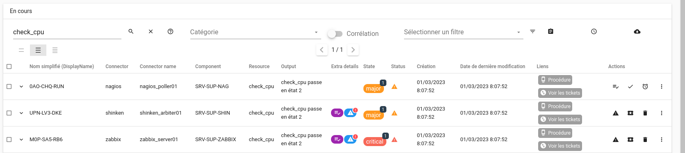
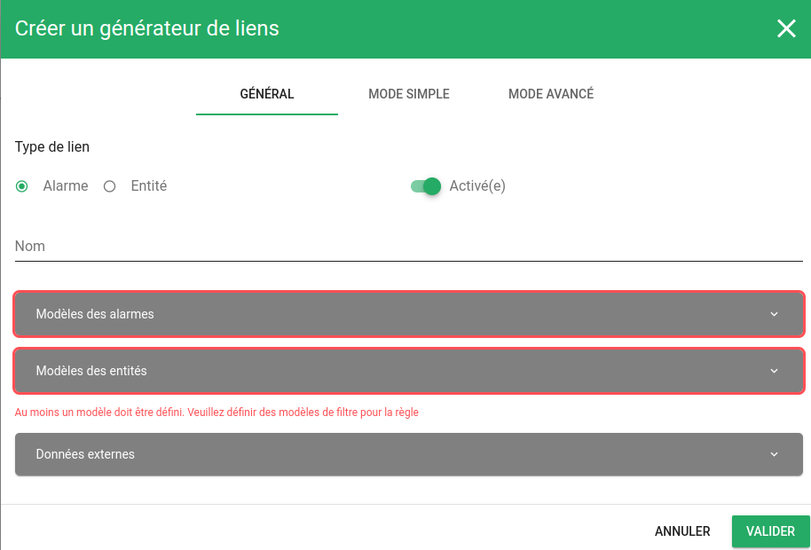
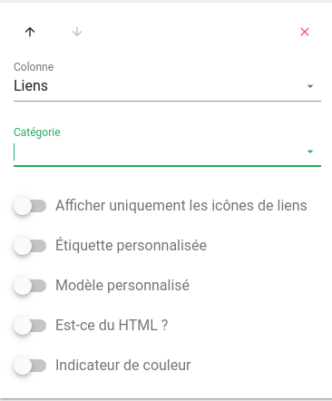
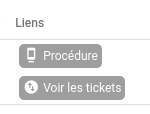
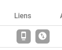
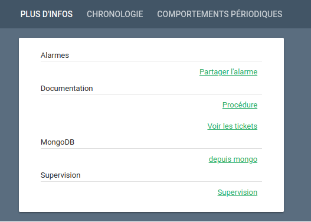
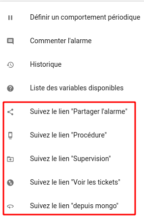
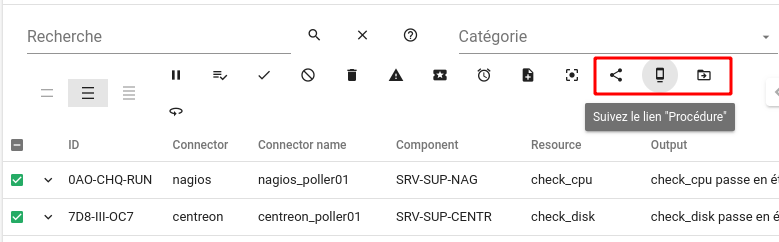

# Générateur de liens

## Définition

Les *générateurs de liens* dans Canopsis permettent d'associer des liens à des alarmes ou à des entités à partir de règles de gestion.  
Ils sont généralement utilisés pour 

* Lier une alarme à son outil de supervision d'origine
* Permettre de rebondir vers le ticket d'incident créé sur une plate-forme tierce
* Rediriger l'utilisateur vers une procédure
* Présenter la fiche d'inventaire d'une entité





## Paramètres généraux



| Paramètre | Description |
| --- | --- |
| **Type de lien** | Il s'agit de déterminer si les liens seront attachés à des entités ou des alarmes |
| **Enabled** | Si activé, le *générateur de liens* sera pris en compte sinon il sera ignoré |
| **Nom** | Nom de la règle |
| **Modèles** | Modèles d'alarmes ou d'entités qui permettent de lier les liens |
| **Données externes** | Possibilité d'enrichir les liens avec des collections mongoDB |


## Mode simple


| Paramètre | Description |
| --- | --- |
| **Label** | Il s'agit du label du lien qui sera généré et accessible dans les widgets |
| **Catégorie** | La catégorie de lien est exploitable dans les colonnes des widgets |
| **Icône** | Icône associée au lien |
| **Appliquer ce lien uniquement à une seule alarme** | Si activé, le lien ne sera pas disponible en cas de sélection multiple |
| **Masquer ce lien des actions d'alarmes** | Si activé, le lien ne sera pas présenté dans la liste des actions des alarmes |
| **URL** | URL de destination du lien généré. Peut utiliser des variables d'alarmes ou d'entités (démarrer l'écriture par `{{`) |
| **Ajouter un lien** | Bouton d'ajout d'autres liens |

## Mode avancé

Le mode avancé permet d'écrire une fonction personnalisée dans le langage `javascript`.  
De cette manière, vous pouvez totalement décrire le lien final souhaité en utilisant un langage de haut niveau.  

La fonction doit nécessairement s'appeler `generate` et prend en paramètre une alarme.  
Cette fonction doit retourner un tableau de liens définis par 

| Clé | valeur |
| --- | --- |
| **label** | Il s'agit du label du lien qui sera généré et accessible dans les widgets |
| **category** | La catégorie de lien est exploitable dans les colonnes des widgets |
| **icon_name** | Icône associée au lien |
| **url** | Icône associée au lien |


Voici un exemple de fonction qui retourne 4 liens avec une URL forgée à partir des `Ressources` sélectionnées :

```js
function generate(alarms) {
        let queryStr = "";
        for (const alarm of alarms) {
          queryStr += "resources[]=" + alarm.Value.Resource + "&";
          }
      
        return [
          {
            label: "test-link-1-label",
            category: "test-category-1",
            icon_name: "test-link-1-icon",
            url: "http://test-link-1-url.com?" + queryStr
          },
          {
            label: "test-link-2-label",
            category: "test-category-2",
            icon_name: "test-link-2-icon",
            url: "http://test-link-2-url.com?" + queryStr
          },
          {
            label: "test-link-3-label",
            category: "test-category-3",
            icon_name: "test-link-3-icon",
            url: "http://test-link-3-url.com?" + queryStr
          },
          {
            label: "test-link-4-label",
            category: "test-category-4",
            icon_name: "test-link-4-icon",
            url: "http://test-link-4-url.com?" + queryStr
          },
          {
            label: "test-link-5-label",
            category: "test-category-5",
            icon_name: "test-link-5-icon",
            url: "http://test-link-5-url.com?" + queryStr
          }
        ];
      }
```

L'éditeur avancé de code vous propose également des suggestions de variables pour les objets suivants :

* **alarm** : toutes les variables associées à l'alarme ciblée par le générateur de liens. Cela inclut également les variables `alarm.Entity.xx` et `alarm.ExternalData.xx`.
* **user** : les variables liées à l'utilisateur qui exécute le générateur de liens.
* **env** : toutes les variables d'environnement référencées dans le [fichier toml](../../../guide-administration/administration-avancee/modification-canopsis-toml/#section-canopsistemplatevars).

## Visualisation

Les liens générés sont accessibles :

* Depuis les colonnes d'un bac à alarmes
* Depuis les colonnes de l'explorateur de contexte
* Depuis un template
* Depuis le menu d'actions unitaires
* Depuis le menu d'actions de masse

### Colonnes d'un bac à alarmes

Il vous suffit d'ajouter la colonne `Liens` :  



Le résultat sera ainsi présenté :



Si vous souhaitez n'afficher que les icônes sans label, vous pouvez cocher `Afficher uniquement les icônes de liens`



### Colonnes de l'explorateur de contexte

Il s'agit du même principe que sur le bac à alarmes.


### Template

Un [Helper Handlebars](../interface/helpers/index.md#helper-links) est mis à disposition.




### Actions unitaires

Pour chaque alarme, vous pouvez accéder aux différents liens par l'intermédiaire de menu `Actions`.



### Actions de masse

En sélectionnant des alarmes, selon l'éligibilité, des actions de masse peuvent s'ajouter


