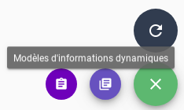
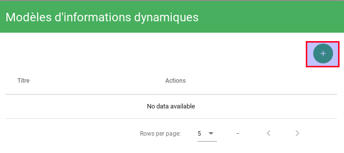
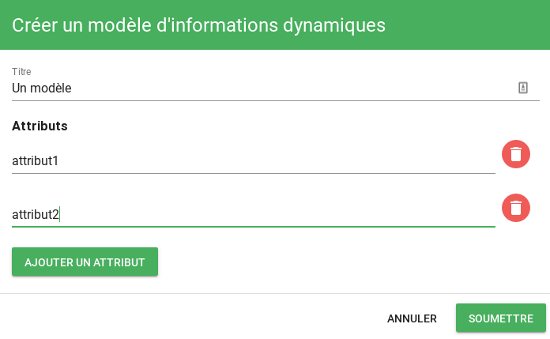
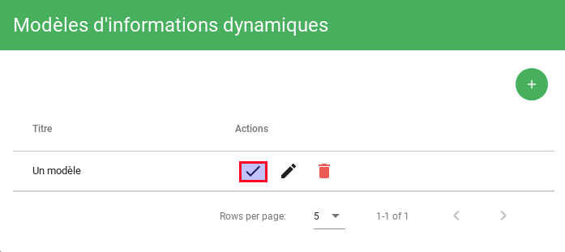
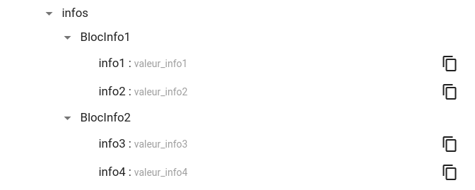

# Informations dynamiques

!!! info
    Disponible uniquement en édition Pro.

Une alarme peut être enrichie grâce à la fonctionnalité `Informations dynamiques`.  
Les informations ainsi ajoutées à une alarme seront présentes dans l'attribut `infos` de celle-ci.

Les règles d'informations dynamiques sont appliquées :

* Au moment de la création d'une alarme
* Toutes les minutes sur les alarmes déjà créées
* Lors d'un changement sur une règle sur les alarmes déjà créées

## Anatomie d'une règle d'information dynamique

Les paramètres demandés lors de la création d'une règle sont les suivants :

* `Nom` : Nom de la règle (présent dans la liste générale)
* `Description` : Description de la règle
* `Désactiver pendant les pauses` : Détermine si la règle s'applique ou non dans le cas de comportements périodiques
* `Informations` : 
	* `Nom` : Nom de l'information à ajouter à l'alarme
	* `Valeur` : Valeur de l'information à ajouter à l'alarme
* `Pattern d'Alarmes et/ou d'Entités` : Alarmes ou Entités sur lequelles la règle s'applique

### Templates

Les champs `Valeur` des informations dynamiques sont personnalisables grâce aux templates. Les templates permettent de générer du texte en fonction de la criticité de l'alarme ou de l'entité.  
Pour plus d'informations, vous pouvez consulter la [documentation sur les templates Golang](../templates-go/index.md).

Les fonctions suivantes sont disponibles dans les templates `Informations dynamiques` :

* lowercase
* uppercase
* split
* trim
* localtime

Les variables accessibles dans les templates sont : 

* .Alarm
* .Entity
* .Event

L'accès à la variable `.Event` permet de manière simple d'exploiter une valeur fournie directement dans l'événement en tant qu'information dynamique.  
Si votre événement contient `"client" : "capensis" ` alors vous pouvez accéder à cette valeur en utilisant le template suivant : `{{ .Event.ExtraInfos.client }}`.

Un exemple concret d'utilisation des informations dynamiques pour l'affichage de consignes techniques dans le bac à alarmes est disponible dans le [guide d'utilisation](../cas-d-usage/affichage-de-consignes.md).

## Pré remplissage des attributs

Lorsque vous devez saisir des règles d'informations dynamiques similaires, vous avez la possibilité de pré remplir les attributs de celles-ci pour ne plus avoir que la saisie des valeurs à réaliser.  

Pour cela, vous devez

* Ajouter un `modèle` depuis l'interface graphique :

* Appuyer sur le bouton `+`

* Saisir un titre puis des attributs puis cliquer sur "Soumettre"

À ce stade, il vous reste à **instancier** le modèle avec vos valeurs

## Exploitation des résultats

Les informations dynamiques créées sur une alarme sont accessibles dans l'attribut `infos` de l'alarme :

