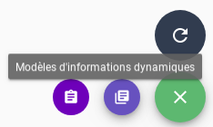
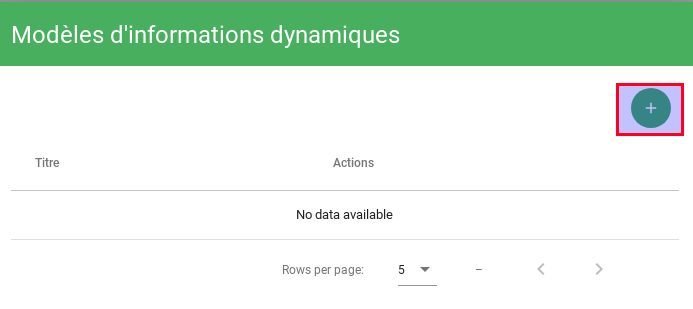
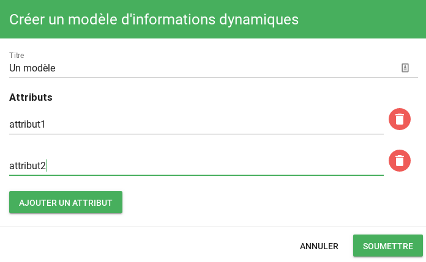
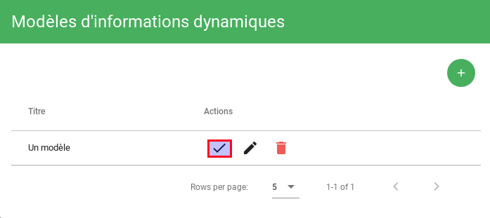
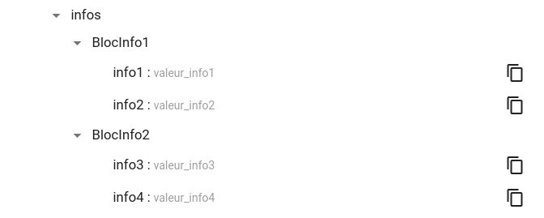

# Informations dynamiques

!!! info
    Disponible uniquement en édition Pro.

Les informations dynamiques permettent d'enrichir une alarme avec des données supplémentaires.  
Ces informations apparaissent dans l'attribut infos de l'alarme.

Les règles d'informations dynamiques sont appliquées :

* Lors de la création d'une alarme,
* Toutes les minutes sur les alarmes déjà existantes,
* Lorsqu'une règle est modifiée, sur les alarmes déjà existantes.

## Anatomie d'une règle d'information dynamique

Les paramètres demandés lors de la création d'une règle sont les suivants :

* `Nom` : Nom de la règle (présent dans la liste générale)
* `Description` : Description de la règle
* `Désactiver pendant les pauses` : Détermine si la règle s'applique ou non dans le cas de comportements périodiques
* `Informations` : 
	* `Nom` : Nom de l'information à ajouter à l'alarme
	* `Type` : Choix du mode de valorisation (constante, template, recopie)
	* `Valeur` : Valeur de l'information à ajouter à l'alarme
* `Pattern d'Alarmes et/ou d'Entités` : Alarmes ou Entités sur lequelles la règle s'applique

## Types de valeur possibles

Pour chaque information, la valeur peut être définie :

* Par une constante,
* Par un template
* Par la recopie d'un champ existant (alarme, entité, événement)

### Constante

La valeur de l'information est une chaîne de caractères fixe.

### Template

La valeur de l'information est calculée grâce à un [template](../templates-go/index.md).

Les fonctions suivantes sont disponibles dans les templates `Informations dynamiques` :

* lowercase
* uppercase
* split
* trim
* localtime

Les variables accessibles dans les templates sont relatives : 

* A l'alarme
* A l'entité
* A l'événement
* A une variable d'environnement

L'accès à la variable `.Event` permet de manière simple d'exploiter une valeur fournie directement dans l'événement en tant qu'information dynamique.  
Si votre événement contient `"client" : "capensis" ` alors vous pouvez accéder à cette valeur en utilisant le template suivant : `{{ .Event.ExtraInfos.client }}`.

Un exemple concret d'utilisation des informations dynamiques pour l'affichage de consignes techniques dans le bac à alarmes est disponible dans le [guide d'utilisation](../cas-d-usage/affichage-de-consignes.md).

### Recopie d'information

La valeur de l'information correspond à la copie d'un champ existant (sur l'alarme, l'entité ou l'événement).  
Le type d'origine est conservé.

## Pré remplissage des attributs

Lorsque vous devez saisir des règles d'informations dynamiques similaires, vous avez la possibilité de pré remplir les attributs de celles-ci pour ne plus avoir que la saisie des valeurs à réaliser.  

Pour cela, vous devez

* Ajouter un `modèle` depuis l'interface graphique :

* Appuyer sur le bouton `+`

* Saisir un titre puis des attributs puis cliquer sur "Soumettre"

À ce stade, il vous reste à **instancier** le modèle avec vos valeurs

## Exploitation des résultats

Les informations dynamiques créées sur une alarme sont accessibles dans l'attribut `infos` de l'alarme :

