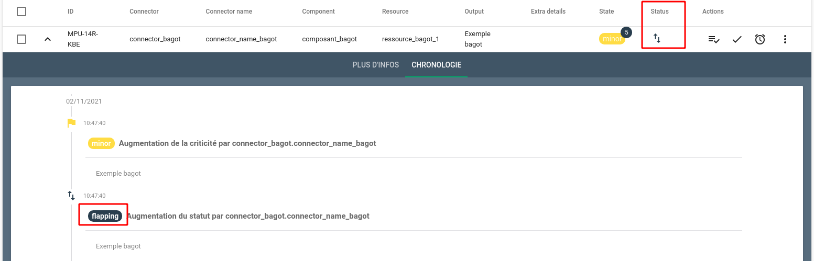

# Règles de bagot

Une alarme hérite du statut `bagot` lorsqu'elle oscille d'une criticité d'alerte à un état stable un certain nombre de fois sur une période donnée.

Vous avez la possibilité de définir ces critères pour les typologies d'alarmes souhaitées.

!!! Note "Rappel"
    Vous pouvez retrouver les différents statuts et transitions associés dans cette [page de documentation](../vocabulaire/index.md?h=bagot#relations-entre-les-statuts-dune-alarme)

## Anatomie d'une règle de bagot

Les paramètres demandés lors de la création d'une règle sont les suivants :

* `Nom` : Nom de la règle (présent dans la liste générale)
* `Durée` : Période sur laquelle sont observés les bagots
* `Priorité` : Priorité d'application des règles (ordre croissant)
* `Nombre d'oscillations` : Nombre d'oscillations de criticité à observer avant le passage au statut `Bagot`
* `Description` : Description de la règle
* `Pattern d'Alarmes et/ou d'Entités` : Alarmes ou Entités sur lequelles la règle s'applique

## Résultats sur une alarme déclarée `bagot`

En considérant la règle suivante

Lorsque la criticité d'une alarme correspondant au pattern défini oscille trois fois sur une période d'une minute, on observe sur l'alarme :

