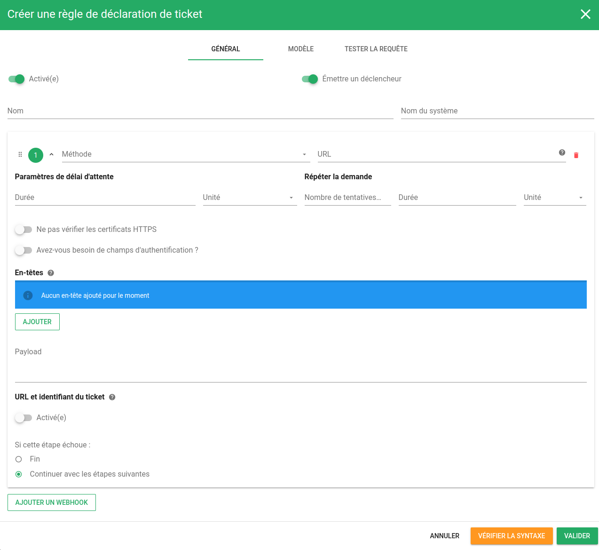
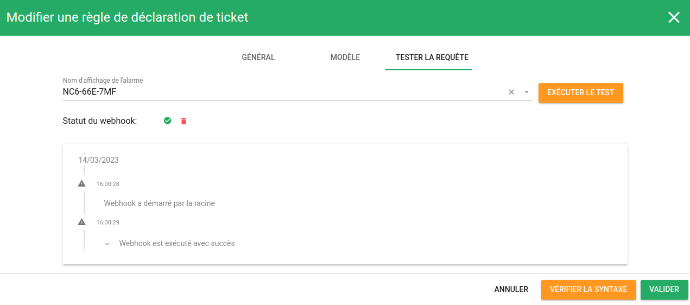
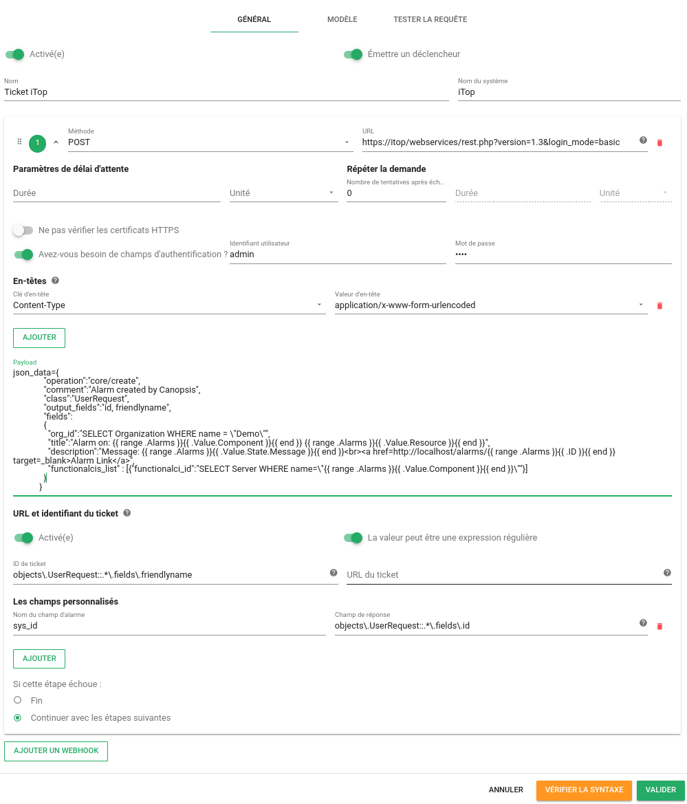
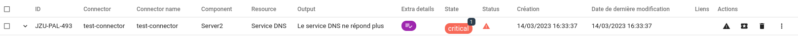
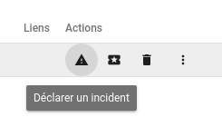
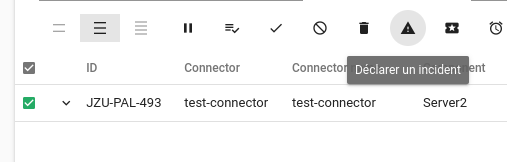
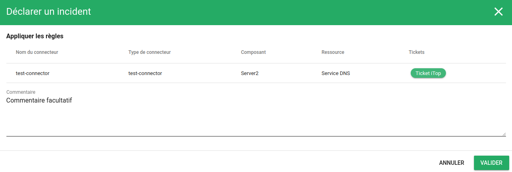
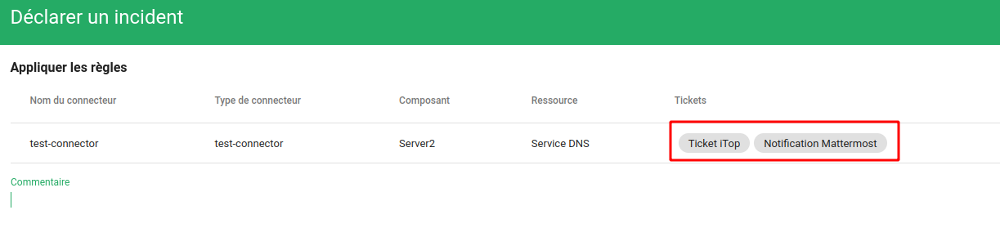
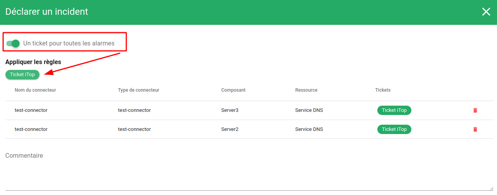
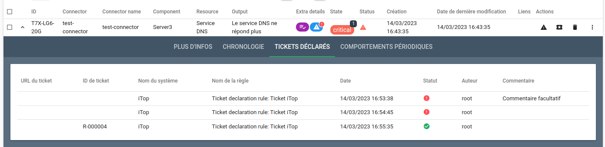

# Règles de déclaration de tickets

## Définition

Les *règles de déclarations de tickets* dans Canopsis permettent d'interagir avec des outils tiers de ticketing par l'intermédiaire de webhooks.  
Ces règles sont très proches des webhooks présents dans la fonctionnalité de [scénario](scenarios.md).

!!! information "Information"

    Le déclenchement de la déclaration de ticket ne peut se faire que manuellement via le bouton de déclaration de ticket.

## Configuration

### Paramètres généraux



| Paramètre | Description |
| --- | --- |
| **Activé** | Si activé, la *règle* est prise en compte, sinon elle est ignorée |
| **Emettre un déclencheur** | Si activé, le [déclencheur "declareticket"](../../guide-administration/architecture-interne/triggers.md) est émis |
| **Nom** | Nom de la règle, affiché dans l'interface de gestion des *règles de déclaration de tickets* |
| **Nom du système** | Nom du système de gestion de tickets |

### Différents webhooks de déclaration de tickets

| Paramètre | Description |
| --- | --- |
| **Methode** | [Méthode HTTP](https://datatracker.ietf.org/doc/html/rfc7231#section-4.3) à utiliser. |
| **URL** | URL de la requête HTTP de l'outil de gestion de tickets. |
| **Paramètres de délai d'attente** | Délai à attendre avec l'exécution de l'action. |
| **Répéter la demande** | Nombre de tentatives avant d'abandonner en cas de problème avec la requête. |
| **Ne pas vérifier les certificats HTTPS** | Si coché, la validité du certificat HTTPS n'est pas vérifiée et la requête est exécutée même si le serveur HTTP présente un certificat invalide. |
| **Avez vous besoin de champs d'authentification ?** | Si coché, active l'authentification HTTP pour la requête. |
| **Identifiant utilisateur** | Nom d'utilisateur pour la requête HTTP. |
| **Mot de passe** | Mot de passe pour la requête HTTP. |
| **Entêtes** | Entêtes HTTP à ajouter à la requête. |
| **Payload** | Corps de la requête. Supporte les [Templates GO](../templates-go/index.md). |
| **URL et identifiant du ticket)** | Si activé, permet de définir les valeurs du numéro de ticket retourné par l'outil de ticketing. |
| **La valeur peut être une expression régulière** | Permet d'appliquer une REGEX dans les champs **ID du ticket** et **Champs personnalisés**. |
| **ID de ticket** | Champ de réponse de l'API qui contient le numéro de ticket |
| **URL du ticket** | Champ de réponse de l'API qui contient l'URL du ticket |
| **Les champs personnalisés** | Champs de la réponse de l'API que vous souhaitez ajouter à l'alarme. La réponse doit être au format JSON.  (exemple : `Nom du champ d'alarme` = `myprop`, `Champ de réponse` = `ticket.msg` et la réponse de l'api est `{"ticket":{"msg" : "Ticket message"}}` alors le champ `myprop` de l'alarme aura pour valeur `"Ticket message"`).|
| **Si cette étape échoue** | Décide de la suite des opération si le webhook échoue. |
| **Ajouter un webhook** | Permet d'ajouter un autre webhook. |

### Modèle

Les règles de déclaration de tickets s'appliquent sur des alarmes qui respectent 

* Des modèles d'alarmes
* Des modèles d'entités
* Des modèles de comportements périodiques

### Tester la requête

Vous avez la possibilité de tester vos règles de déclaration de tickets à partir d'une alarme existante.  
Vous devez sélectionner ou indiquer l'identifiant court de l'alarme et cliquer sur "Excéuter le test". 




## Exploitation

Prenons l'exemple d'une règle de déclaration de tickets sur l'outil [iTop](https://www.combodo.com/itop).



??? example "Requête correspondante vers l'API"

    ```sh
    curl -H "Content-Type: application/json" -X POST -u root:root -d '{
    "name": "Ticket iTop3",
    "system_name": "iTop",
    "enabled": true,
    "emit_trigger": true,
    "webhooks": [
      {
        "request": {
          "url": "https://itop/webservices/rest.php?version=1.3&login_mode=basic",
          "method": "POST",
          "auth": {
            "username": "admin",
            "password": "itop"
          },
          "headers": {
            "Content-Type": "application/x-www-form-urlencoded"
          },
          "payload": "json_data={\n              \"operation\":\"core/create\",\n              \"comment\":\"Alarm created by Canopsis\",\n              \"class\":\"UserRequest\",\n              \"output_fields\":\"id, friendlyname\",\n              \"fields\":\n              {\n                \"org_id\":\"SELECT Organization WHERE name = \\\"Demo\\\"\",\n                \"title\":\"Alarm on: {{ range .Alarms }}{{ .Value.Component }}{{ end }} {{ range .Alarms }}{{ .Value.Resource }}{{ end }}\",\n                \"description\":\"Message: {{ range .Alarms }}{{ .Value.State.Message }}{{ end }}<br><a href=http://localhost/alarms/{{ range .Alarms }}{{ .ID }}{{ end }} target=_blank>Alarm Link</a>\",\n                \"functionalcis_list\" : [{\"functionalci_id\":\"SELECT Server WHERE name=\\\"{{ range .Alarms }}{{ .Value.Component }}{{ end }}\\\"\"}]\n              }\n            }",
          "skip_verify": false,
          "timeout": null,
          "retry_count": 0,
          "retry_delay": null
        },
        "declare_ticket": {
          "empty_response": false,
          "is_regexp": true,
          "sys_id": "objects\\.UserRequest::.*\\.fields\\.id",
          "ticket_id": "objects\\.UserRequest::.*\\.fields\\.friendlyname",
          "ticket_url": ""
        },
        "stop_on_fail": false
      }
    ],
    "author": {
      "_id": "root",
      "name": "root"
    },
    "created": 1678799414,
    "updated": 1678806513,
    "alarm_pattern": [
      [
        {
          "field": "v.component",
          "cond": {
            "type": "contain",
            "value": "Server"
          }
        }
      ]
    ]
    }' 'http://localhost:8082/api/v4/cat/declare-ticket-rules'
    ```

Lorsqu'une demande de déclration de ticket sera effectuée par un utilisateur, le webhook défini sera exécuté.  
Le numéro de ticket reçu dans le champ `friendlyname` sera associé à l'alarme dans Canopsis.  
Le champ supplémentaire `sys_id` sera également inséré dans l'alarme; Il vaudra alors `l'id` renvoyée par l'API.

L'alarme suivante est éligible à la règle précédemment créée.



### Déclarer un ticket

Pour déclarer un ticket, l'utilisateur peut exécuter l'action de manière unitaire ou en masse, puis sélectionner la règle de déclaration souhaitée.






!!! info "Information"

    Une alarme peut être éligible à plusieurs règles de déclaration de tickets.  
    Dans ce cas, vous avez la possibilité de sélectionner les différentes règles.  
    


**Option : Déclarer un seul ticket à partir de plusieurs alarmes**

En cas de sélection multiples d'alarmes, vous avez la possibilité de demander la création d'un ticket par alarme ou un ticket commun pour toutes les alarmes.




### Visualiser les informations du ticket

Lorsque vous "dépliez" une alarme, l'onglet **Ticket Déclarés** présente l'ensemble des tentatives de créations de tickets réalisées.



Vous y trouverez notamment pour chaque tentative son statut, les horaires associés.
