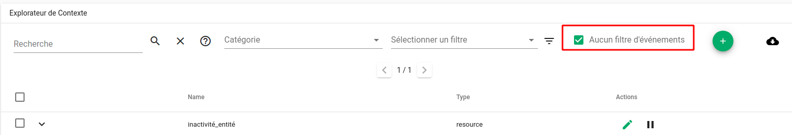
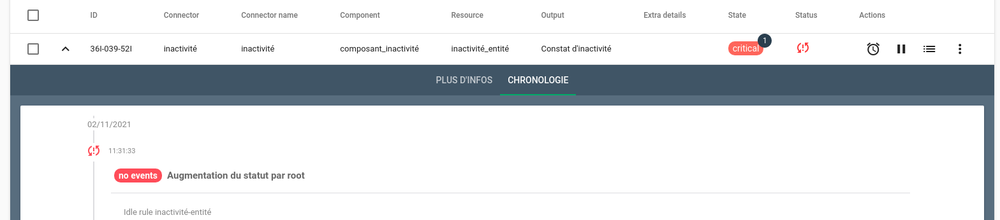

# Règles d'inactivité

Lorsqu'une inactivité est constatée sur une alarme existante ou sur une entité, Canopsis peut réagir en exécutant une action.

## Inactivité d'une Alarme

L'inactivité d'une alarme est caractérisée par le fait de ne recevoir durant une période : 

* Aucun événement la concernant
* Aucun changement de criticité la concernant

Lorsque l'inactivité est constatée, Canopsis peut déclencher une action de type : 

* Mise en veille (Snooze)
* Acquitter (Ack ou Ackremove)
* Annuler (Cancel)
* Associer un ticket (associateticket)
* Changement de criticité (Change and lock severity)
* Déclencher un comportement périodique (Pbehavior)

### Anatomie d'une règle d'inactivité sur Alarme
 
Les paramètres demandés lors de la création d'une règle sont les suivants :

* `Nom` : Nom de la règle (présent dans la liste générale)
* `Type` : Aucun événement reçu / Aucun changement d'état
* `Description` : Description de la règle
* `Délai d'attente` : Délai à partir duquel sera considérée l'inactivité
* `Priorité` : Priorité d'application des règles (ordre croissant)
* `Désactiver pendant les pauses` : Possibilité de désactiver la règle pendant un comportement périodique
* `Type d'action` : Définition de l'action à exécuter
* `Pattern d'Alarmes et/ou d'Entités` : Alarmes ou Entités sur lequelles la règle s'applique

### Exploitation des résultats

Dans ce cas, le résultat observé est le résultat de l'exécution de l'action définie dans la règle.

## Inactivité d'une Entité

L'inactivité d'une alarme est caractérisée par le fait de ne recevoir durant une période : 

* Aucun événement la concernant

Lorsque l'inactivité est constatée, Canopsis peut déclencher une action de type : 

* Mise en veille (Snooze)
* Acquitter (Ack ou Ackremove)
* Annuler (Cancel)
* Associer un ticket (associateticket)
* Changement de criticité (Change and lock severity)
* Déclencher un comportement périodique (Pbehavior)

### Anatomie d'une règle d'inactivité sur Entité
 
Les paramètres demandés lors de la création d'une règle sont les suivants :

* `Nom` : Nom de la règle (présent dans la liste générale)
* `Description` : Description de la règle
* `Délai d'attente` : Délai à partir duquel sera considérée l'inactivité
* `Priorité` : Priorité d'application des règles (ordre croissant)
* `Désactiver pendant les pauses` : Possibilité de désactiver la règle pendant un comportement périodique
* `Pattern d'Alarmes et/ou d'Entités` : Alarmes ou Entités sur lequelles la règle s'applique

### Exploitation des résultats

**Cas général**

Lorsqu'une entité est déclarée en inactivité, elle apparait dans la liste des entités inactives disponible dans l'explorateur de contexte.

**Cas où il existe une alarme concernant l'entité**

Dans ce cas, en plus de la possibilité de filtrer les entités inactives dans l'explorateur de contexte, vous retrouvez un statut particulier sur l'alarme

