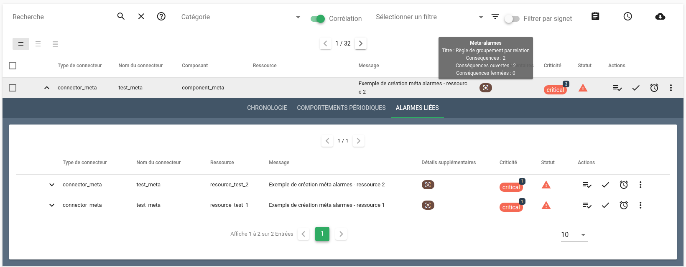

# Règles Méta Alarmes (pro)

## Définition

Une méta alarme permet de grouper dynamiquement des alarmes selon des critères définis dans une règle.  
Une méta alarme est une alarme à part entière et aura un cycle de vie équivalent à n'importe quelle alarme.

Ces groupements d'alarmes permettent de voir rapidement les corrélations entre les différentes alarmes présentes dans le [bac à alarmes](../../guide-utilisation/interface/widgets/bac-a-alarmes/index.md).


Plusieurs types de regroupement sont disponibles :

* [Groupement par relation parent-enfant](#groupement-par-relation-parent-enfant)
* [Groupement par intervalle de temps](#groupement-par-intervalle-de-temps)
* [Groupement par attribut](#groupement-par-attribut)
* [Groupement complexe avec seuil de déclenchement](#groupement-complexe-avec-seuil-de-declenchement)
* [Groupement complexe avec taux de déclenchement](#groupement-complexe-avec-taux-de-declenchement)
* [Groupement par groupe de valeurs](#groupement-par-groupe-de-valeurs)
* [Groupement par utilisation d'un identifiant](#groupement-par-utilisation-dun-identifiant)

## Types

Quelque soit le type utilisé, une règle `méta alarme` est composée à minima de 

| Champ | Description |
|-------| ------------|
| **Identifiant**  | Identifiant de la règle |
| **Nom** | Nom donné au groupement, il apparaîtra sur les méta alarmes dans le bac |
| **Modèle de message** | L'`output_template` permet de formater le message informatif associé à une méta alarme ({{ .Children.Alarm.Value.State.Message }}) |
| **Résolution autmatique** | Permet de résoudre la méta alarme lorsque toutes ses alarmes conséquences sont résolues |
| **Type** | Type de groupement : `relation`, `timebased`, `attribute`, `complex`, ou `valuegroup` |
| **Modèles des alarmes** | La règle ne s'applique que sur les alarmes qui correspondent au modèle |
| **Modèles des entités** | La règle ne s'applique que sur les alarmes dont l'entité correspond au modèle |


### Groupement par relation parent-enfant

Il permet de regrouper les alarmes qui ont un lien de parenté.  
Par exemple, si un composant a provoqué une alarme, toutes les alarmes des ressources ayant le même composant seront regroupées dans une même méta alarme.

Exemple :

| Champ | Description |
|-------| ------------|
| **Identifiant**  | Vide |
| **Nom** | Groupement relation parent-enfant |
| **Modèle de message** | {{ .Children.Alarm.Value.State.Message }} |
| **Résolution autmatique** | Vrai |
| **Type** | relation |

Cette règle s'applique à toutes les entités.

### Groupement par intervalle de temps

Ce type de méta alarme regroupe toutes les alarmes survenues dans un intervalle de temps donné.  
Par exemple toutes les alarmes apparues au cours de la même minute (à partir de la création de la première alarme) seront regroupées sous une même méta alarme.

Exemple :

| Champ | Description |
|-------| ------------|
| **Identifiant**  | Vide |
| **Nom** | Règle de groupement par intervalle de temps |
| **Modèle de message** | {{ .Children.Alarm.Value.State.Message }} |
| **Résolution autmatique** | Vrai |
| **Type** | timebased |
| **Intervalle de temps** | 60 secondes |

### Groupement par attribut

Ce type de groupement utilise des attributs d'alarmes ou d'entités pour regrouper des alarmes au sein d'une méta alarme.  

Par exemple si on utilise un modèle qui vaut `Composant Egal srv001`, toutes les alarmes créées à partir d'un évènement dont le composant est égal à srv001 seront regroupées dans une méta alarme.

Exemple :

| Champ | Description |
|-------| ------------|
| **Identifiant**  | Vide |
| **Nom** | Règle de groupement par attribut |
| **Modèle de message** | {{ .Children.Alarm.Value.State.Message }} |
| **Résolution autmatique** | Vrai |
| **Type** | attribute |
| **Modèles des alarmes** | `Composant Egal srv001` |

### Groupement complexe avec seuil de déclenchement

C'est une combinaison de groupement par attribut et de groupement par intervalle de temps, il possède aussi une notion de seuil de déclenchement.  
Par exemple, on pourra l'utiliser pour regrouper toutes les alarmes créées pour une même entité durant un intervalle de temps donné, seulement si le nombre d'alarmes créées dépasse un certain seuil.

Exemple :

| Champ | Description |
|-------| ------------|
| **Identifiant**  | Vide |
| **Nom** | Règle de groupement complexe |
| **Modèle de message** | {{ .Children.Alarm.Value.State.Message }} |
| **Résolution autmatique** | Vrai |
| **Type** | complex |
| **Type de seuil** | Seuil de déclenchement |
| **Seuil de déclenchement** | 3 |
| **Intervalle de temps** | 60 secondes |
| **Délai d'inactivité** | 180 secondes |
| **Modèles des alarmes** | `Ressource Egal check` |

Cette règle s'applique si 3 alarmes ou plus, dont la ressource vaut `check`, ont été créées durant un intervalle de temps de 60 secondes.  
De plus, le paramètre **Délai d'inactivité** permet d'ajouter un délai avant l'activation des alarmes qui matchent le modèle d'alarmes. Cela permet par exemple de ne pas être obligé de créer des tickets pour des alarmes qui seraient bientôt corrélées.

### Groupement complexe avec taux de déclenchement

Comme le précédent il s'agit d'un groupement par attribut et par intervalle de temps. Mais celui-ci calcule le taux d'entités en erreur par rapport à un groupe donné, défini par un modèle d'entités.  
Par exemple, vous avez 5 serveurs situés sur le site de Wasquehal et vous souhaitez grouper les alarmes si au moins 80% de ces serveurs sont en erreur sur une période de 5 minutes. Au préalable, vous aurez pris soin de créer ces entités dans le référentiel interne de Canopsis et de les enrichir avec `infos.site.value = Wasquehal`.

Exemple :

| Champ | Description |
|-------| ------------|
| **Identifiant**  | Vide |
| **Nom** | Groupement dysfonctionnement global site Wasquehal |
| **Modèle de message** | {{ .Children.Alarm.Value.State.Message }} |
| **Résolution autmatique** | Vrai |
| **Type** | complex |
| **Type de seuil** | Taux de déclenchement |
| **Taux de déclenchement** | 80% |
| **Intervalle de temps** | 300 secondes |
| **Délai d'inactivité** |  |
| **Modèles des entités** | `Infos site Valeur Egal Wasquehal` |

**Cas particulier nécessitant une autre base de calcul du ratio**

Lorsque Canopsis reçoit des événements et qu'il enrichit les entités correspondantes grâce à des règles, l'application d'un ratio peut paraître inadaptée.  
Par exemple, si les événements reçus concernent des `ping`, pour le calcul du ratio, nous avons besoin :

* Du nombre d'alarmes `ping`
* Du nombre total d'entités concernées par ces ping

Dans le cas où vous n'avez pas de référentiel pré rempli dans Canopsis, le nombre total d'entités concernées par ces ping n'est autre que le nombre d'alarmes `ping` déjà reçues par Canopsis jusque là.

Ce ratio ainsi calculé n'a pas de sens métier dans cet exemple.

Le type `complex` propose donc une solution pour utiliser une base de ratio différente. Cette base est représentée par l'attribut `Modèle des entités (Total)`

La règle ci-après permet de créer une méta alarme lorsque le ratio entre le nombre d'alarmes `ping` et le nombre de composants est supérieur à 80%

| Champ | Description |
|-------| ------------|
| **Identifiant**  | Vide |
| **Nom** | Groupement dysfonctionnement ping |
| **Modèle de message** | {{ .Children.Alarm.Value.State.Message }} |
| **Résolution autmatique** | Vrai |
| **Type** | complex |
| **Type de seuil** | Taux de déclenchement |
| **Taux de déclenchement** | 80% |
| **Intervalle de temps** | 1 heure |
| **Délai d'inactivité** |  |
| **Modèles des alarmes** | `Ressource Egal ping` |
| **Modèles des entités (Total)** | `Type Egal component` |


### Groupement par groupe de valeurs

Ce type de règle possède les mêmes attributs que le type `complex` avec la notion de *chemins de valeur (value_paths)* en plus.  
Ces *chemins de valeur* sont utilisés pour grouper les valeurs de manière unique.

Exemple :

| Champ | Description |
|-------| ------------|
| **Identifiant**  | Vide |
| **Nom** | Groupe de valeurs |
| **Modèle de message** | Regroupé par un chemin de valeurs |
| **Résolution autmatique** | Vrai |
| **Type** | valuegroup |
| **Type de seuil** | Seuil de déclenchement |
| **Seuil de déclenchement** | 5 |
| **Intervalle de temps** | 1 heure |
| **Délai d'inactivité** |  |
| **Chemin de valeur** | entity.infos.site.value |
| **Modèles des entités** | `Infos site Valeur Contient .+` |

Cette règle s'applique si 5 alarmes ou plus concernant le même chemin de valeur (`entity.infos.site.value`), ont été créées durant un intervalle de temps de 3600 secondes.
Plusieurs chemins de valeur peuvent être observés. Dans ce cas, une méta alarme est créée pour chaque combinaison de chemins de valeurs.

### Groupement par utilisation d'un identifiant (corelid)

Le groupement par identifiant de corrélation s'appuie sur une corrélation qui a déjà été réalisée en amont.  
Ainsi, il est possible de s'appuyer sur un identifiant de corrélation, que nous appelons `Identificant de corrélation` ou `corel_id`, qui est attaché à différentes alarmes déjà corrélées.  
Dans les alarmes qui possèdent le même identifiant de corrélation, on distingue la cause et les conséquences.  
La cause est repérée par "la corrélation parent" (corel_parent) tandis que les conséquences sont repérées par "la corrélation enfant" (corel_child).  

La méta alarme qui en découle est portée par l'alarme "corrélation parent".

Exemple : 

| Champ | Description |
|-------| ------------|
| **Identifiant**  | Vide |
| **Nom** | Groupe de valeurs |
| **Modèle de message** | Regroupement par identifiant de corrélation |
| **Résolution autmatique** | Vrai |
| **Type** | corel |
| **Type de seuil** | Seuil de déclenchement |
| **Seuil de déclenchement** | 3 |
| **Intervalle de temps** | 2 minutes |
| **Délai d'inactivité** |  |
| **Modèles des entités** | `Infos corelid Valeur Contient .+` |
| **Identifiant de corrélation** | "{{ .Entity.Infos.corelid.Value }}" |
| **Statut de corrélation** | "{{ .Entity.Infos.corelstatus.Value }} |
| **Corrélation parent** | "parent" |
| **Corrélation enfant** | "child" |


* On attend l'identifiant de corrélation dans l'information d'entité `Identifiant de corrélation` (corel_id) (prévoir un [enrichissement](./filtres-evenements.md) pour cela)
* Le `Statut de corrélation` correspond à un mot clé qui détermine si l'alarme est une cause ou une conséquence
* Les `Corrélation parent et enfant` spécifient les mots clés désignant s'il s'agit d'un parent ou d'un enfant

## Démonstration vidéo

La démonstration en vidéo suivante permet de constater l'effet obtenu avec la
règle de corrélation `relation` (relation parent-enfant) :

<iframe width="560" height="315" src="https://www.youtube-nocookie.com/embed/Y-OwUIqiu_s" title="YouTube video player" frameborder="0" allow="accelerometer; autoplay; clipboard-write; encrypted-media; gyroscope; picture-in-picture" allowfullscreen></iframe>

D'autres vidéos sont disponibles pour les autres types de règles de corrélation.
Voir la [playlist « Tutoriels Canopsis » (YouTube)][youtube-pl].

[youtube-pl]: https://www.youtube.com/playlist?list=PLOoYSSN74hIZVLA1oGkZpora2scQvuFNJ

### Processus de création d'une méta alarme

En reprenant l'exemple d'un groupement par relation parent-enfant, la création d'une méta alarme se déroule de la façon suivante.

Une erreur se produit sur un composant `component_meta` qui envoie un évènement à Canopsis.

```json
{
  "event_type": "check",
  "connector": "connector_meta",
  "connector_name": "test_meta",
  "component": "component_meta",
  "source_type": "component",
  "author": "Canopsis",
  "state": 3,
  "output": "Exemple de création méta alarmes - component"
}
```

Une alarme sur le composant est créée et visible dans le bac à alarmes.


Comme le composant est en erreur, ses ressources envoient probablement elles aussi des évènements qui vont conduire à la création d'alarmes.

```json
{
  "event_type": "check",
  "connector": "connector_meta",
  "connector_name": "test_meta",
  "component": "component_meta",
  "resource": "resource_test_X",
  "source_type": "resource",
  "author": "Canopsis",
  "state": 3,
  "output": "Exemple de création méta alarmes - ressource X"
}
```

Le moteur corrélation détecte la relation et l'alarme sur le composant devient alors une méta alarme. Les alarmes sur les ressources sont vues comme des conséquences du dysfonctionnement du composant et sont regroupées dans la méta alarme.

Dans l'interface cela se traduit de la façon suivante :



Au passage de la souris sur l'icône de la colonne « Extra Details » une info-bulle apparaît et indique le nom de la règle qui a créé la méta alarme et le nombre d'alarmes liées.

Le détail des alarmes liées peut-être consulté en déroulant le détail de la méta alarme et en affichant l'onglet « Alarmes Liées ».

Dans le cas ci-dessus (groupement par relation parent-enfant), c'est l'alarme parent qui devient la méta alarme. Ses valeurs de `connector`, `connector_name` et `component` sont alors conservées. Pour les autres types de groupement, une méta alarme est générée par Canopsis. Celle-ci aura toujours les valeurs suivantes :

- connector : `engine`
- connector_name : `correlation`
- component : `metaalarm`

### Variables d'une méta alarme

La méta alarme a été enrichie avec de nouvelles variables.


- `consequences` : contient le nombre d'alarmes liées ainsi que les données de ces alarmes dans un tableau `data`.

- `metaalarm` : la valeur 1 indique qu'il s'agit d'une méta alarme.

- `rule` : contient l'`id` et le `name` de la règle qui a déclenché la création de cette méta alarme.


- `v.children` : embarque les `id` des entités liées.

- `v.parents` : est présent dans les variables mais ne sera renseigné que pour les alarmes liées à la méta alarme.

### Format du message informatif d'une méta alarme

Le message informatif, ou `output`, peut être formaté grâce à un template porté par la variable `output_template`.

Cet attribut peut-être composé de **texte statique** et/ou de **variables**.

Les variables accessibles sont : 

* **.Count** : Le nombre d'alarmes conséquences attachées à la méta alarme.
* **.Children** : L'ensemble des variables de la dernière alarme conséquence attachée à la méta alarme.
* **.Rule** : Les informations administratives de la méta alarme en elle-même

Quelques exemples :

* {{ .Count }} Alarmes conséquences; {{ .Children.Alarm.Value.State.Message }}; Règle : {{ .Rule.Name }}
* Un message informatif statique
* Corrélé par la règle {{ .Rule.Name }}

!!! Note
    Il est possible d'utiliser les informations des méta alarmes dans des règles d'enrichissement. La documentation associée se trouve [ici](../filtres-evenements/#variables-utilisables-dans-les-templates)


### Activation de la corrélation

Dans les bacs à alarmes, un interrupteur situé en haut du widget vous permet d'activer la corrélation.


