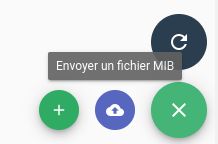

# Règles SNMP (pro)

## Définition

Les règles SNMP permettent de traiter des traps SNMP reçus depuis le [connecteur SNMP](../../../interconnexions/Supervision/SNMPtrap).
Le traitement consiste à transformer des traps bruts en événements Canopsis de type `check` grâce :

* à des MIBs préalablement insérées dans Canopsis ou
* à des classes Python permettant d'appliquer un traitement personnalisé.

## Schéma de principe


## Règles SNMP avec MIBs

Dans le cas où vous possédez des MIBs contenant des objets de type `NOTIFICATION`, vous êtes en mesure de créer des règles de traduction de trap SNMP dans Canopsis.

Les étapes à suivre sont les suivantes :

* Chargement des MIBs dans Canopsis
* Écriture de règles SNMP
* Test d'envoi d'un trap SNMP

### Chargement des MIBs

Dans le menu « _Exploitation_ » > « _Règles SNMP_ », cliquez sur le bouton « _Envoyer un fichier MIB_ ».



Puis sélectionnez les fichiers MIBs à charger :


Le système vous indiquera le nombre d'objets de type `NOTIFICATION` qui ont pu être exploités.


!!! warning "Avertissement"
    Dans la plupart des cas, les MIBs dépendent d'autres MIBs. Si vous chargez un fichier MIB sans ses dépendances, le système générera une erreur. 
    Dans l'exemple précédent, le fichier `NAGIOS-NOTIFY` dépend de `NAGIOS-ROOT`. Il est donc indispensable de les charger en même temps.


### Écriture de règles SNMP

Cliquez sur le bouton « + » pour créer une règle de traduction SNMP :


| Paramètre | Description |
| --- | --- |
| **OID** | Module de MIB et nom du trap à reconnaître |
| **Message** | Variable de la MIB à utiliser en tant que "Message" (output) de l'évènement qui sera généré |
| **Composant** | Variable de la MIB à utiliser en tant que "Composant" de l'évènement qui sera généré |
| **Ressource** | Variable de la MIB à utiliser en tant que "Ressource" de l'évènement qui sera généré |
| **Nom du connecteur** | Variable de la MIB à utiliser en tant que "Nom du connecteur" de l'évènement qui sera généré |
| **State** | Criticité de l'évènement qui sera généré |

Chaque paramètre de l'évènement final est représenté par un _template_. Cela signifie que vous pouvez utiliser des variables de la MIB mais également du texte statique, ou une combinaison de ces éléments.  
Par exemple, le message de l'évènement pourrait être de la forme : `Message : {{ variable_mib }}`

Par ailleurs, le formulaire de saisie des règles vous permet de définir des _groupes de capture_ basés sur des expressions régulières.  
Pour cela, utilisez l'icône « Trombone » en fin de ligne et renseignez les paramètres comme suit :

| Paramètre | Description |
| --- | --- |
| **Champ d'association des variables SNMP** | Variable de la MIB qui sur laquelle sera exécutée l'expression regulière  |
| **Expression régulière** | Expression régulière à utiliser accompagnée des groupes de captures souhaités |
| **Format (groupe de capture avec \x)** | Template final à générer utilisant les groupes de capture |

La criticité peut être traitée de deux manières :

* En la fixant de manière statique

    Ici on fixe la criticité à "Critique". Toutes les occurrences de cet OID de trap produiront un évènements avec la criticité sélectionnée.

    

* En utilisant une variable du trap sur laquelle il est possible d'appliquer des expressions régulières

    Dans le cas d'une criticité personnalisée, on utilise une variable de la MIB (`nSvcOutput` dans l'exemple) et on applique une expression régulière pour chaque criticité envisagée.

    Dans l'exemple ci-dessous, si la variable visée contient « OK », cela entraînera une criticité Canopsis « Info » ; si la variable contient « Warning », la criticité Canopsis sera « Majeure », et ainsi de suite.

    

### Test d'envoi d'un trap SNMP

Voici un exemple complet basé sur les [MIBs Nagios](https://github.com/nagios-plugins/nagios-mib/tree/master/MIB).

**Étape 1 : chargement des MIBs dans Canopsis**


À ce stade, la MIB Nagios a été chargée dans Canopsis. 4 objets de type `NOTIFICATION` ont été mis à disposition.

**Étape 2 : création d'une règle de transformation**


**Étape 3 : envoi d'un événement test**

```sh
/usr/bin/snmptrap -v 2c -c public localhost '' NAGIOS-NOTIFY-MIB::nSvcEvent   nHostname s "Equipement" nSvcDesc s "Ressource Impactee"   nSvcStateID i 3 nSvcOutput s "Warning : Message de sortie du trap SNMP"
```

L'alarme suivante est à présent visible dans le bac à alarmes :


## Règles SNMP personnalisées dans des classes Python

Le moteur SNMP permet le traitement des traps SNMP récupérés par le connecteur
`snmp2canopsis`, grâce à des règles de correspondance utilisant les MIB. C'est
le cas décrit dans la section précédente.

En l'absence de MIB, il est possible d'effectuer un traitement spécifique
en passant par une classe Python construite pour l'occasion.

Lorsqu'un trap reçu n'a été reconnu par aucune règle basée sur les MIBs, le
moteur essaie de passer par la partie « Trap custom ».

Le moteur va alors utiliser les différentes classes Python de prise en charge
de traps « custom » à sa disposition pour, tout d'abord, **identifier** le
trap reçu (fonction qui retourne `True` ou `False`).

Toute classe qui « reconnaît » ainsi le trap est retenue pour exécuter la
seconde fonction, qui va **construire l'évènement** à republier dans le bus
d'évènements.

### Conception d'une classe custom

Toute logique de reconnaissance et traduction de trap en un évènement Canopsis
doit faire l'objet d'une classe Python.

La classe doit hériter de `SnmpTrap` et implémenter au moins les méthodes :

- `match(trap)`

    Cette méthode doit retourner `True` ou `False`.

    Le paramètre `trap` passé correspond au JSON produit en sortie du
    connecteur `snmp2canopsis`.

- `build_event(trap)`

    Cette méthode doit en principe retourner un évènement au format attendu par
    Canopsis.

    Il est aussi possible de retourner une valeur fausse (le booléen `False` ou
    toute autre valeur évaluée comme fausse en Python) si au dernier moment,
    lors de l'étape `build_event`, on décide de ne pas produire d'évènement.

    Le paramètre `trap` est toujours le dictionnaire sorti par `snmp2canopsis`.
    Il est en fait déjà construit pour respecter la forme d'un évènement
    Canopsis, dont il ne reste qu'à corriger, transformer ou enrichir les
    valeurs dans `build_event`.

    Conseil : utiliser la méthode `format_event(trap)` pour s'assurer de la
    présence des attributs obligatoires avant de retourner l'évènement.

Squelette minimal de classe :

```python
from canopsis_pro.managers.snmp.custom_trap import SnmpTrap

class MyCustomTrap(SnmpTrap):

    DELIMITER = '#'
    RULE_TAG = 'MYRULENAME'
    STOP_AT_FIRST_MATCH = False

    def match(self, trap):
        """
        :rtype: bool
        """
        return False

    def build_event(self, trap):
        """
        :rtype: dict
        """
        return self.format_event(trap)
```

#### Utilitaires inclus

Des opérations courantes pour l'extraction d'informations dans les traps sont
fournies via les méthodes suivantes :

* `self.date_format(timestamp)`

    Convertit le timestamp donné en chaîne de caractères formattée.
    Exemple : `self.date_format(62) == '1970-01-01 00:01:2'`

* `self.trap_oid(trap)`

    Donne l'OID du trap.
    Exemple : `self.trap_oid({ 'snmp_trap_oid': '6.2' }) == '6.2'`

* `self.var_from_oid(trap, oid)`

    Retrouve un OID dans les variables du trap snmp.
    Exemple : `self.var_from_oid({ 'snmp_vars': {'5.9': 0} }, '5.9') == 0`

* `self.word(variable, index)`

    Permet de récupérer le i-ème élément d'une variable, en la découpant suivant
    un caractère de séparation (# par défaut).
    Exemple : `self.word('a#b#c', 2) == 'b'`

### Ajout de la classe

Le fichier de classe doit être placé dans le dossier
`/opt/canopsis/lib/python3.9/site-packages/canopsis_pro/managers/snmp/custom_handler/`,
là où tourne le moteur `snmp`.

Dans le cas d'un environnement Docker, il est conseillé de créer un volume pour
ce répertoire, ce qui facilitera le placement des fichiers.

Une fois le fichier ajouté ou modifié, redémarrer le moteur `snmp` de Canopsis.

### Ordre et options de traitement

Les modules Python déposés dans le dossier `custom_handler` sont chargés
d'après l'ordre des noms de fichiers (ordre lexicographique). Lors du traitement
d'un trap, les classes sont « exécutées » dans ce même ordre.

Par défaut, si plusieurs classes reconnaissent un même trap, le mécanisme de
traitement de traps personnalisés peut produire plusieurs évènements pour ce
même trap. Ce comportement peut être modifié sur chaque classe en définissant
l'attribut de classe `STOP_AT_FIRST_MATCH` (booléen). Lorsque cet attribut est
vrai pour une classe et que cette classe a reconnu un trap, aucune autre classe
suivante ne sera essayée pour ce trap.

### Journalisation

Au sein de la classe custom, un [logger Python][logging] est utilisable,
les messages se trouveront alors dans le log du moteur snmp.

Le logger est accessible via `self.logger` :

```python
from canopsis_pro.managers.snmp.custom_trap import SnmpTrap

class MyCustomTrap(SnmpTrap):

    DELIMITER = '#'
    RULE_TAG = 'MYRULENAME'
    STOP_AT_FIRST_MATCH = False

    def match(self, trap):
        """
        :rtype: bool
        """
        self.logger.info("It's a trap! but it will never match.")
        return False

    # ...
```

[logging]: https://docs.python.org/3/library/logging.html

### Outil de test de classe

Il est possible de tester le comportement d'une règle custom pour vérifier la
bonne détection et la bonne génération d'un évènement Canopsis, d'après le
JSON qu'envoie le connecteur `snmp2canopsis`.

Cela évite d'attendre l'arrivée ou la reproduction de « vrais » traps.

Pour ce faire, écrire le JSON donné par `snmp2canopsis` dans un fichier et
invoquer l'outil `traptester` avec :

- l'option `-t` et le chemin vers le fichier de trap (ci-dessous, `trap.json`)
- l'option `-c` et le nom complet du module qui fournit la classe à tester
(ci-dessous, pour un fichier déposé sous le nom `mycustomtrap.py`, le nom
complet sera `canopsis_pro.managers.snmp.custom_handler.mycustomtrap`)
- éventuellement, l'option `--publish` pour déclencher la publication réelle de
l'evènement produit vers le bus de messages habituel de Canopsis

Dans un environnement Docker, il faut se placer dans le conteneur du
moteur `snmp` pour utiliser cet outil.

```console
python3 -m canopsis_pro.scripts.traptester -t trap.json -c canopsis_pro.managers.snmp.custom_handler.mycustomtrap [--publish]
```

### Test complet de mise en œuvre

Pour cet exemple, on considère le cas où l'on doit gérer un trap spécifique
« Guitare ».

Voici le contenu du JSON pour ce trap, tel que produit par le connecteur
`snmp2canopsis` :

```json
{
   "component":"172.18.0.1",
   "connector":"snmp",
   "connector_name":"snmp2canopsis",
   "event_type":"trap",
   "snmp_trap_oid":"1.3.6.1.4.1.20006.1.12",
   "snmp_vars":{
      "1.3.6.1.2.1.1.3.0":"527512",
      "1.3.6.1.4.1.20006.1.3.1.54":"607",
      "1.3.6.1.4.1.20006.1.3.1.55":"it#doesnt#matter#star#guitare#the#test",
      "1.3.6.1.6.3.1.1.4.1.0":"1.3.6.1.4.1.20006.1.12"
   },
   "snmp_version":"2c",
   "source_type":"component",
   "state":3,
   "state_type":1,
   "timestamp":1560936165.165884
}
```

Spécifications imaginaires :

> On considère que la reconnaissance de ce trap repose sur l'OID de trap
> `1.3.6.1.4.1.20006.1.12` et la présence du mot `guitare` en cinquième position
> de la variable à l'OID `1.3.6.1.4.1.20006.1.3.1.55`, cette variable étant une
> chaîne séparable par `#`.
>
> Pour créer l'évènement Canopsis, on prend le nombre dans la variable d'OID
> `1.3.6.1.4.1.20006.1.3.1.54`. Une valeur strictement supérieure à 100 est
> à interpréter comme CRITICAL, la valeur 0 est à interpréter comme OK, toute
> autre valeur comme MINOR.

Code de la classe associée :

```python
from canopsis_pro.managers.snmp.custom_trap import SnmpTrap

class GuitarTrap(SnmpTrap):
    """
    Snmp Trap handling class for guitar traps.
    """

    DELIMITER = '#'
    RULE_TAG = 'letagdeguitare'

    def match(self, trap):
        """
        Tell if a given trap will be treated by this class.

        :param dict trap: a snmp trap
        :rtype: bool
        """
        oid = self.trap_oid(trap)
        message = self.var_from_oid(trap, '1.3.6.1.4.1.20006.1.3.1.55')
        if oid == '1.3.6.1.4.1.20006.1.12' and self.word(message, 5) == 'guitare':
            return True

        return False

    def build_event(self, trap):
        """
        Take a trap, an process it to create an event.

        :param dict trap: a snmp trap
        :rtype: dict
        """
        message = self.var_from_oid(trap, '1.3.6.1.4.1.20006.1.3.1.55')
        value = int(self.var_from_oid(trap, '1.3.6.1.4.1.20006.1.3.1.54'))

        trap['output'] = self.word(message, 7)
        trap['component'] = 'Gibson'
        trap['resource'] = self.word(message, 3)

        if value > 100:
            trap['state'] = 3
        elif value == 0:
            trap['state'] = 0
        else:
            trap['state'] = 1

        return self.format_event(trap)
```

On place ce fichier sous le nom `guitare.py` dans
`/opt/canopsis/lib/python3.9/site-packages/canopsis_pro/managers/snmp/custom_handler/`,

On redémarre le service ou conteneur `snmp` Canopsis. Cette étape dépend du
type d'installation. Par exemple, sur une installation Docker Compose :

```sh
CPS_EDITION=pro docker compose restart snmp
```

Pour la validation de fonctionnement de la classe avec le script, placer
le contenu du trap en JSON dans un fichier sur le serveur Canopsis ou sur
le conteneur `snmp`. L'exécution du script et son résultat se présentent comme
suit :

```console
(canopsis x.yy.z)[canopsis@ct ~]$ python3 -m canopsis_pro.scripts.traptester -t /tmp/event.json -c canopsis_pro.managers.snmp.custom_handler.guitare
* Found class GuitarTrap
* Trap can be handled by this class. Building event...
* The following event has been generated: 
{
    "_id": "snmp.snmp2canopsis.check.resource.Gibson.matter",
    "component": "Gibson",
    "connector": "snmp",
    "connector_name": "snmp2canopsis",
    "event_type": "check",
    "output": "test",
    "resource": "matter",
    "source_type": "resource",
    "state": 3,
    "state_type": 1,
    "timestamp": 1560936165.165884
}
```

Ceci confirme la bonne détection du trap et la bonne transformation des infos
pour produire l'évènement Canopsis attendu.

Après validation du comportement de la classe custom, on peut constater le bon
fonctionnement de la chaîne complète en envoyant réellement le trap au
connecteur `snmp2canopsis`.

```console
snmptrap -v 2c -c public ${IP_RECEPTEUR} '' 1.3.6.1.4.1.20006.1.12 \
  1.3.6.1.4.1.20006.1.3.1.54 i 607 \
  1.3.6.1.4.1.20006.1.3.1.55 s 'it#doesnt#matter#star#guitare#the#test'
```

Dans les logs du service ou conteneur `snmp2canopsis`, on retrouve le JSON
montré en début de test.

Dans les logs du service ou conteneur du moteur `snmp`, on peut observer la
ligne suivante qui indique le déclenchement de notre *handler* custom :

```
2023-10-09 06:45:54,427 INFO snmp [snmp 97] Trap handled by custom handler : letagdeguitare
```

