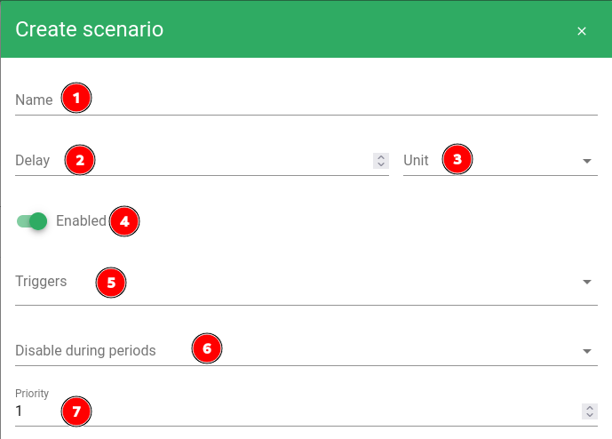

# Scenarios

## Définition

Les *scénarios* dans Canopsis permettent d'appliquer un enchainement d'actions sur les alarmes lors de [*triggers*](/guide-administration/architecture-interne/triggers) sur celles-ci.
Ils sont gérés par le *moteur Action* et le *moteur Webhook* (pour la partie webhooks).

## Paramètres généraux

!!! warning
	
	Les configurations de *scenarios* sont rechargées toutes les minutes.
	Lors de l'ajout ou de la modification d'un *scenario*
	attendez une minute avant de tester votre nouvelle configuration.

| Paramètre | Description |
| --- | --- |
| **Name (1)** | Nom du *scenario*, affiché dans l'interface de gestion des *scenarios* |
| **Delay (2)** | Délai avant de commencer à exécuter les actions lorsqu'un *trigger* déclenche le scénario |
| **Unit (3)** | Unité de temps pour le paramètre **Delay (2)** (second, minute, hour) |
| **Enabled (4)** | Si activé, le *scenario* sera execute sinon il sera ignoré |
| **Triggers (5)** | *triggers* déclenchant le *scenario*. Il est possible d'en sélectionner plusieurs. [Liste des différents *triggers*](/guide-administration/architecture-interne/triggers) |
| **Priority (7)** | Priorité du *scenario* lorsque plusieurs sont applicables à un même *trigger*. Les *scenarios* sont exécutés par ordre de priorité croissant (d'abord le `1` ensuite le `2` etc).|

## Actions

### Paramètres communs

### Types d'actions

#### Acknowledge

#### Acknowledge remove

#### Associate ticket

#### Cancel

#### Snooze

#### Pbehavior

#### Change state (Change and lock severity)

#### Webhook

